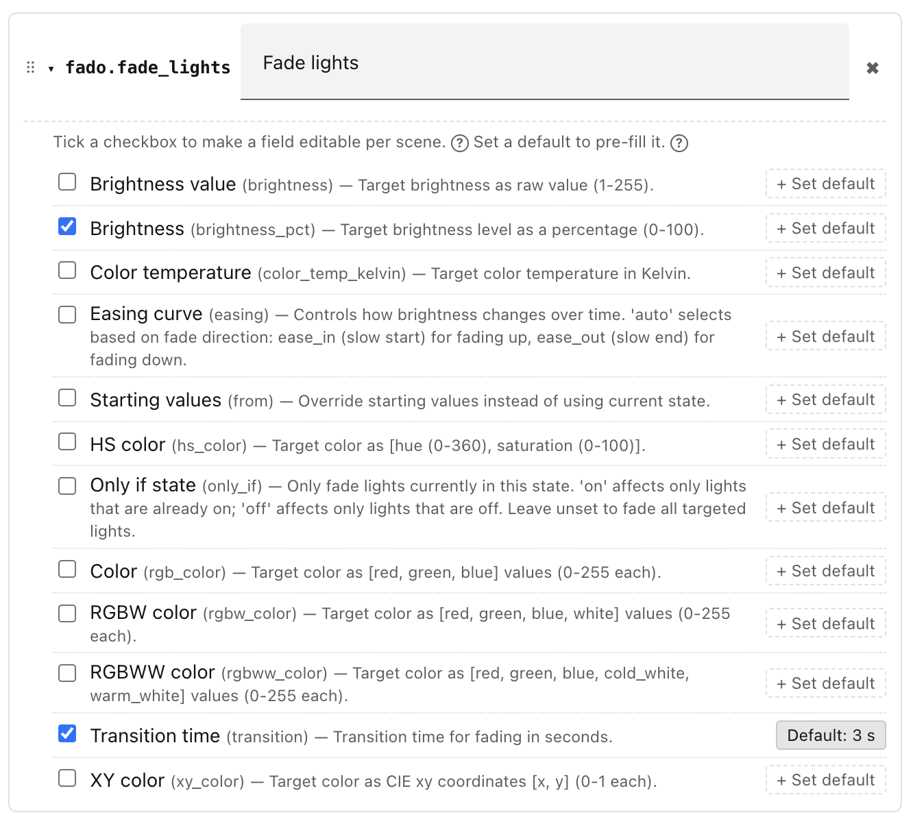

# Actions reference

An **action** is something Ambience does when a scene is applied, for example:
turn on a light, set a cover position, send a notification, or run a script.
Each action calls a Home Assistant service, passing it a target (which entities
to act on) and any field values the service needs (brightness, colour
temperature, and so on).

You can put as many actions in a scene as you like. When the scene wins,
Ambience runs all of them.

## Exposed actions

Rather than configuring a service from scratch every time you use it in a scene,
Ambience uses a layer of reusable templates called **exposed actions**. You set
these up once, in **Settings → Actions**, and they then appear in the action
picker whenever you edit a scene.

Each exposed action wraps a single Home Assistant service and captures two kinds
of per-field setting:

- **Which fields are visible** in the scene editor — these are the fields you
    expect to vary from scene to scene. When you add the action to a scene, you
    fill these fields in for that scene.
- **Defaults** — values that are always sent to the service, regardless of what
    any scene says. A default can accompany a visible field (pre-filling it with
    a sensible starting value) or it can apply to a hidden field (so the service
    always receives that value but the per-scene editor never shows it).

The combination is flexible. For example, a
[`fado.fade_lights`](https://github.com/clintongormley/ha-fado/#fado-light-fader)
exposed action might:

- show **brightness** and **transition** as visible fields, so each scene can
    set its own levels;
- but set `transition: 3` as a default, so every scene using this action gets a
    three-second fade — without needing to configure it each time.

!!! note "Hidden defaults"

    A field doesn't need to be visible to set a default. You can set a default but
    leave the field unchecked. The default parameter will always be passed, but you
    won't be able to override it in the scene's action list.

See [Step 3 of Getting started](getting-started/step-3-exposing-actions.md) for
a worked example.

## Built-in actions

Alongside Home Assistant's own services, Ambience provides a few **built-in
actions** that are smarter than a plain service call. They appear in the
**Settings → Actions** picker like any other service (search for "Ambience").

**Turn on / Turn off** — added for you by default. A single cross-domain on/off
that targets any mix of supported entities (lights, switches, fans, input
booleans, and more) and skips any entity that is already in the target state, so
scenes don't fire redundant commands. If you don't want them, delete them in
Settings → Actions — they won't come back.

**Safe cover actions** — added for you by default on new installs. (If you set
Ambience up before these became defaults, add them from the picker when you need
them; like Turn on / Turn off, any you delete won't come back.)

- **Open cover (safe)** / **Close cover (safe)** — open or close the targeted
    covers, but skip any that are already fully open / fully closed.
- **Set cover position (safe)** / **Set cover tilt (safe)** — move the targeted
    covers to a position (or tilt), skipping any already there.

The "safe" variants read each cover's current position before acting, so a cover
that is already where you want it never receives a command — avoiding the relay
*click* some covers make when told to open while already open. A cover that is
mid-travel, or whose state can't be read, is always commanded.

## Using an exposed action in a scene

In a scene's **Actions** section, click **+ Add action…** and pick one of your
exposed actions. Fill in its **visible fields** (each shows the right input
control, plus a *Default: …* hint where one is set) and choose a **target** —
the entities to act on, if the service requires one. The target picker lists
only entities relevant to the scene's scope (House, Floor, or Area). When the
scene applies, Ambience sends the service call with your values plus any
defaults; a visible field left blank falls back to its default.

!!! info "📷 Screenshot"

    *The scene editor's action section, showing a "Main lights on" action with
    Brightness and Colour temperature fields filled in, and a target set to the
    living-room lights.*

### Apply on every match

At the bottom of a scene's **Actions** section is an **Apply on every match**
toggle.

- **Off** (default) — when the scene becomes the winner for its scope/category,
    Ambience runs its actions once. While it stays the winner, repeated
    re-evaluations are suppressed (debounced), so the actions are not re-sent.
- **On** — Ambience re-runs the scene's actions every time the scope/category is
    re-evaluated while this scene is still the winner. Turn it on when you want
    the scene to keep re-asserting its state — for example, to counteract
    another integration that keeps changing a light.

This is independent of the global **Re-run all scenes after inactivity** setting
(Settings → Advanced), which periodically re-applies every unit's winning scene
regardless of this toggle.

______________________________________________________________________

## How actions run

Ambience re-evaluates your scenes continuously. Whenever the winning scene
changes — because a condition changes state, the time crosses a boundary, or
something else shifts — it applies the new winner's actions immediately.

Which scopes Ambience evaluates is controlled by a toggle switch on each scope
row. If you switch a scope off, Ambience stops applying scenes there.

If you want to test a scene's actions without waiting for its conditions to
match, use the **Run actions** option in the scene's action menu. This runs that
scene's actions once, independently of the normal evaluation cycle.

## Action execution model

The actions of the winning scene are applied as follows:

- **In parallel**, not sequentially — every action is turned into a coroutine
    and they're all launched together via `asyncio.gather`. There's no
    per-action `await` in the loop, so action #2 doesn't wait for action #1.
- **Not fire-and-forget** — each call is `blocking=True`, and the whole batch is
    `await`ed. Ambience waits for all the service calls to finish before the
    apply completes (it then records last-applied, traces, etc.). It does not
    just dispatch and move on.
- **Fault-isolated** — `return_exceptions=True` means one action raising an
    exception is logged (`"ambience: action raised: …"`) but doesn't abort the
    others. Malformed, unexposed, or empty-target actions are skipped with a
    warning before the gather (so they never become coros).
- **No ordering guarantee between actions** — because they run concurrently,
    completion order is nondeterministic. If the same entity exists in two
    actions, whichever arrives last wins.
