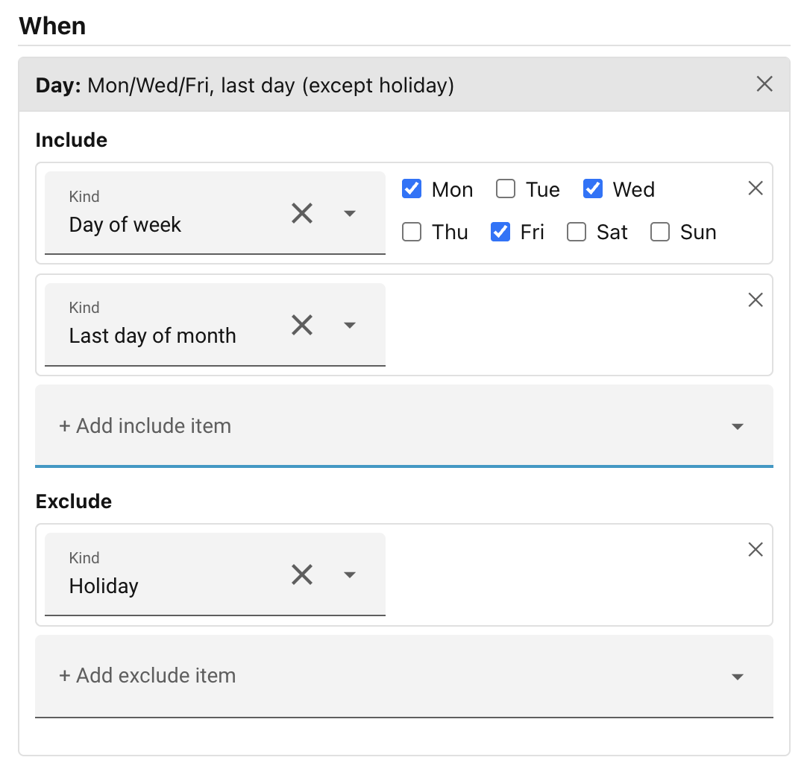
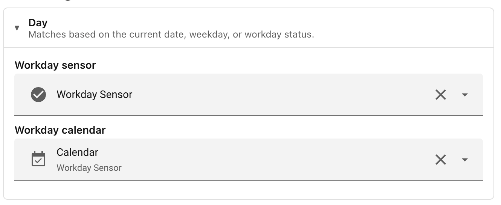

# Day

Checks whether today's date matches a set of calendar criteria: the day of the
week, a day of the month, a specific annual date, a date range, whether today is
a workday or a holiday, and more.

The Day condition editor has two sections: **Include** and **Exclude**. A scene
matches on a given day if that day is covered by at least one Include entry (or
if the Include list is empty, which means "every day") and is not covered by any
Exclude entry.

Use the **+ Add include item** and **+ Add exclude item** dropdowns to build up
your list. Each item has a kind, chosen from the options below.

## Day of the week

Pick **Day of week** and tick the days you want to match: Monday through Sunday.
For example, tick Monday through Friday to cover all working weekdays (without
reference to public holidays).

## Day of the month

Pick **Day of month** and type a spec into the text field. A spec is a
comma-separated list of single day numbers and inclusive ranges, for example:

- `1` — the first of the month only
- `1, 15` — the 1st and 15th
- `1-10` — the 1st through the 10th
- `1-5, 20-25` — two separate ranges

Days run from 1 to 31. If a month has fewer days than the upper end of a range,
the extra days simply never occur and the entry never matches in that month.

## A specific date (every year)

Pick **Date (annual)** and choose a month and a day. The condition matches on
that month/day combination in any year, so you can target, say, 25 December
without specifying a year. February 29 is accepted — it only matches in leap
years.

## A date range (every year)

Pick **Date range (annual)** and set a From month/day and a To month/day. The
condition matches any date falling within that range, inclusive of both
endpoints, in any year. Ranges can wrap the year boundary: a range from 20
December to 5 January matches from 20 Dec through to 5 Jan the following
calendar year.

## The last day of the month

Pick **Last day of month**. This matches the 28th, 29th, 30th, or 31st,
depending on the month, so it works correctly in February and in months with 30
days.

## Workday/Holiday

Pick **Workday** or **Holiday**. These match on days when the workday sensor
reports "on" (for Workday) — typically weekdays excluding public holidays — or
"off" (for Holiday) — usually weekends and public holidays — according to
whatever country and configuration you have set up in the
[Workday integration](https://www.home-assistant.io/integrations/workday/).

!!! tip "Workday sensor required"

    These options requires a workday sensor to be configured before it can be used.
    See [Settings](#settings) below.

## First/Last workday of the month

Pick **First workday of month** or **Last workday of month**. These match on the
first or last day in the current month that the workday calendar records as a
working day. It is useful for triggering things like a start-of-month or
end-of-month report or reminder.

!!! tip "Workday calendar required"

    These options requires a workday **calendar** to be configured before it can be
    used. See [Settings](#settings) below.

## Settings

Several day types — `Workday`, `Holiday`, `First workday of month`, and
`Last workday of month` — need a source of workday information. Configure this
in the **Conditions** tab of the Settings modal (open it from the cogwheel ⚙ in
the Ambience panel header). The sensor powers the `Workday` and `Holiday` types;
the calendar powers `First workday of month` and `Last workday of month`.

**Workday sensor** Select a `binary_sensor` entity provided by the HA
[Workday integration](https://www.home-assistant.io/integrations/workday/). The
picker is filtered to show only entities from that integration. When set, scenes
using the `Workday` or `Holiday` day type read their state from this sensor.

**Workday calendar** Select a `calendar` entity provided by the Workday
integration. This is an alternative source — configure one or the other
depending on which the Workday integration exposes in your setup.

If you remove either entity from HA after scenes have referenced it, Ambience
shows a warning listing the affected scenes by name.

______________________________________________________________________

Next: [Entity state](entity-state.md).
