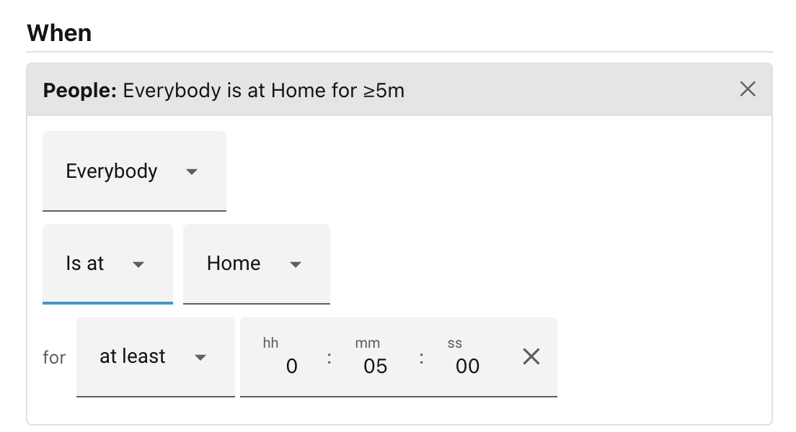

# People

Checks who is, or is not, at home or in a named zone.

When you add a People condition to a scene, the first field allows you to choose
**Who** to match on:

| Option        | Meaning                                                      |
| ------------- | ------------------------------------------------------------ |
| **Everybody** | Every tracked person must be at the chosen location.         |
| **Anybody**   | At least one tracked person must be at the chosen location.  |
| **Nobody**    | No tracked person must be at the chosen location.            |
| **Any of:**   | At least one person you tick must be at the chosen location. |
| **All of:**   | Every person you tick must be at the chosen location.        |
| **None of:**  | None of the people you tick must be at the chosen location.  |

The first three options apply to your whole household — anyone Home Assistant
tracks as a `person` entity. The last three reveal a checklist of your tracked
people so you can limit the test to specific individuals. When you switch to one
of those modes, all people start ticked; untick anyone you want to exclude.

Beneath the **Who** field, you will find:

- **Is at / Is not at** — a dropdown that lets you invert the test. This toggle
    is hidden when the scope is **Nobody** or **None of:**, because combining a
    negative scope with "Is not at" would produce a confusing double negative;
    for those modes the direction is always "is at".
- **Location** — a dropdown populated from your HA zones. **Home** is always the
    first entry. Any other zone you have configured (Work, School, and so on)
    follows it.
- **for** — an optional duration (see
    [the *for* duration](index.md#the-for-duration)). When set, the condition
    only matches if the location *test* has been continuously true for at least
    that long. Because it tracks the test rather than the exact zone, a _"nobody
    home"_ duration keeps counting when a person moves between two away zones
    (work to the shops) because _"not home"_ never stopped being true. It only
    resets when someone actually comes home. This prevents a scene from firing
    the moment someone briefly crosses a zone boundary.

### Examples

Combining quantifier and direction gives you expressions such as:

- *Everybody / Is at / Home* — the whole household is home.
- *Anybody / Is not at / Home* — at least one person is away.
- *Nobody / (is at) / Home* — the house is empty.
- *Any of: Alice, Bob / Is at / Work* — Alice or Bob (or both) are at work.

______________________________________________________________________

Next: [Script](script.md).
