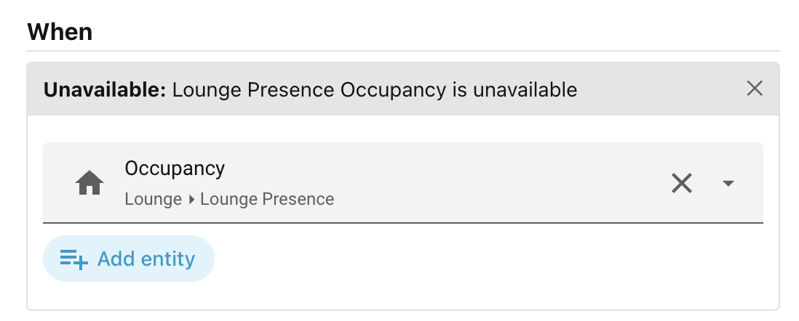
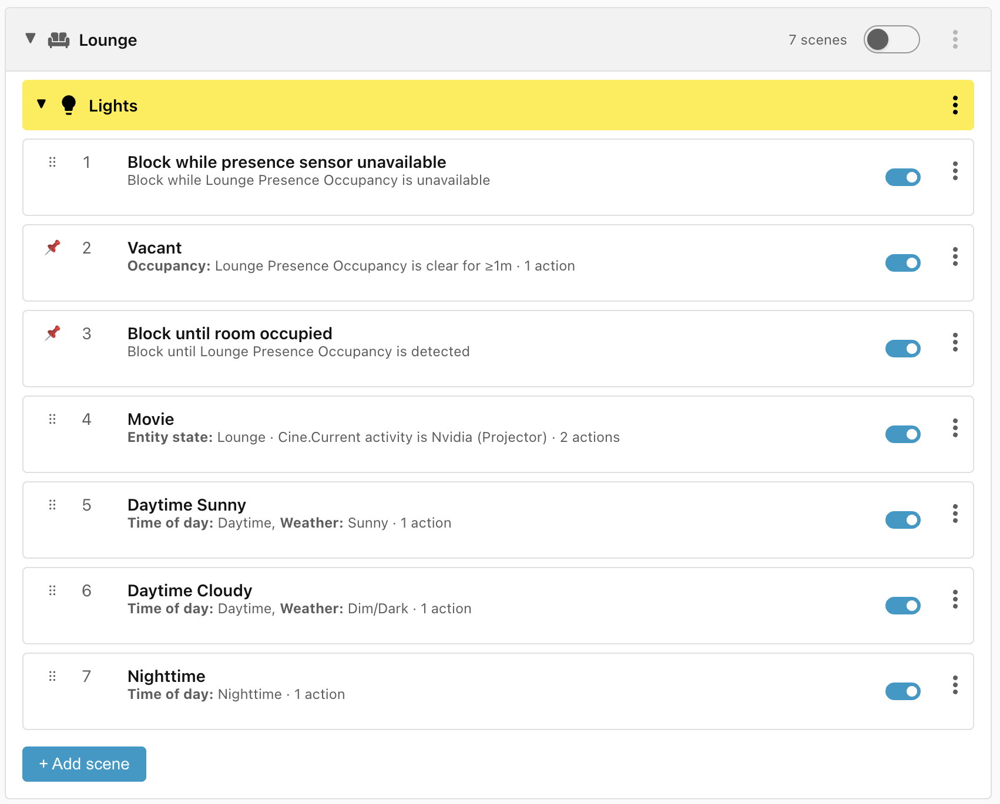

# Unavailable

Checks whether any of the entities you list is **unavailable**, **unknown**, or
missing.

Most conditions treat an unavailable entity as *unobservable* and quietly
decline to match on it. Any scene in which an entity is unavailable will simply
not match. This can result in the wrong scenes being applied.

If it is important to block matching if one or more entities are unavailable,
then use the **Unavailable** condition to block further processing.

When you add an Unavailable condition to a scene, the editor shows a single
control:

- **Entity** — a picker listing entities of **any** domain. Pick one or more.

It matches as soon as **any one** of the entities you picked is unavailable,
unknown, or absent (deleted or not yet loaded). You must pick at least one
entity.

## Using it as a fallback guard

The Unavailable condition is the condition with the highest precedence as it
would normally be used to block the evaluation of all scenes, but it can be
manually dragged to a new position if required.

!!! note "When entities go missing"

    When an entity changes state to **Unavailable** or **Unknown** or goes missing,
    it still triggers a re-evaluation of the related scenes, but the winning scene
    is not acted upon unless it matched an **Unavailable** clause.

______________________________________________________________________

Next: [Weather](weather.md).
