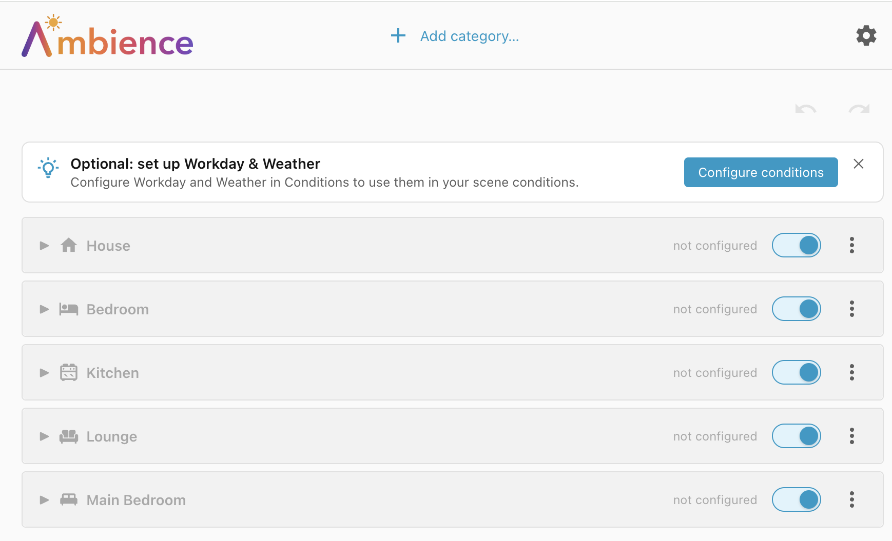
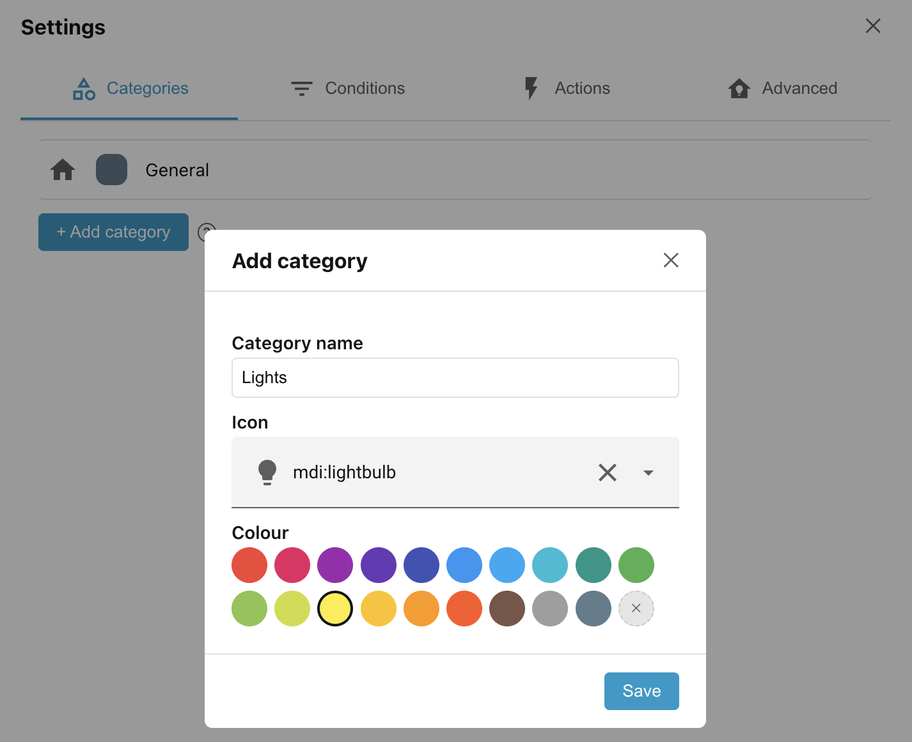
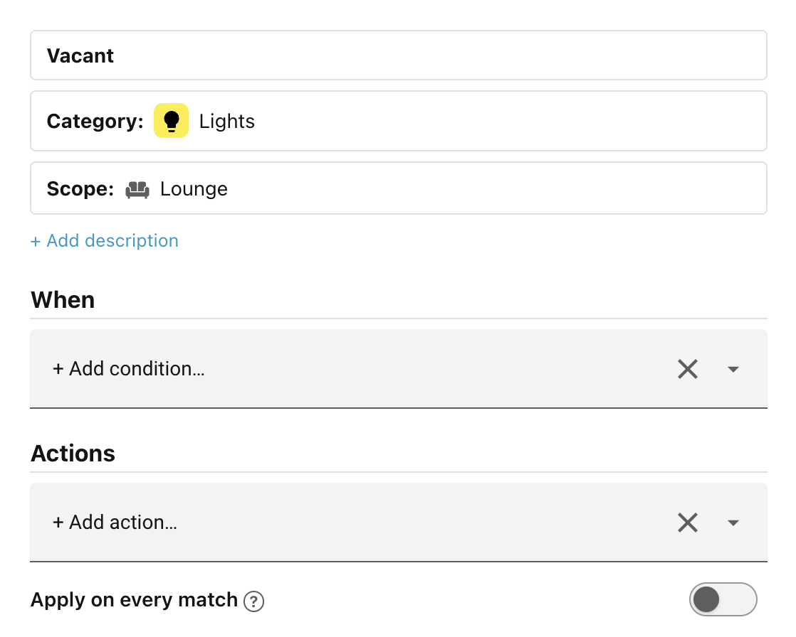

# Getting started

A **Scene** is a combination of the **Conditions** which allow the scene to
match, and the **Actions** which are applied when the scene matches. This guide
takes you through setting up scenes to control the lights and blinds in a
lounge.

## Requirements

This example depends on the following entities being available in Home
Assistant:

- lights, including a light group called **Lounge Lights**
- blinds
- an occupancy or presence sensor called **Lounge Presence**
- a weather integration
- a remote control to turn on the projector called **Cine**

## Scenes for lights

We want the lights in the lounge to support the following scenes:

| Conditions                                             | Device state                                     |
| ------------------------------------------------------ | ------------------------------------------------ |
| The room is vacant for more than 1 minute.             | Fade lights off                                  |
| The room is occupied during the evening or nighttime   | Fade lights to 25%                               |
| The room is occupied during the day, when it is sunny  | Fade lights to 40%                               |
| The room is occupied during the day, when it is cloudy | Fade lights to 60%                               |
| The projector is on for movie time                     | Fade lights off, except side-table lights at 10% |

## Scenes for blinds

The blinds share some conditions with the lights but have their own lifecycle:

| Conditions                                     | Device state  |
| ---------------------------------------------- | ------------- |
| Between dusk and sunrise (but not before 8:00) | Blinds closed |
| Between sunrise (but not before 8:00) and dusk | Blinds open   |
| The projector is on for movie time             | Blinds closed |

## Step 1: Opening the panel

Open the Ambience panel from the Home Assistant sidebar. The panel lists every
**scope** in your home: a **House** row at the top, followed by any **floors**
and then any **areas**.

!!! tip "Optional: set up Workday & Weather"

    The **Weather** and **Day** conditions depend on other services in Home
    Assistant. You can dismiss the suggestion to set them up for now. Later you will
    see how to configure them under **Settings**.

## Step 2: Add a category

We want to set up scenes to control the lights in the lounge. To start we will
add a new category called **Lights**, by clicking **+ Add category** at the top
of the screen.

This takes you to the **Categories** tab under **Settings**. Click the **+ Add
category** button and fill out the form as shown below:

Click **Save** and then close the settings page with the **X** in the top right
corner. Then select the **Lights** category from the **Category filter** at the
top of the page.

## Step 3: Add the *Vacant* scene

The first scene we'll add is the **Vacant** scene — what the lights should do
when the room has been vacant for at least 1 minute. Click the **Lounge** header
to expand that scope, then:

- Press the **+ Add scene** button.
- Click on **New scene** to change the name to **Vacant**.
- The **Category** and **Scope** should already be set to **Lights** and
    **Lounge** respectively.

!!! info "Scopes and Categories"

    Scopes and Categories allow you to segment your devices down into small related
    groups. All the scenes which control (for instance) the lights in the lounge
    should be added to the **Lounge** scope, under the **Lights** category. That way
    you can be sure that there are no competing automations trying to control the
    same devices.

    The **actions** in a scene can only target devices that belong to that scope (or
    to children of the scope if the scope is **House** or a floor). **Conditions**,
    on the other hand, can target entities anywhere in the house.

We want this scene to apply when the lounge has been vacant for at least one
minute. So, under **When**:

- Click **Add condition** and choose **Occupancy**.
- Click **Select an entity**.
- Select the **Lounge Presence** entity.
- Change **Detected** to **Clear**.
- and set **For** to **00:01:00** (i.e. one minute).

As soon as you click away from the condition you've just added, the form gets
replaced by a simple summary of the condition:

______________________________________________________________________

To learn exactly how scenes, categories, and the resolution order fit together,
see [Scenes & resolution](concepts/scenes-and-resolution.md). To understand why
a particular scene was (or was not) applied, see
[Tips & testing](tips-and-testing.md), which covers the trace viewer that shows
Ambience's decision for every evaluation.
