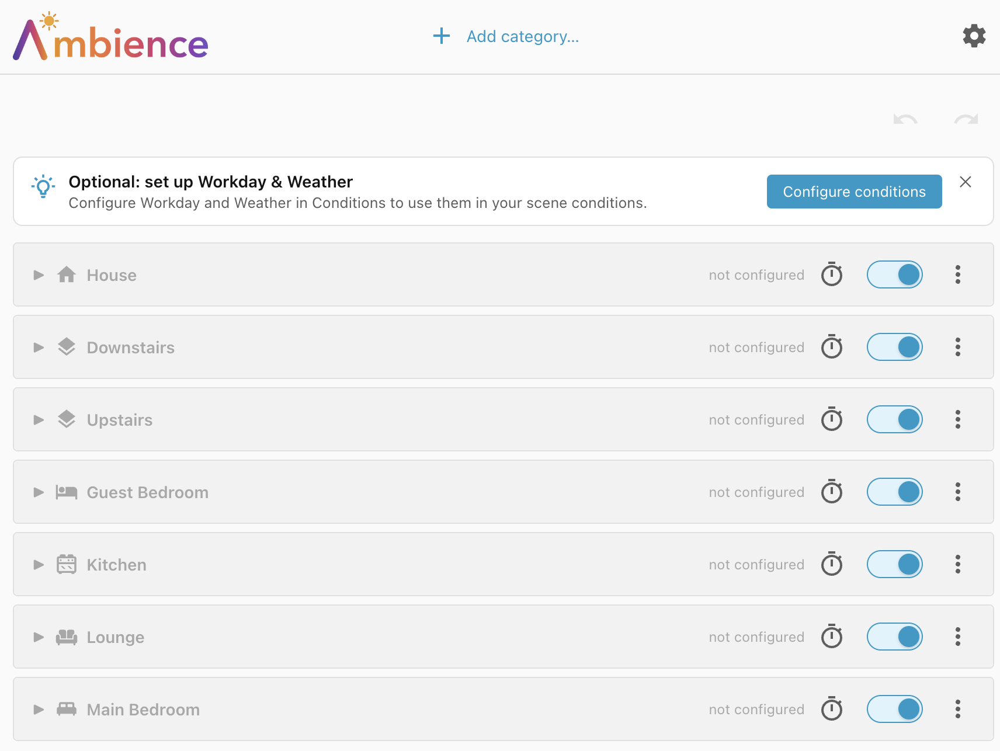
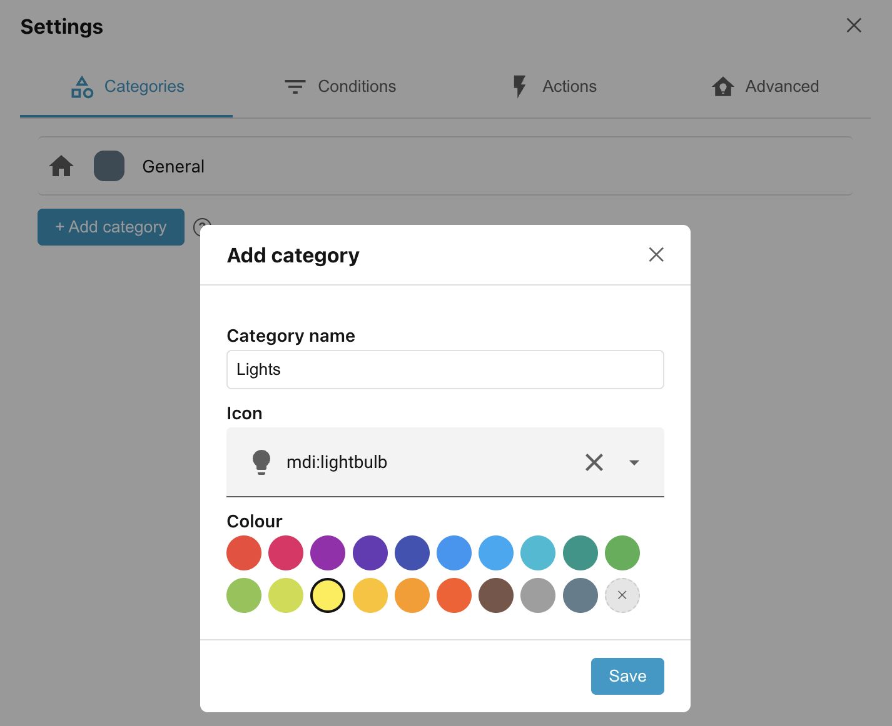

# Step 1: Scopes and categories

Open the Ambience panel from the Home Assistant sidebar. The panel lists every
**scope** in your home: a **House** row at the top, followed by any **floors**
you have defined (if any), and then any **areas**.

!!! tip "Optional: set up Workday & Weather"

    The **Weather** and **Workday** conditions depend on other services in Home
    Assistant. You can dismiss the suggestion to set them up for now. Later you will
    see how to configure them under **Settings**.

## Add a category

We want to set up scenes to control the lights in the lounge. To start we will
add a new category called **Lights**, by clicking **Add category…** at the top
of the screen.

This link takes you to the **Categories** tab under **Settings**. Then click the
**+ Add category** button on this page and fill out the form as shown below:

Click **Save**, then close the settings page with the **X** in the top right
corner.

Select the **Lights** category from the **Category filter** at the top of the
page.

## Scope/category scene groups

Scopes and Categories allow you to segment your devices down into small related
groups. All the scenes which control (for instance) the lights in the lounge
should be added to the **Lounge** scope, under the **Lights** category — the
**Lounge/Lights scene group**. That way you can be sure that there are no
competing automations trying to control the same devices.

The **actions** in a scene can only target entities that belong to that scope
(or to children of the scope if the scope is the **House** or a floor).
**Conditions**, on the other hand, can reference entities anywhere in the house.

Besides the lights, maybe you also have window blinds in the Lounge. They would
have a different lifecycle from the lights, although many of the conditions may
be shared. For instance, your blinds might implement the following scenes:

| Conditions                                     | Device state  |
| ---------------------------------------------- | ------------- |
| The projector is on for movie time             | Blinds closed |
| Between dusk and sunrise (but not before 8:00) | Blinds closed |
| Between sunrise (but not before 8:00) and dusk | Blinds open   |

Both blinds and lights are impacted by the state of the projector and by the
time of day, but lights don't depend on blinds and blinds don't depend on
lights. They are independent of each other, although they share the same room.

We would use a separate **Blinds** category to manage the **Lounge/Blinds**
scene group independently of the **Lounge/Lights** scene group.

## Use categories freely

Categories are created globally, but don't be afraid to add new categories for
concepts that exist in only a few rooms or even a single room.

General categories like **Lights** and **Blinds** are useful, but maybe you have
an en-suite bathroom which belongs to a bedroom area. The lights and blind in
the bathroom would have a different lifecycle to the lights and blind in the
bedroom and so deserve their own dedicated **Bathroom lights** and **Bathroom
blinds** category. And maybe in just one bathroom you have **Shower lights**
which have a different lifecycle to the other **Bathroom lights**.

Categories are cheap — use them freely.

!!! tip "General category"

    The integration ships with a single default category called **General**. Feel
    free to rename or delete this category, as long as you have defined at least one
    other category.

______________________________________________________________________

Next: [Step 2: Your first scene](step-2-your-first-scene.md).
