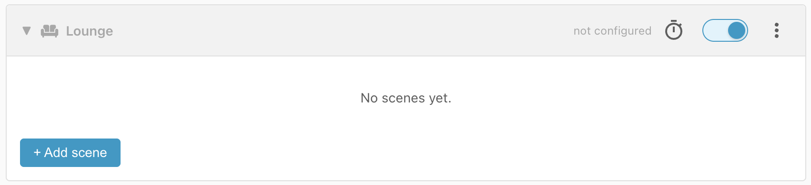
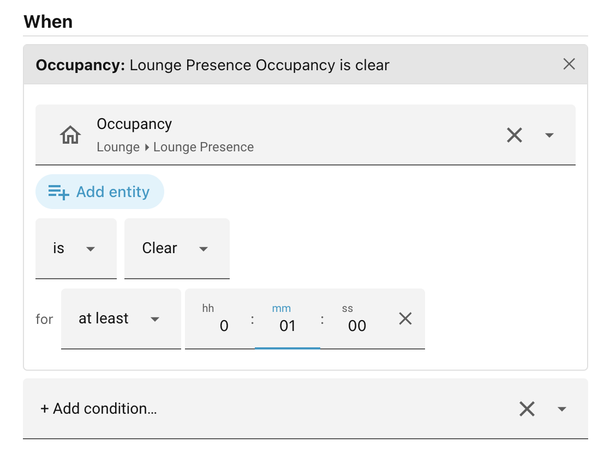
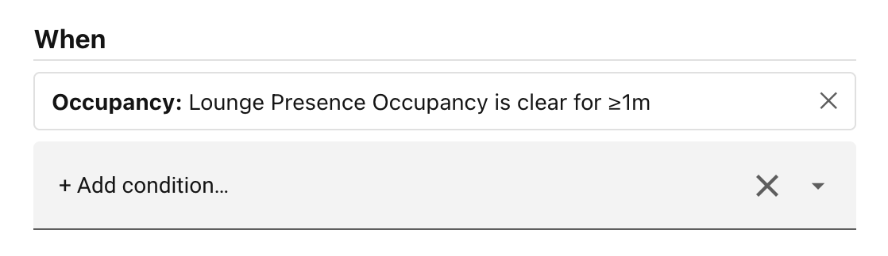
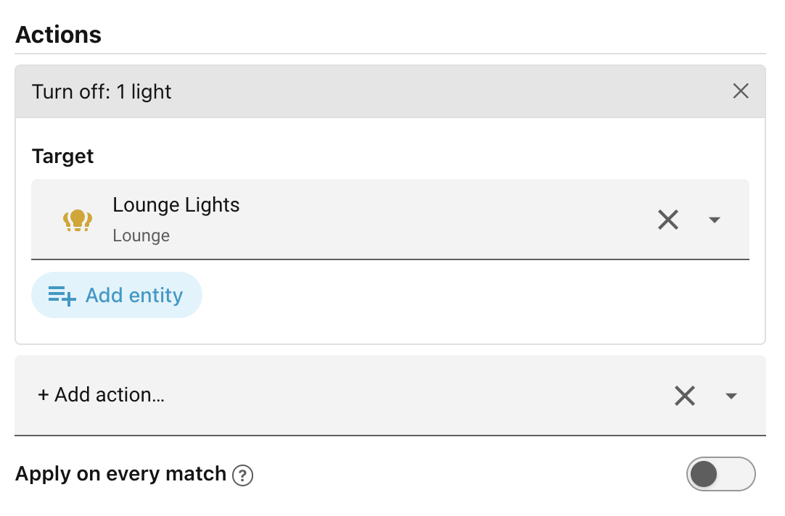
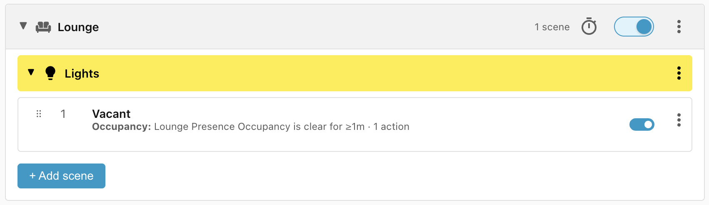
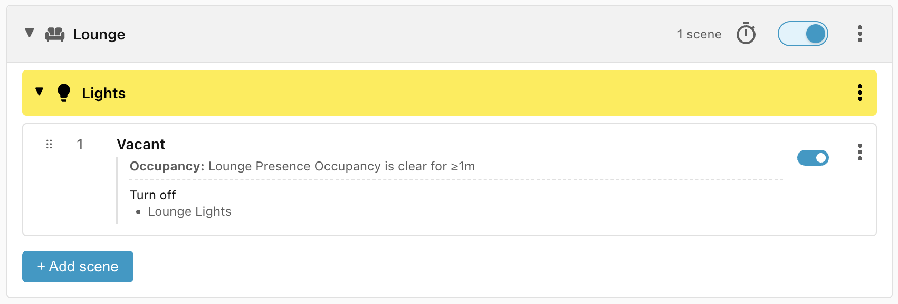

# Step 2: Your first scene

The first scene we'll add is the **Vacant** scene — what the lights should do
when the room has been vacant for at least 1 minute.

## Expand the Lounge scope

First, click the **Lounge** header to expand that scope:

Then:

- Press the **+ Add scene** button.
- Click on **New scene** to change the name to **Vacant**.
- The **Category** and **Scope** should already be set to **Lights** and
    **Lounge** respectively.

## Add the Occupancy condition

We want this scene to apply when the lounge has been vacant for at least one
minute. So, under **When**:

- Click **Add condition** and choose **Occupancy**.
- Click **Select an entity**.
- Select the **Lounge Presence** entity.
- Change **Detected** to **Clear**.
- and set **For** to **00:01:00** (i.e. one minute).

As soon as you click away from the condition you've just added, the form gets
replaced by an easy-to-read summary of the condition you have specified:

## Specify the actions

All that is left to do is to specify what should happen when this scene matches.

- Click **+ Add action**.
- Select **Turn off**.
- Under **Target**, select the entity **Lounge Lights**.
- Click **Save scene**.

## Completed scene

This takes you back to the scene manager and shows you a summary of the scene:

!!! tip "Disabling scenes"

    Use the blue toggle to the right of the scene name to temporarily disable a
    scene.

Click on the scene name to see the full details:

!!! info "Green dot"

    The green dot to the left of the scene name tells you that this scene is the one
    that currently best matches the conditions that you have specified, that it is
    the winning scene.

______________________________________________________________________

Next: [Step 3: Exposing actions](step-3-exposing-actions.md).
