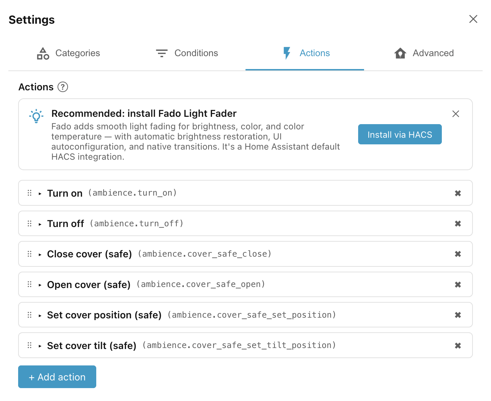
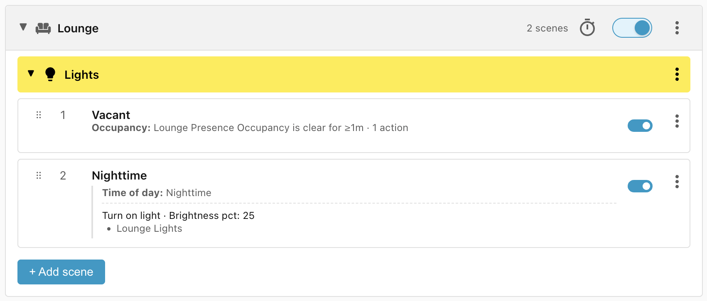

# Step 3: Exposing actions

Next we'll add the **Nighttime** scene — turn the lights to 25% as soon as
anybody enters the room.

In order to do this we will need to add an action that understands how to set
lights to a particular brightness:

- Click the cogwheel (⚙) in the top right corner of the **Ambience** panel.
- Select the **Actions** tab.

## Built-in actions

You can see that Ambience ships with six built-in actions by default:

- **Turn on** and **Turn off** will turn on or off any entity that supports that
    action, but it will check the current state of the entity before acting, so
    if a light is already `on` the **Turn on** will not try to turn it on again.
- **Close cover (safe)**, **Open cover (safe)**, **Set cover position (safe)**,
    and **Set cover tilt (safe)** control covers like blinds, awnings, and
    curtains. They check the current state or position of the cover (or its tilt
    value) before acting, and so avoid activating the motor on a cover that is
    already in the correct position.

You are welcome to delete or rename the built-in actions.

## Add a new action type

Besides the built in action, you will need to add any other actions that you
want to use, and specify which fields belonging to the action are of interest to
you. We will do this for the **Turn light on** (`light.turn_on`) action:

- Click **+ Add action** and click on the **Action** drop down.
- Search for and select **Turn on light**.
- The only field that we need is **Brightness pct**, so select just that one.
- Close the settings by clicking the **X** in the top right corner.

!!! tip "Fado Light Fader"

    The **Turn on light** action has a **transition** field which allows you to
    specify over what time the light should transition to the new brightness, e.g.
    *Fade to 50% brightness over 3 seconds*. Unfortunately, many lights don't
    support these native transitions.

    The
    [Fado Light Fader](https://github.com/clintongormley/ha-fado/#fado-custom-integration)
    custom HACS integration solves this problem by providing smooth light fading for
    brightness, colors, and color temperatures, with automatic brightness
    restoration, autoconfiguration via a UI, and support for native transitions.

## Add the Scene

- Click **+ Add scene**.
- Change the name to **Nighttime**.
- Add the condition **Time of day** and select **Nighttime**.
- Add the action **Turn on light**, select target **Lounge Lights**, and set the
    **Brightness pct** to 25%.
- Click **Save scene**

## Why no occupancy condition?

You may have expected that we would need to add an **Occupancy** condition to
check whether somebody has entered the room before we turn the lights on. It is
not required because we already have the **Vacant** scene in place.

Each scene is evaluated in order and if it matches, then that scene wins and no
further scenes are evaluated. This means that, for evaluation to reach the
current scene, the conditions in all the previous scenes are guaranteed not to
match.

The **Vacant** scene checks whether the room has been vacant for at least one
minute. If that scene didn't match then we know that the room is either
currently occupied or has been vacant for less than one minute, in which case
the lights should be on.

______________________________________________________________________

Next: [Step 4: Weather conditions](step-4-weather-conditions.md).
