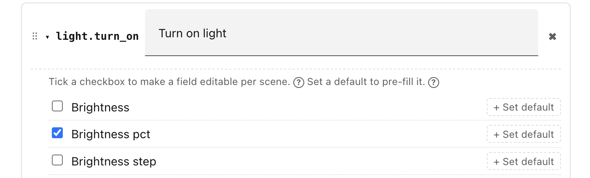
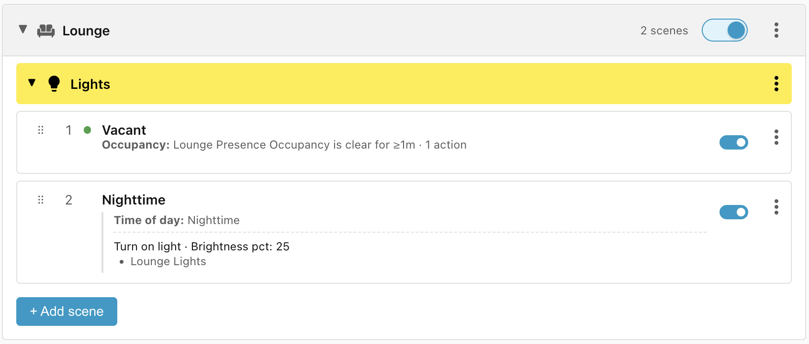

# Step 4: Exposing actions

Next we'll add the **Nighttime** scene — turn the lights to 25% as soon as
anybody enters the room.

In order to do this we will need to add an action that understands how to set
lights to a particular brightness:

- Click the cogwheel (⚙) in the top right corner of the **Ambience** panel.
- Select the **Actions** tab.

You can see that Ambience ships with just the **Turn on** and **Turn off**
actions built in. You need to add any other actions that you want to use, and
specify which fields are of interest to you:

- Click **+ Add action** and click on the **Action** drop down.
- Search for and select **Turn on light**.
- The only field that we need is **Brightness pct**, so select just that one.
- Close the settings by clicking the **X** in the top right corner.

!!! tip "Fado Light Fader"

    The **Turn On Lights** action has a **transition** field which allows you to
    specify over what time the light should transition to the new brightness, e.g.
    *Fade to 50% brightness over 3 seconds*. Unfortunately, many lights don't
    support these native transitions.

    The
    [Fado Light Fader](https://github.com/clintongormley/ha-fado/#fado-custom-integration)
    custom HACS integration solves this problem by providing smooth light fading for
    brightness, colors, and color temperatures, with automatic brightness
    restoration, autoconfiguration via the UI, and support for native transitions.

## Add the Scene

- Click **+ Add Scene**.
- Change the name to **Nighttime**.
- Add the condition **Time of day** and select **Nighttime**.
- Add the action **Turn on light**, select target **Lounge Lights**, and set the
    **Brightness pct** to 25%.
- Click **Save**

## Why no occupancy condition?

You may have expected that we would need to add an **Occupancy** condition to
check whether somebody has entered the room before we turn the lights on. It is
not required because we already have the **Vacant** scene in place.

Each scene is evaluated in order and if it matches, then that scene wins and no
further scenes are evaluated. This means that, for evaluation to reach the
current scene, the conditions in all the previous scenes are guaranteed not to
match.

The **Vacant** scene checks whether the room has been vacant for more than one
minute. If that scene didn't match then we know that the room is either
currently occupied or has been vacant for less than one minute, in which case
the lights should be on.

______________________________________________________________________

Next: [Step 5: Weather conditions](step-5-weather-conditions.md).
