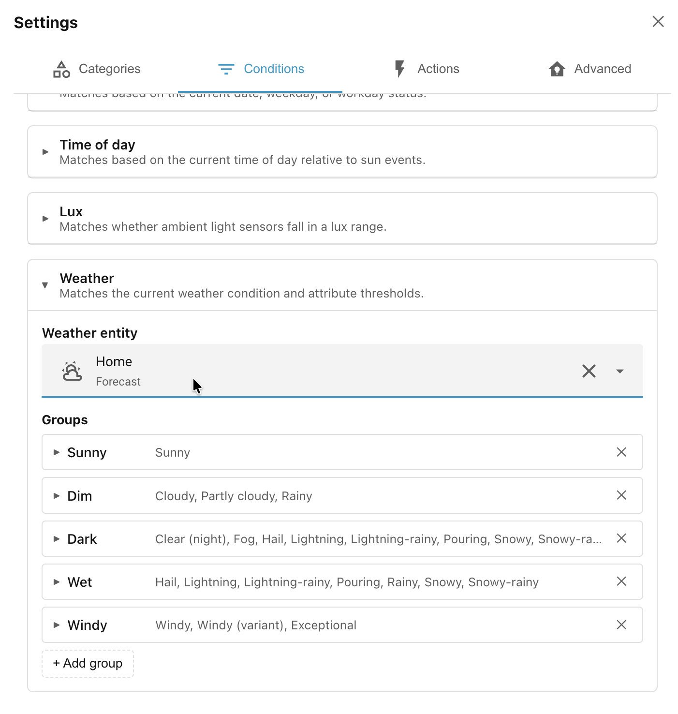
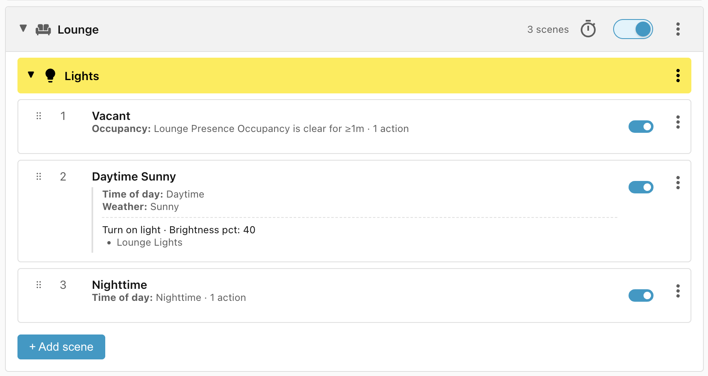
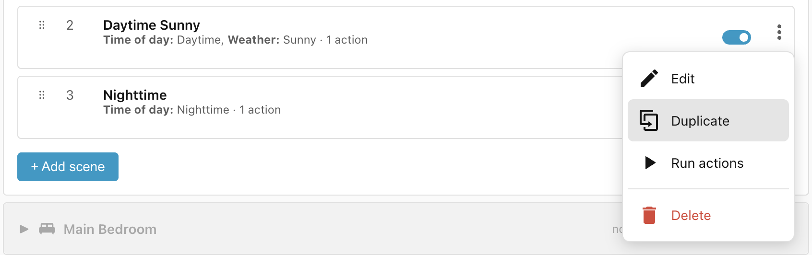
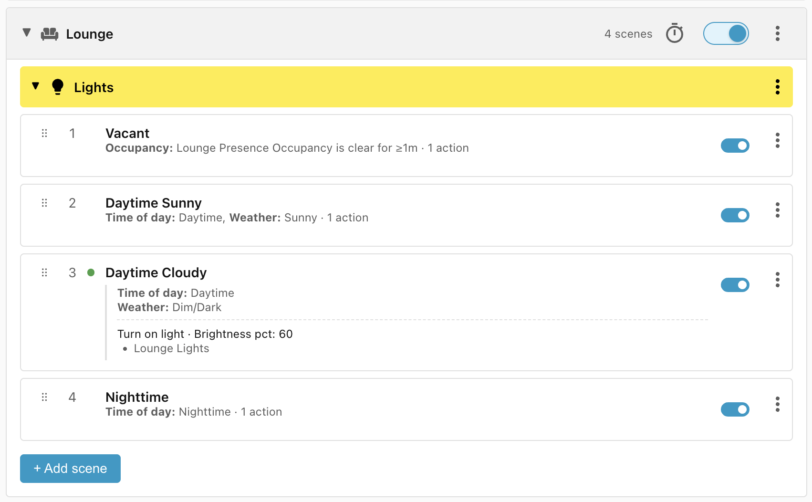

# Step 4: Weather conditions

Next up are the **Daytime** scenes, one for when the weather is sunny and one
for when the weather is cloudy.

## Add a Weather integration

To use the **Weather** condition, it needs to know which Weather integration you
prefer. If you don't already have a Weather integration set up, you can just use
the built-in **Meteorologisk institutt**:

- Click: **Settings > Devices & services > + Add integration**.
- Search for and select **"Meteorologisk institutt"**.
- You probably don't need to change any of the configuration, maybe
    **Elevation**.
- Click **Submit**

!!! tip "Weather services"

    For more info about the various weather integrations available in Home
    Assistant, see the
    [Definitive guide to Weather integrations](https://community.home-assistant.io/t/definitive-guide-to-weather-integrations/736419).

## Configure the Weather condition

Now that we have a weather integration set up, we need to configure the
**Weather** condition to use it:

- Open the **Ambience** panel.
- Click the cogwheel (⚙) in the top right corner.
- Select the **Conditions** tab.
- Click on the **Weather** condition to expand it.
- Click **Select an entity** and select your newly created weather forecast.

You can see that the Weather condition comes preconfigured with various groups.
For instance the **Dim** group includes **Cloudy, Partly cloudy, and Rainy**.
You can add your own groups and even override the built in groups to suit your
needs.

## Using the Weather condition

Now that the **Weather** condition is set up, we can use it in our **Daytime
Sunny** scene — set the lights to 40% when it is sunny:

- Click **+ Add scene**.
- Change the name to **Daytime Sunny**.
- Add condition **Time of day** and select **Daytime**.
- Add condition **Weather** and check **Sunny**.
- Add action **Turn on light**, select target **Lounge Lights**, and set the
    **Brightness pct** to **40%**.
- Click **Save scene**.

## Duplicating a scene

The **Daytime Cloudy** scene is almost identical to **Daytime Sunny** so we can
just duplicate that one and edit it:

- Click the **⋮** icon to the right of the **Daytime Sunny** scene and select
    **Duplicate**.

!!! info "Duplicating to other scene groups"

    The **Duplicate** function is also useful for copying a scene into other scopes
    or categories, for instance if you need to replicate a lifecycle from one
    bedroom to another.

Then:

- Change the name to **Daytime Cloudy**.
- Click on the **Weather** condition to edit it and check **Dim** and **Dark**
    instead of **Sunny**.
- Click on the **Turn on light** action and change the **Brightness pct** to
    **60%**.
- Click **Save scene**.

______________________________________________________________________

Next: [Step 5: Entity-state conditions](step-5-entity-state-conditions.md).
