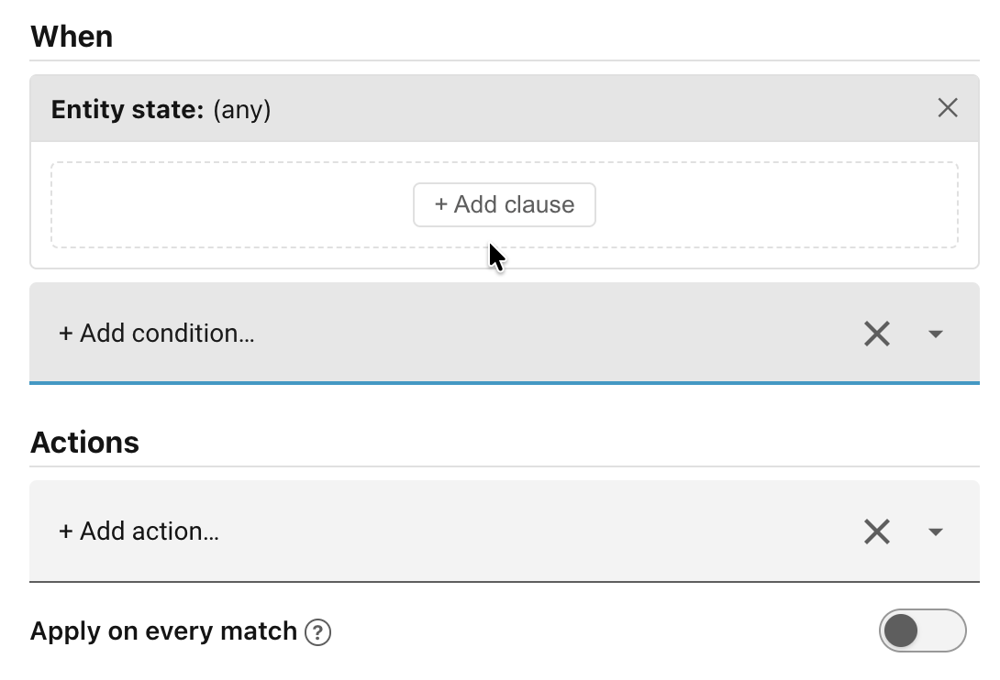
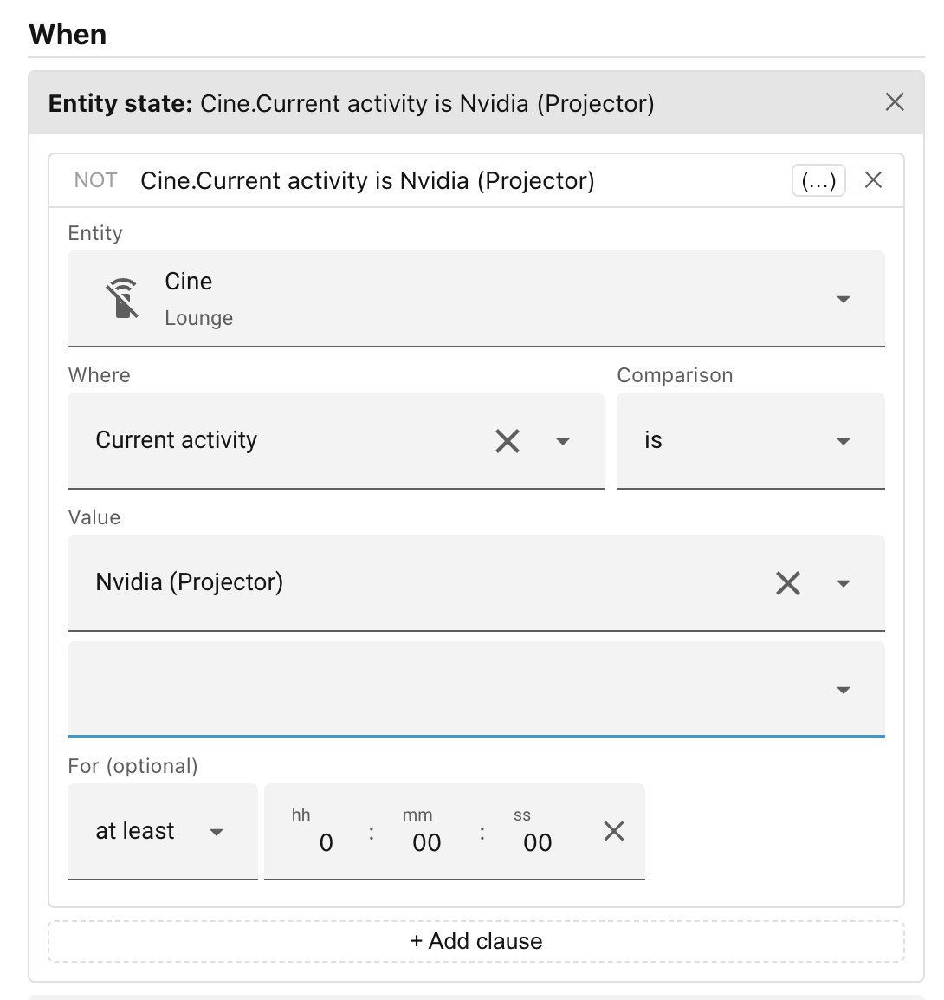
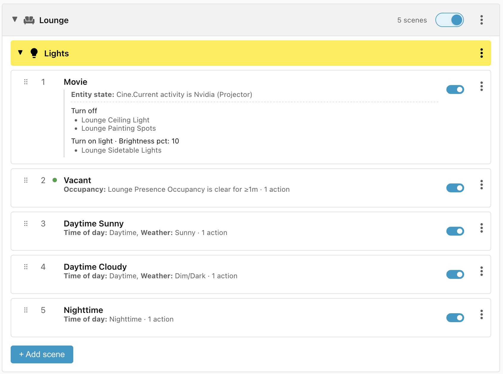

# Step 5: Entity-state conditions

The last Lounge/Lights scene to add is the **Movie** scene — when the projector
is on, turn all the lights off except the sidetable lights, which should be set
to **10%**.

We can determine when the projector is in use because our **Cine** remote
control sets its **Current activity** attribute to **Nvidia (Projector)**. Of
course, your own setup is likely to be different.

## Add the scene

For this we will use the **Entity state** condition. This is a particularly
powerful condition which allows you to query the state of an entity, or the
value of any of an entity's attributes. On top of that, it allows you to use
Boolean logic to combine **AND**, **OR**, and **NOT** conditions to apply
sophisticated logic.

To add the scene:

- Click **+ Add scene**.
- Change the name to **Movie**.
- Click **+ Add condition** and select the **Entity state** condition.
- Click the **+ Add clause** button.

- Click **Select an entity** and search for the **Cine** remote control.
- Change the **Where** field from **State** to the attribute **Current
    activity**.
- Set the **Value** to **Nvidia (Projector)**.

Finally, configure the actions to take:

- Click **+ Add action** and select **Turn off**.
- Target the **Lounge Ceiling Light** and the **Lounge Painting Spots**.
- Click **+Add action** and select **Turn on light**.
- Target the **Lounge Sidetable Lights** and set **Brightness pct** to **10%**.
- Click **Save scene**.

______________________________________________________________________

Next: [Step 6: Scene priority](step-6-scene-priority.md).
