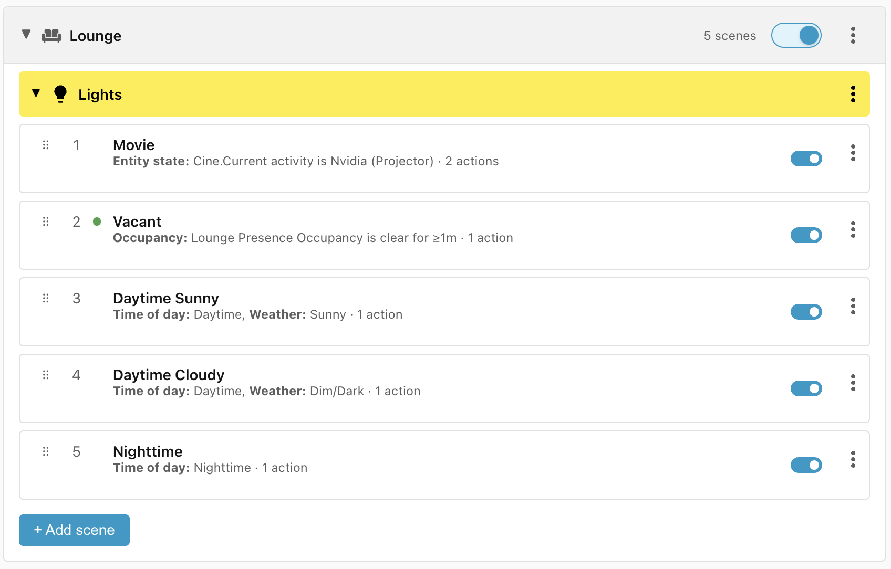
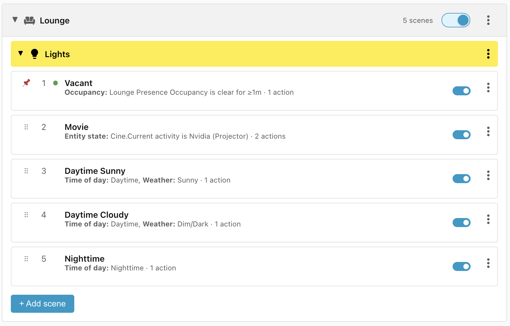

# Step 6: Scene priority

You will notice that the **Movie** scene has jumped to the top of the list. This
is because the **Entity state** condition has a higher priority than conditions
like **Time of day: Daytime**.

The **Time of day** condition will also compare time ranges, sorting a more
specific **Evening** time range above a less specific **Nighttime** time range.

While the heuristics used to sort scenes by priority and specificity usually
work, sometimes they will get it wrong and you will want to change the order of
scenes manually.

For instance, the way the scenes are ordered at the moment, if the projector is
turned on then the sidetable lights will be turned on even if the room is
vacant. If we wanted to change the logic so that the **Vacant** scene should be
more important than the **Movie** scene, then all we need to do is to use the
**⠿** drag handles to drag the **Vacant** scene above the **Movie** scene:

The red pin shows that the scene has been manually reordered, and clicking the
pin will restore automatic ordering.

______________________________________________________________________

Next: [Step 7: Blocking scenes](step-7-blocking-scenes.md).
