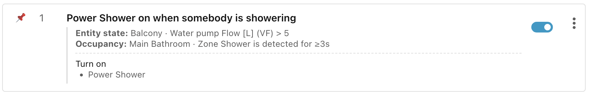

# Step 7: Blocking scenes

The pedants amongst us will have noticed that we only turn off the lights once
the room has been vacant for one minute. We never check that the room is
actually occupied. How is it possible for the room to not be recently occupied,
but for it to be vacant for less than one minute?

This will happen when we restart Home Assistant. The occupancy sensor state will
be **Unknown** before switching to **Clear**. For the next 60 seconds, the
lights in the Lounge will come on until the **Vacant** scene matches again.

We can prevent this by checking that the room is actually occupied, but we don't
want to have to add the check to all four **Movie**, **Nighttime**, **Daytime
Sunny**, and **Daytime Cloudy** scenes, all of which currently benefit from the
single occupancy check in the **Vacant** scene.

## Adding a blocking scene

Instead, we can add a **blocking scene** — a scene with conditions but no
actions:

- Click **+ Add scene**.
- Change the name to **Block until room occupied**.
- Add the **Occupancy** condition with entity **Lounge Presence**, and change
    **is** to **is not** (and the default **Detected**).
- Click **Save scene**.

By default, this scene sorts below the **Movie** scene, so you may want to drag
it to just after the **Vacant** scene instead, to make sure that all scenes
except **Vacant** are gated on actual occupancy.

!!! tip "Writing blocking conditions"

    Sometimes it can be a bit confusing figuring out how to express the right
    blocking condition, especially when many **AND**, **OR**, or **NOT** clauses are
    involved. The easiest way to think about it is to say _"In what situation
    **should** execution pass to the **next** scene?"_ Write that condition, then
    add a **NOT** in front of it.

## Execution of blocking scenes

When a blocking scene is the current best matching scene, then it is marked with
the winning scene **green dot**. However, it has no actions to apply, so the
last scene with actions that were applied is marked with a **grey hollow dot**.

If the scene with the grey dot wins again directly after a blocking scene, then
the actions are not re-applied because we assume that they are still in force
from the previous time this scene won.

This can be seen in detail by clicking the **⋮** icon to the right of the
**Lights** header and selecting **View traces**:

## No match

It is possible to have a scene group where none of the scenes match, in which
case the Trace records a **No match** result, and no scene is marked with a
green or grey dot. This is distinct from the blocking scene case. When a scene
**does** match after a no match, its actions will be applied, even if it was the
scene which had won the previous time.

## Apply on every match

When any condition specified in a scene group changes from true to false or vice
versa, it triggers a reassessment of all scenes in the scene group. The winning
scene might be the same scene that won the previous time. Usually we don't want
to reapply its actions as nothing will have changed in the interim.

In fact, often we want to be able to make manual changes and not have Ambience
override them anytime a trigger fires. For instance, perhaps I want to close a
blind manually, and I don't want Ambience to open it again two seconds later.

However, in certain circumstances we do want the actions to be reapplied on
every match. For instance, imagine a Power Shower function which we can switch
on when somebody is in the shower and the shower is turned on. We can create a
scene such as this:

But the Power Shower has a timer which switches itself off automatically every 5
minutes. That automatic off-switch is outside our control. To Ambience it looks
like our scene is still winning, but in reality the power shower has been turned
off. We can solve this in two steps:

1. We want to include state of the Power Shower switch as a trigger, so we add
    it as a clause which matches on both **On** and **Off** into the entity
    state condition .
1. Turn the Action's **Apply on every match** toggle to **On**.

This way, the scene will match when somebody is in the shower and the water is
flowing, and will turn the Power Shower back on whenever it turns itself off.
The built-in **Turn on** action has a safeguard in place so that it will not try
to turn the Power Shower on if it is already on.

______________________________________________________________________

Next: [Step 8: Debugging scenes](step-8-debugging-scenes.md).
