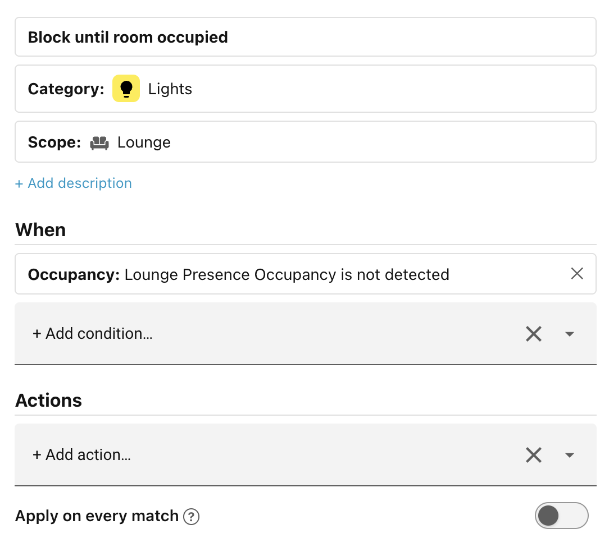
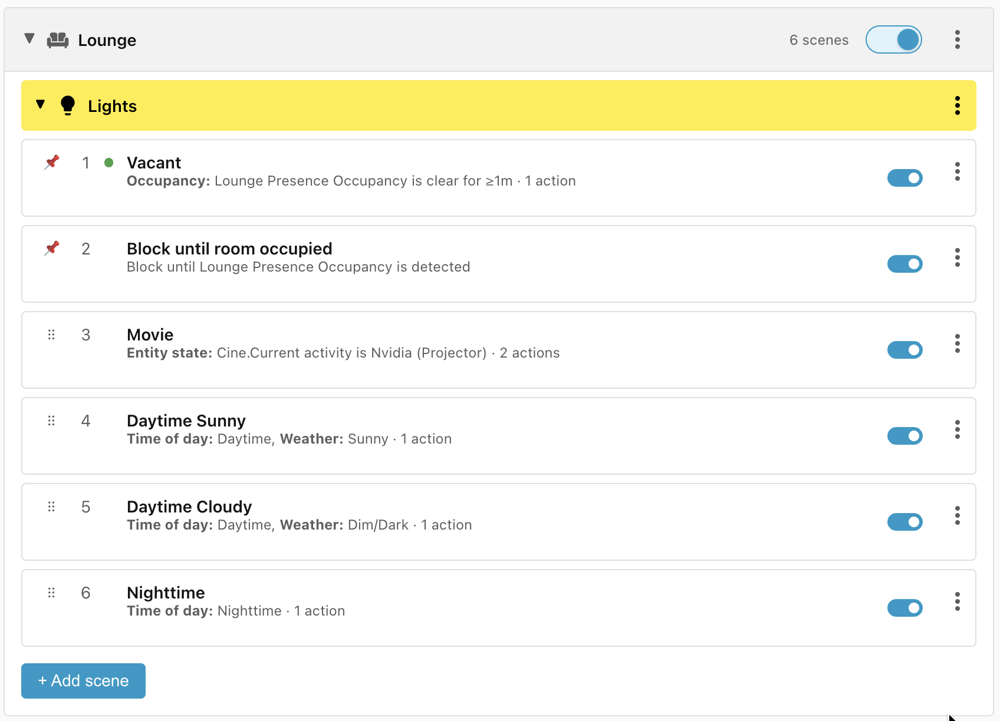
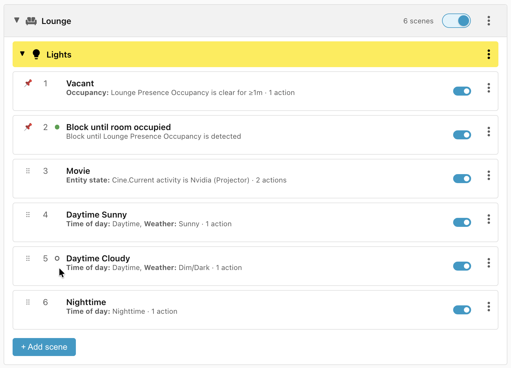
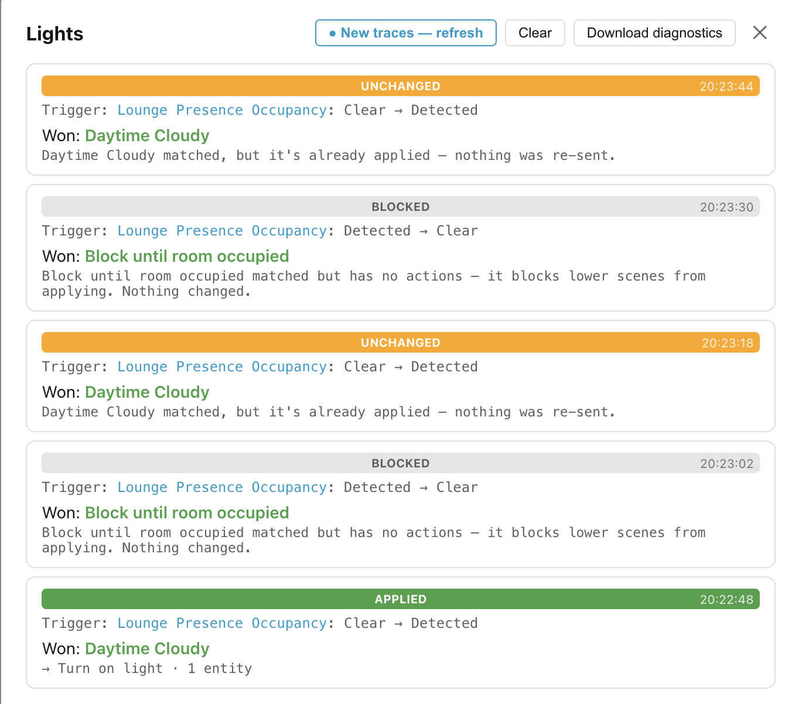

# Step 7: Blocking scenes

The pedants amongst us will have noticed that we only turn off the lights once
the room has been vacant for one minute. We never check that the room is
actually occupied. How is it possible for the room to not be recently occupied,
but for it to be vacant for less than one minute?

This will happen when we restart Home Assistant. The occupancy sensor state will
be **Unknown** before switching to **Clear**. For the next 60 seconds, the
lights in the Lounge will come on until the **Vacant** scene matches again.

We can prevent this by checking that the room is actually occupied, but we don't
want to have to add the check to all threee **Nighttime**, **Daytime Sunny**,
and **Daytime Cloudy** scenes, all of which currently benefit from the single
occupancy check in the **Vacant** scene.

Instead, we can add a **blocking scene** — a scene with conditions but no
actions:

- Click **+ Add scene**.
- Change the name to **Block until room occupied**.
- Add the **Occupancy** condition with entity **Lounge presence**, and change
    **is** to **is not** (and the default **Detected**).
- Click **Save scene**.

By default, this scene sorts below the **Movie** scene, so you may want to drag
it to just after the **Vacant** scene instead, to make sure that all scenes
except **Vacant** are gated on actual occupancy.

## Blocking scene execution

When a blocking scene is the current best matching scene, then it is marked with
the winning scene **green dot**. However, it has no actions to apply, so the
last scene with actions that were applied is marked with a **grey hollow dot**.

If the scene with the grey dot wins again directly after a blocking scene, then
the actions are not re-applied because we assume that they are still in force
from the previous time this scene won.

This can be seen in detail by clicking the **⋮** icon to the right of the
**Lights** header and selecting **View traces**:

______________________________________________________________________

Next: [Step 8: Debugging scenes](step-8-debugging-scenes.md).
