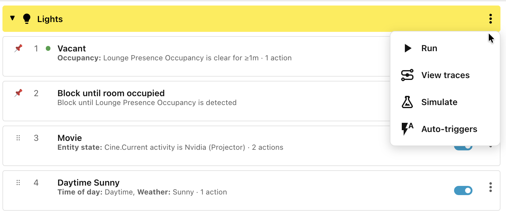
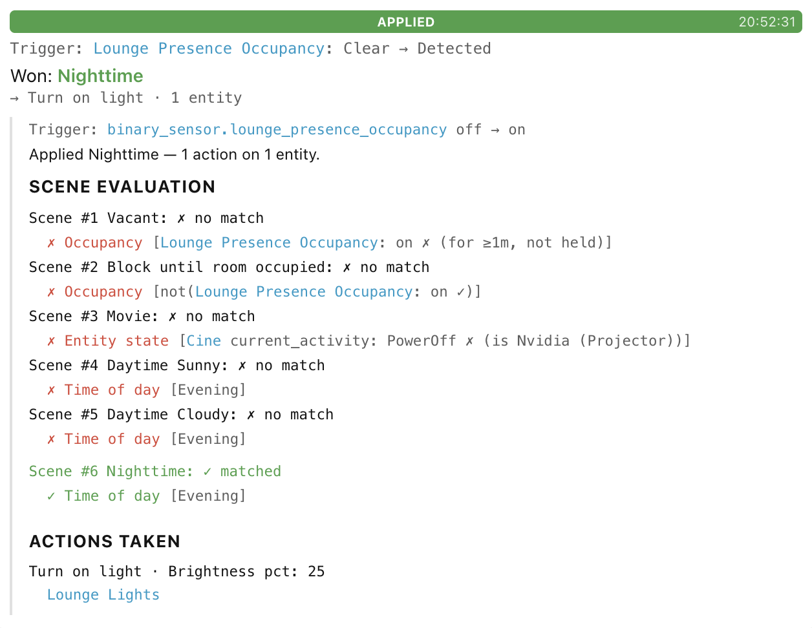

# Step 8: Debugging scenes

There are a number of debugging tools available in the menu behind the **⋮**
icon to the right of the **Lights** category header.

## Auto-triggers and Run

The **Auto-triggers** option will show a list of all of the triggers
automatically derived from the various conditions that you have specified. They
are specific to the scenes in the scope/category group. Whenever any of the
triggers is fired, all of the scenes in the scope/category group are reassessed
to determine the new winning scene (if any).

You can force the scenes to be reassessed without waiting for a trigger by
clicking the **Run** option.

## View traces

The last 5 scene evaluations are recorded in memory and can be viewed by
clicking **View traces**. They are displayed in summary form, explaining what
triggered the evaluation, which scene won, and what action was taken.

Clicking on the coloured bars will expand the trace to show why each condition
did or didn't match, along with the specific actions that were applied.

When new traces become available, click the **New traces - refresh** button to
see them.

You can also use the **Download diagnostics** button to download the
configuration for this scope/category group, along with the details of the
previous 5 traces. This makes debugging reported issues much easier.

## Simulate

The **Simulate** option opens a window with fields representing all of the
conditions that your scenes specify.

You can change the values of each and click **Simulate** to see which scene won,
and expand the trace to see the details of why.

______________________________________________________________________

Next: ...
