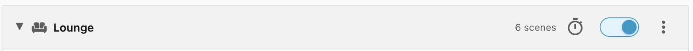
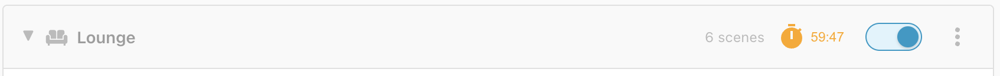
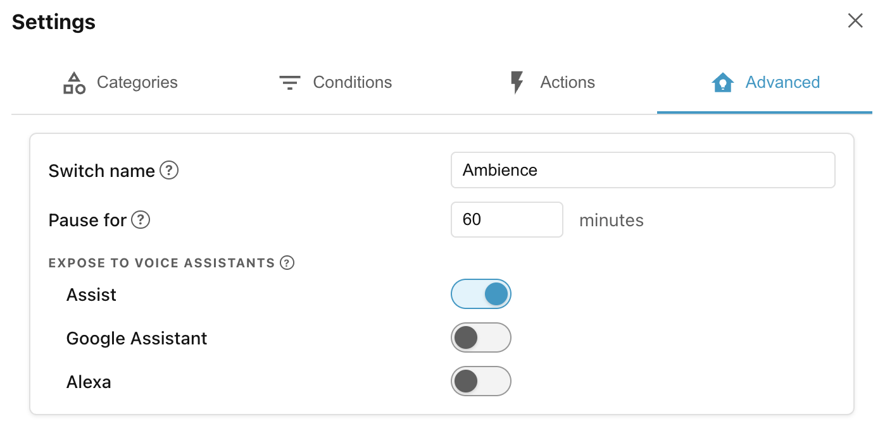

# Step 8: Pausing & disabling scopes

By now your scenes are running automatically. Sometimes, though, you want
Ambience to stop controlling a scope — either for good, or just for a while.
Each scope row gives you two controls for exactly that.

## Disabling scopes

The blue toggle to the right of each scope name allows you to disable Ambience
completely for that scope. Disabled scopes will be moved to the bottom of the
list and any scenes in a disabled scope will be ignored. This is useful to move
scopes which won't have any scenes out of the way, or to disable an entire scope
while you set up the scenes.

## Pausing a scope

Automation is great, but sometimes you want to take control and control things
manually, but just **temporarily**. That is what a scope's **pause switch** is
for.

Every enabled scope has its own pause switch: a `switch` entity named after the
scope, such as **Lounge Ambience**. The pause/resume stopwatch button on the
scope row toggles the switch.

While a scope is paused, Ambience stops applying scenes there and leaves your
devices exactly as they are. When you resume — manually, or automatically once
the pause delay elapses — Ambience re-evaluates and applies the winning scene
again.

Toggling the **House-** or a **floor-switch** cascades down to the scopes
beneath it, so you can turn off Ambience in all scopes with the **House** switch
(but then turn it back on for just a particular room, should you so desire).

And because each pause switch is an ordinary Home Assistant entity, you can
pause and resume from a dashboard, an automation, or your voice assistant: *"Hey
Google, turn off Ambience"* will turn off Ambience for just the room you are in.

By default a scope stays paused until you resume it. To auto-resume after a set
time, to rename the switches, or to expose them to voice assistants, see the
**Advanced** tab in the **Settings**.

______________________________________________________________________

Next: [Step 9: Debugging scenes](step-9-debugging-scenes.md).
