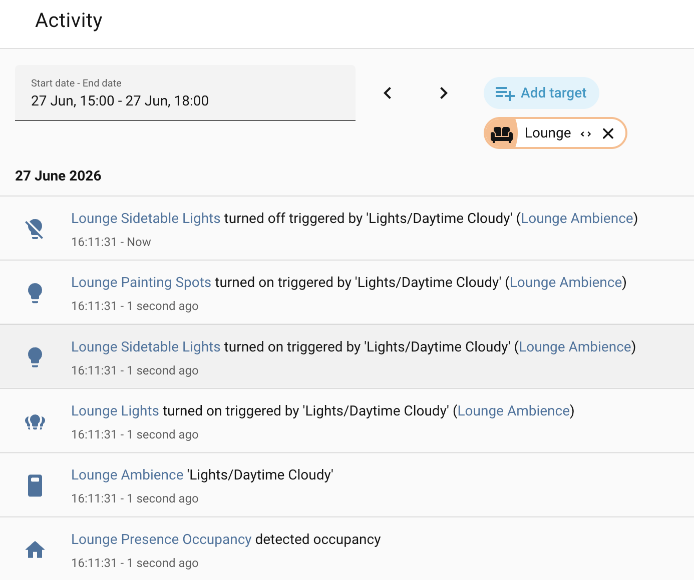
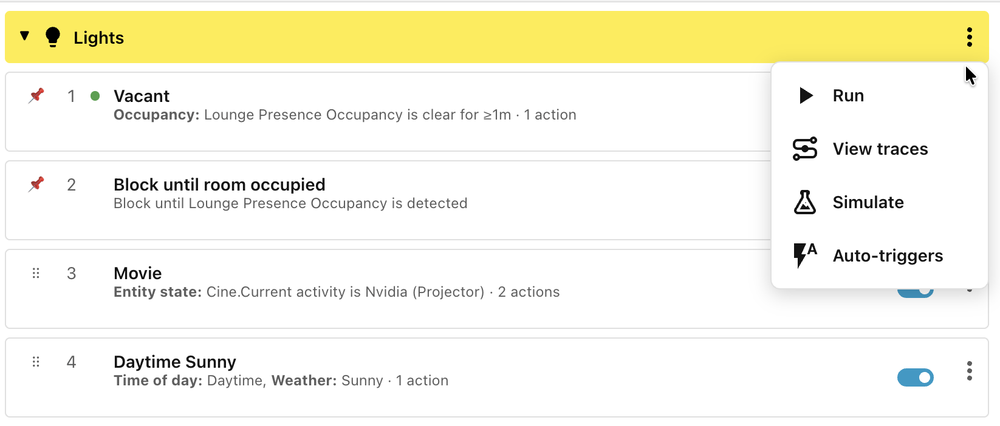
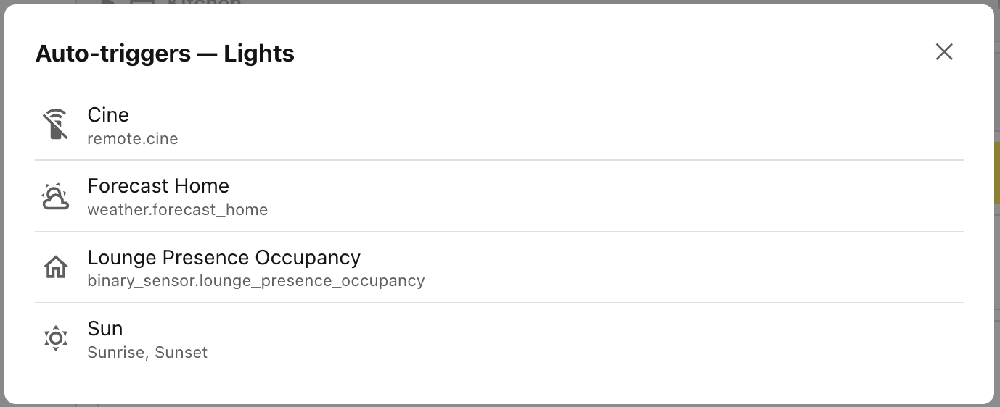
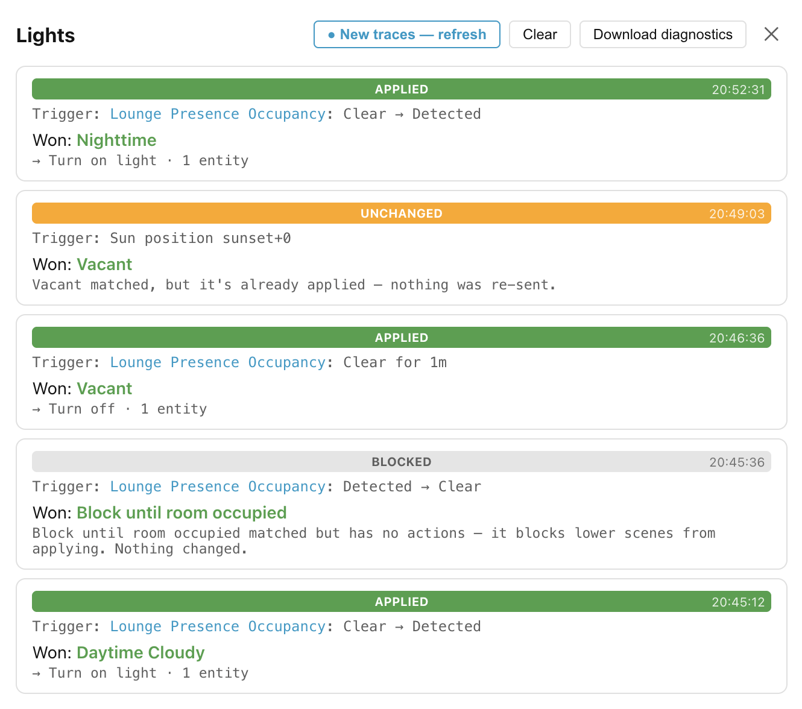
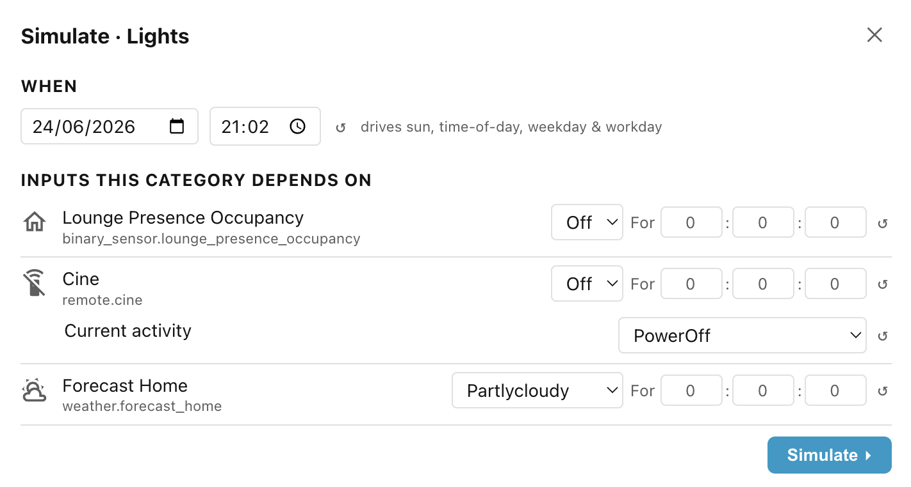
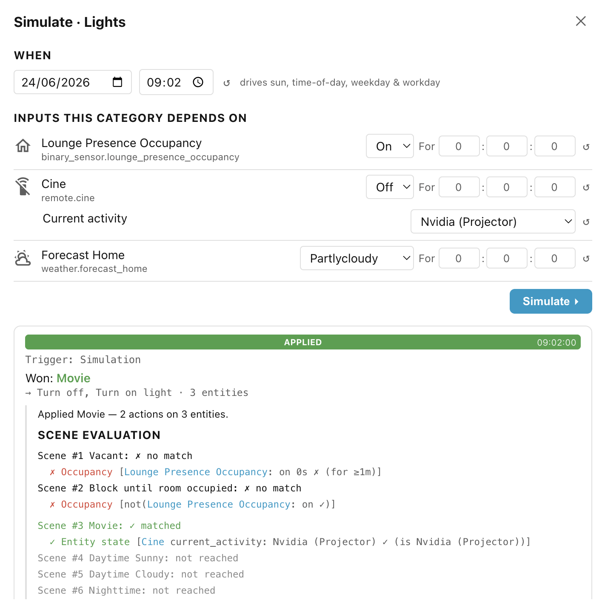

# Step 9: Debugging scenes

Ambience gives you several ways to see what your scenes are doing and why: a
record of what has already happened (the **activity log**), plus a set of live
tools in the **⋮** category menu.

## Activity log

Every time a scene is applied, Ambience records it in Home Assistant's
**Logbook**, against that scope's
[pause switch](step-8-pausing-and-disabling-scopes.md#pausing-a-scope).

Because each area's switch is tied to the same area, you can open the
**Logbook** and **filter by area** to see only the scene activity for that
space. The devices the scene changed are attributed to it as well so you can
trace a device's change back to the scene that caused it. Entries persist for as
long as Home Assistant's Logbook retains history; there is no separate Ambience
limit.

## The category menu

The rest of the debugging tools live in the menu behind the **⋮** icon to the
right of the **Lights** category header.

## Auto-triggers and Run

The **Auto-triggers** option will show a list of all of the triggers
automatically derived from the various conditions that you have specified. They
are specific to the scenes in the scope/category group. Whenever any of the
triggers is fired, all of the scenes in the scope/category group are reassessed
to determine the new winning scene (if any).

You can force the scenes to be reassessed without waiting for a trigger by
clicking the **Run** option.

## Traces — why a scene won

Every time Ambience evaluates a scope/category pair it records a *trace*: what
triggered the evaluation, which scene won (if any), and how each condition came
out. Click **View traces** in the category menu to browse these recent
evaluations without leaving the panel. A **Refresh** button appears highlighted
when Ambience has recorded newer entries since you opened the viewer.

### Reading a trace entry

Each entry has a coloured **outcome bar**:

- **applied** (the winning scene's actions ran, also when triggered by **Run**
    or a
    [**Re-run**](../../actions/apply-on-every-match/#re-run-all-scenes-after-inactivity)),

- **blocked** (a scene won but has no actions to run — a pure blocker),

- **unchanged** (a scene won, but it is the one already applied, so its
    identical actions were suppressed),

- **no match** (no scene matched), or

- **skipped** (the unit was not evaluated — expand it to see why: the scope's
    pause switch is off, the scope is disabled, or the triggering entity dropped
    out).

Below the bar, each entry shows:

- the **Trigger**, that caused the scene group to be evaluated, such as an
    entity state change, the **Time of day**, **Sun position**, **Startup** of
    Home Assistant, the scope config was **Reloaded**, and more,
- and the scene that **Won** (if any).

### Expanding the detail

Click a trace's **outcome bar** to expand it — the whole bar is the toggle. The
expansion adds two sections:

- **Scene evaluation** lists every scene that was considered, whether it matched
    or not, and why.

- **Actions taken** lists every service call that was made, with the action
    name, any parameters (for example `Turn on light · Brightness: 60`), and the
    entities targeted. An action whose service is no longer exposed is tagged
    *skipped (not exposed)*.

## Simulate

The **Simulate** option lets you ask "what would Ambience do if conditions were
different?" without touching your home. It runs a full scene evaluation against
invented inputs and shows the result using the same trace-detail view as the
traces above. It opens pre-filled with live values from your home, so the first
run (before you change anything) shows what Ambience would decide right now.

You can change:

- **Date and time** — if any condition depends on time (time of day, sun,
    weekday, workday), a *When* row appears with a date and a time picker.
    Changing them drives all time-derived conditions at once.
- **Entity states and attributes** — each entity a condition depends on appears
    as a row: a dropdown for known state sets (presence, weather), a number
    field for numeric entities, a text field otherwise. Relevant attributes
    appear as indented rows beneath, and each row has a reset button (↺) that
    restores the live value.
- **Opaque condition verdicts** — conditions that cannot be broken into entity
    controls (a template, or a third-party integration) appear as true/false
    dropdowns labelled with the condition name.

Click **Simulate ▸** to run. The result appears below as a single trace-detail
card you can expand to see which conditions passed and which actions would have
run. It describes what *would* happen, not what actually happened in your home
(so it never shows **unchanged**).

______________________________________________________________________

If a problem still has you stuck, see
[Reporting an issue](../reporting-an-issue.md) for how to capture diagnostics
and debug logs.

Next: [Conditions](../conditions/index.md).
