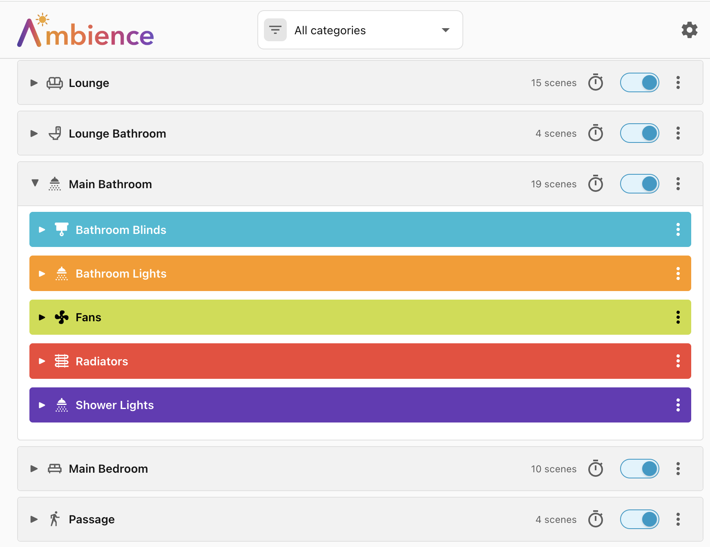
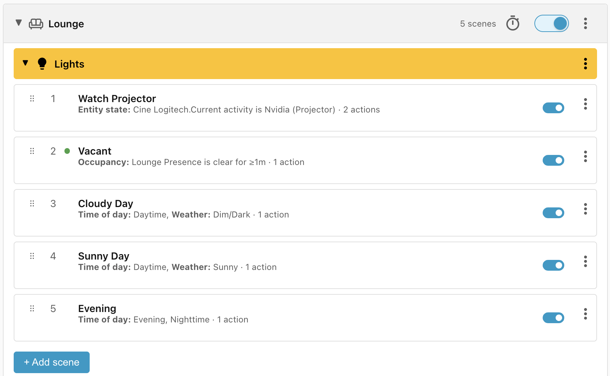
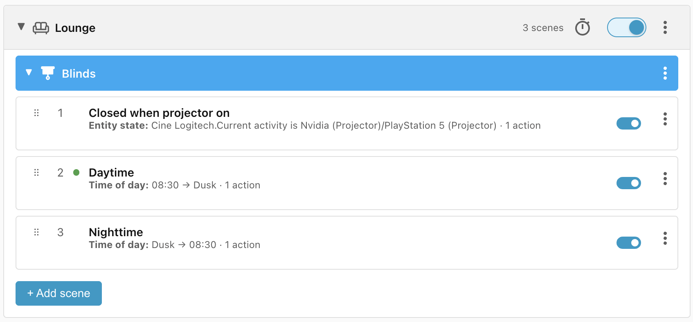
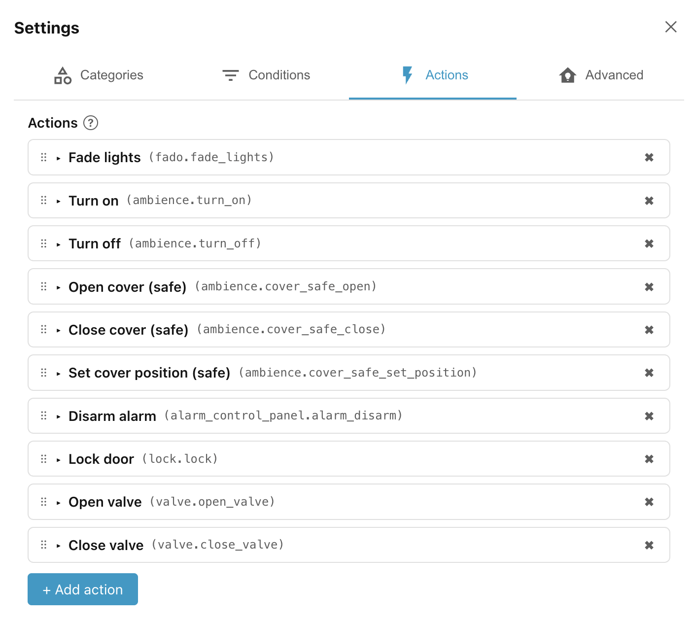
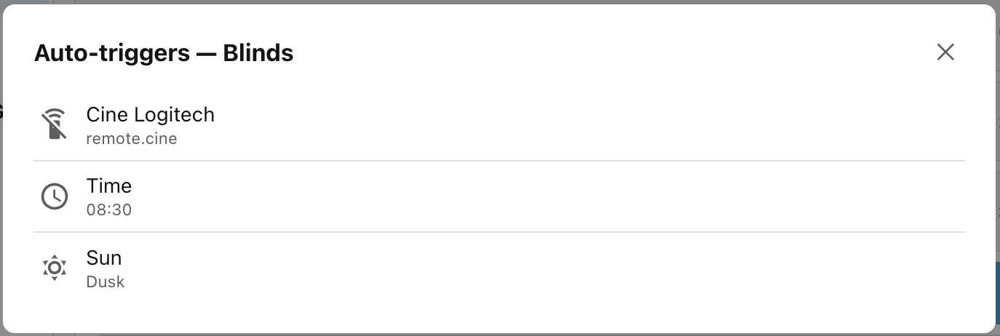
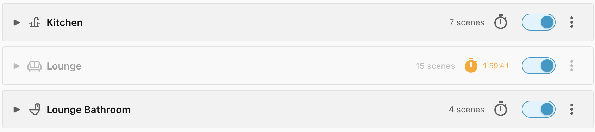
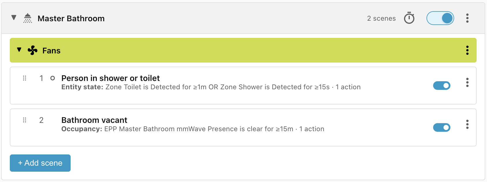
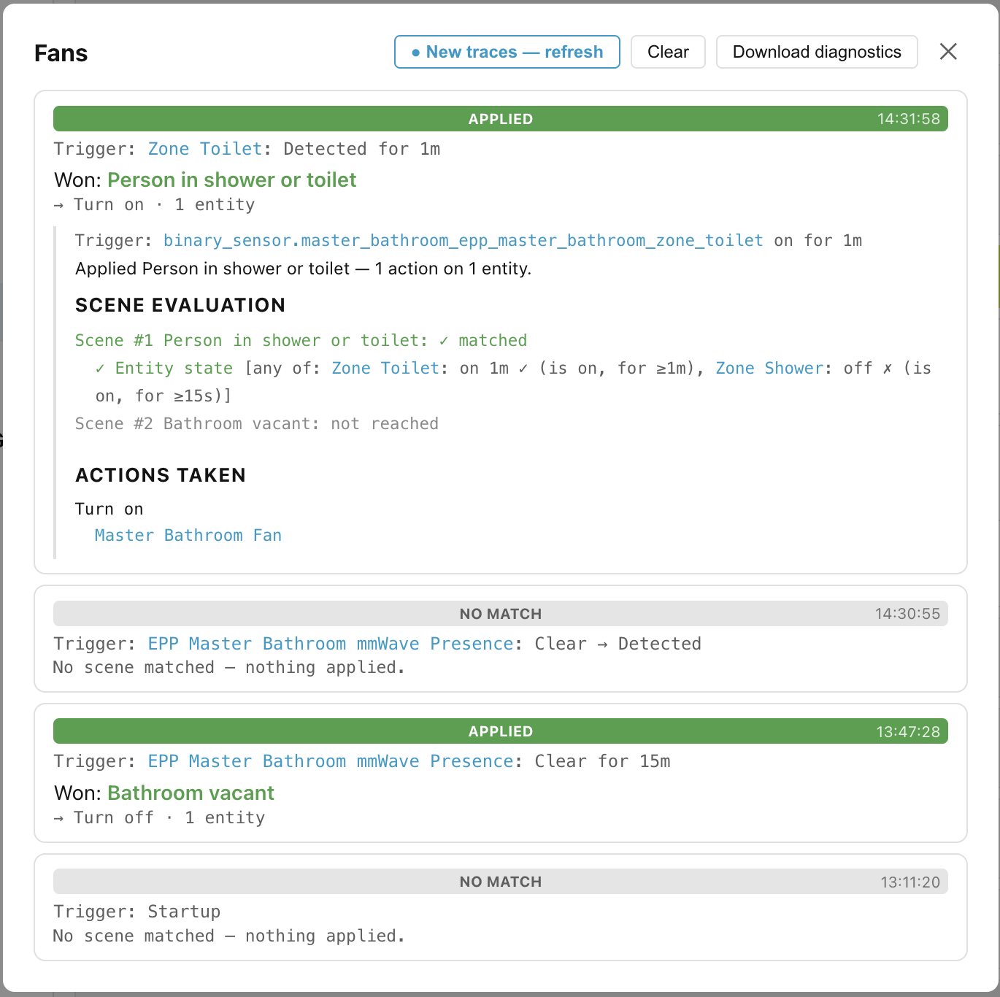
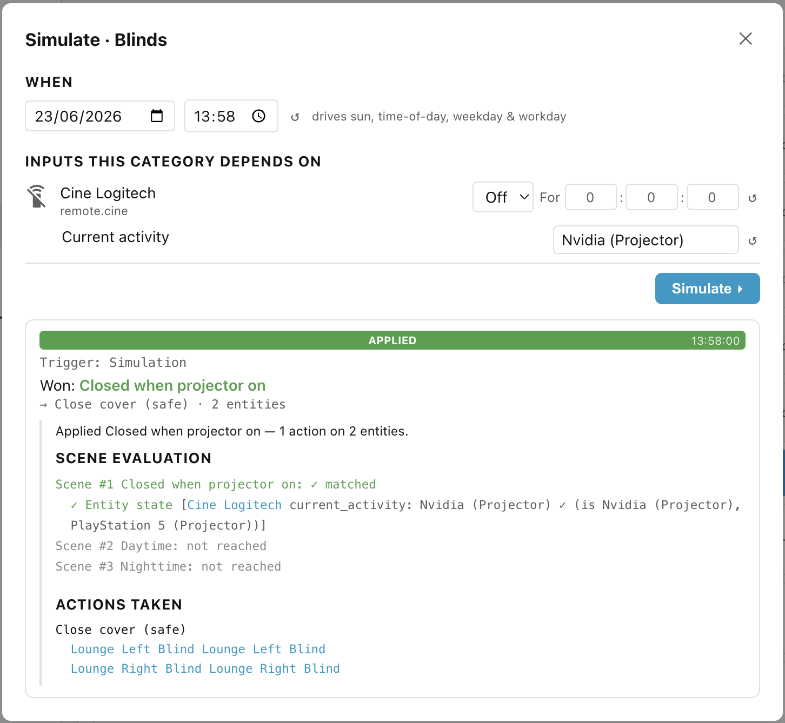
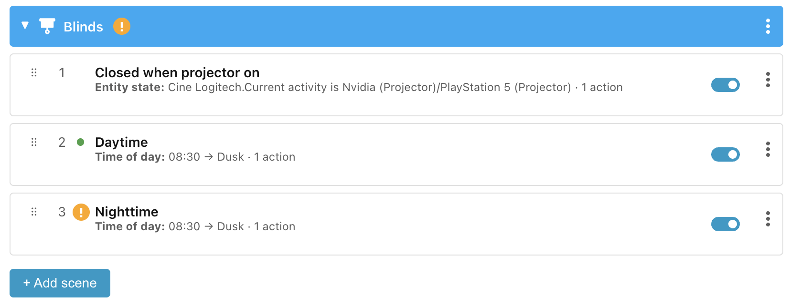

# Introduction

Ambience is a **condition-based scene engine** for Home Assistant. You describe
scenes for a room — _"Room is empty"_, _"Movie time"_ — along with the
conditions under which each scene should apply — _"Projector is turned on"_,
_"Person in room"_, _"Daytime"_, _"Cloudy weather"_. Ambience watches your home
and applies the best-matching scene automatically.

## The problems with Scenes

Home Assistant already has a concept called Scenes.

- They describe the desired state of the devices in the room, not **how** those
    devices should reach that state.
- They can be **verbose**, **difficult to read**, and **difficult to compare**
    one with another.

## The problems with Automations

Automations are powerful, flexible, configurable, and generic. You can do
anything with them but, most of the time, you just want to do a few things
easily.

- They can be **verbose** and **difficult to read**.
- It is **difficult to compare** one with another.
- They are **trigger-based**: _"When a person enters the room, then turn the
    lights on."_ But what happens if the person is already inside the room? How
    do you apply the correct scene based on the **current conditions**?
- **Competing automations** can clash with each other for control over the same
    device.
- In spite of automation tracing, they are **difficult to debug**.
- It's not easy to detect **dead or unreachable configuration**.
- There's no simple way to **disable all automations** for a room or floor or
    house. You can disable individual automations, but when you re-enable them
    the room doesn't automatically update to the current desired state.

## What Ambience does differently

Ambience changes the way to think about scene management.

### Conditions, actions, and auto-triggers

Instead of defining the events that trigger a change of scene — _somebody enters
the living room_, or _somebody turns on the projector_ — think about the
**conditions** that define the scene, the state that the devices in that scene
should be in, and how they should reach that state:

| Conditions                                             | Device state                                     |
| ------------------------------------------------------ | ------------------------------------------------ |
| The projector is on for movie time                     | Fade lights off, except side-table lights at 10% |
| The room is vacant for more than 1 minute.             | Fade lights off                                  |
| The room is occupied during the day, when it is sunny  | Fade lights to 40%                               |
| The room is occupied during the day, when it is cloudy | Fade lights to 60%                               |
| The room is occupied during the evening or nighttime   | Fade lights to 25%                               |

These conditions are automatically sorted by **priority** and **specificity**,
and they are used to **auto-derive triggers**. When one of these triggers fires,
the conditions are reassessed, the highest priority matching scene wins, and the
winning scene is applied by calling the specified **actions**.

### Scopes and categories

A **scene** (a named set of conditions and actions) belongs to a **scope** (i.e.
the whole **House**, a **Floor**, or an **Area** or room). While conditions can
reference entities anywhere in the house, actions are limited to the devices in
the chosen scope. This is to make them simpler to manage and specify.

On top of that, different **categories** of devices are subject to different
lifecycles. The lights from our previous example are governed by different
conditions than would be window blinds, although some of those conditions might
overlap:

| Conditions                                     | Device state  |
| ---------------------------------------------- | ------------- |
| The projector is on for movie time             | Blinds closed |
| Between dusk and sunrise (but not before 8:00) | Blinds closed |
| Between sunrise (but not before 8:00) and dusk | Blinds open   |

A **single winning scene** is chosen only from the scenes belonging to the
**same scope and category**. Because exactly one scene wins per scope and
category, there is no way for two rules to clash over the same device; the
winner is always well defined.

### Actions

Home Assistant Scenes allow you to specify the state that you want devices to
achieve. In Ambience you specify which **actions** to call to apply the new
state. That means you can control how entities achieve the desired state.

For instance, many lights don't support the `transition` parameter provided in
HA Scenes. Instead you can use the
[Fado Light Fader](https://github.com/clintongormley/ha-fado) custom integration
that provides smooth light fading for brightness, colours, and colour
temperatures, and support for native transitions where available.

To make scene configuration simpler, you expose just the actions that you need,
with just the fields that matter to you.

### Triggers

Ambience examines all of the conditions in a scope/category group and
auto-generates a list of triggers to install. When any of those triggers fires,
all of the scenes in that group are reassessed.

### Switches

Each scope has its own independent **toggle** that pauses or resumes Ambience's
automatic control for that scope. The House and Floor toggles **cascade
downwards**, so if you turn off the Floor toggle it will also turn off the Areas
on that floor, and if you turn off the House toggle it'll disable Ambience
everywhere. But because toggles are independent, you can, for example, turn off
the House toggle and then reenable just the room you are in.

These switches can be added to a dashboard or exposed to your voice assistant so
that a simple _"Hey Google, turn off Ambience"_ will pause automations in your
current room until you turn them on again, or for a configurable number of
minutes.

### Readable, traceable, and testable

Scenes are described using human-friendly language with a compact format that
makes them easy to understand and to compare with each other.

Here are two simple rules which control an extractor fan in a bathroom:

- **Person in shower or toilet:** When a person has been in the shower for at
    least 15 seconds, or on the toilet for at least 1 minute, then turn on the
    extractor fan.
- **Bathroom vacant:** When the bathroom has been vacant for at least 15
    minutes, turn off the fan.

#### Tracer

The details of the five most recent executions can be viewed to determine which
scene won and why the other scenes failed to match. Below is a trace explaining
why the **Person in shower or toilet** scene won.

#### Simulator

You can even use the simulator to change the current conditions (e.g. time or
weather) to see if your conditions are working as you expected.

#### Flagged problems

The editor also flags **unreachable scenes** — scenes that can never win because
an earlier scene will always match first, making it obvious where problems need
to be solved.

Ready to try it? Start with [Installation](installation.md).
