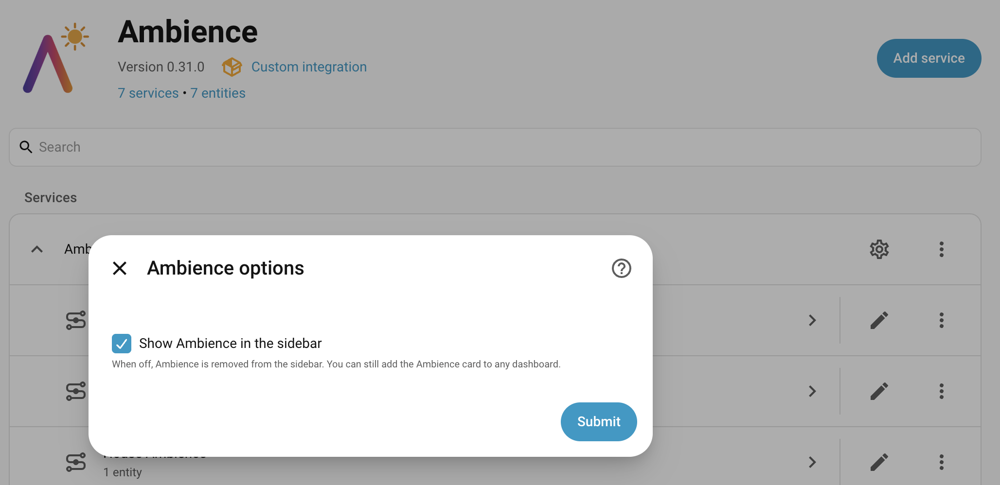
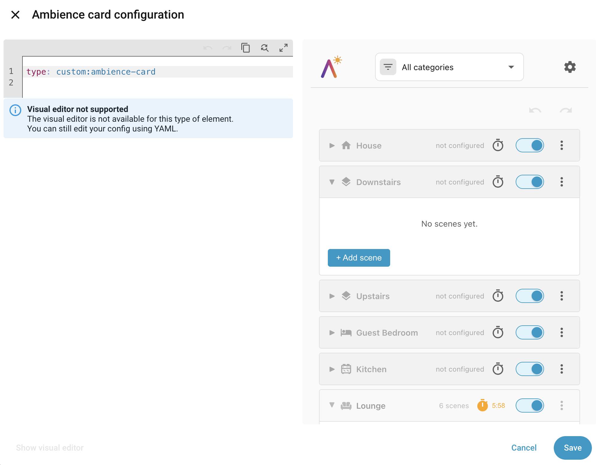
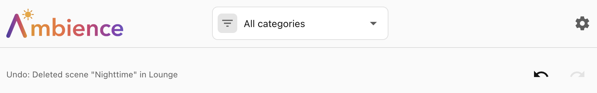

# The panel and the card

Ambience gives you one interface — the scene manager — that you can use in two
places: as a dedicated **sidebar panel**, or as a **card** on any dashboard.
Both provide the same controls, so pick whichever suits how you like to work.

## The panel

Once you have added the integration, an **Ambience** entry appears in the Home
Assistant sidebar. The panel is visible to **administrator users only** — Home
Assistant hides it from non-admin users. If you are an admin and the entry does
not appear, hard-refresh the HA web UI (Ctrl-F5 / Cmd-Shift-R).

### Showing or hiding the panel

Whether the sidebar entry is shown is the integration's **only** configuration
option. Go to **Settings → Devices & Services**, find the Ambience integration,
and open its **Configure** dialog.

**Show Ambience in the sidebar** is enabled by default. Uncheck it to remove the
sidebar entry, if you would instead like to reach Ambience only through a
dashboard card.

## The card

You can add the **Ambience card** to any dashboard. The card provides the same
interface as the panel, and is useful if you want to embed Ambience within an
existing dashboard layout rather than giving it a dedicated sidebar panel. You
add it like any other card, through the dashboard editor.

## Undo / redo

The scene manager keeps the last 30 scene-list changes in memory. Undo and Redo
buttons at the top step back and forward through those changes (or use Ctrl/⌘+Z
and Ctrl/⌘+Shift+Z). A caption beside the buttons always names the change that's
next, e.g. *Undo: Deleted scene "Movie night" in Living Room*.

The history is global (it spans the house and every area and floor), is shared
across browser tabs, and is cleared when Home Assistant restarts. When you
change scenes in one tab, other open tabs refresh automatically; if a tab has
the scene editor open on the scope that changed, it shows a "changed in another
tab — Refresh" banner instead of reloading underneath your edit. Changes to
categories, time periods, lux ranges, and the whole-scope on/off switch are not
part of undo.
