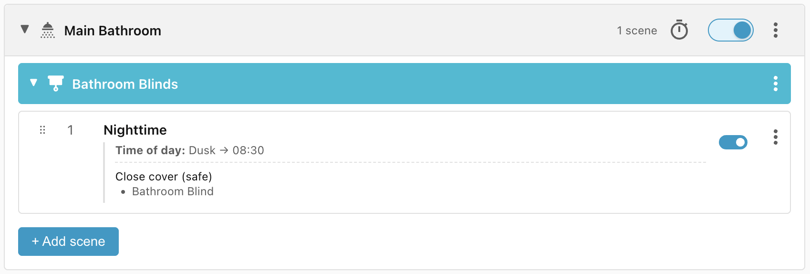
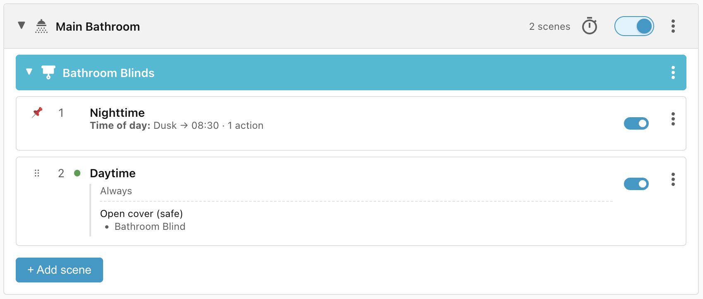
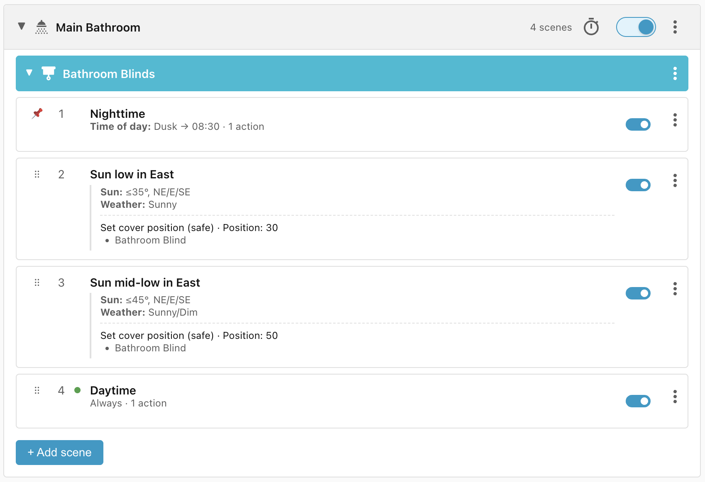
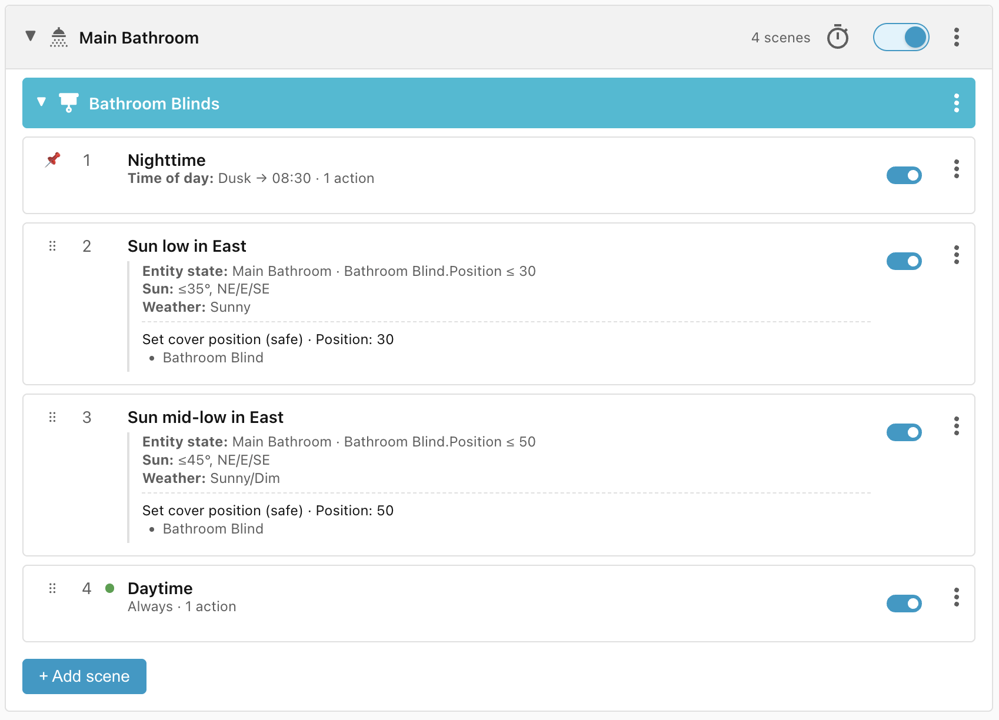
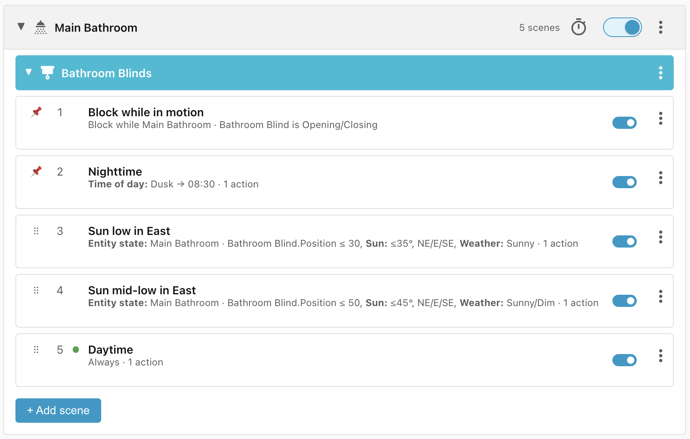

# Bathroom blind

This recipe describes the lifecycle of the window blind in the bathroom. I want
the blind to be open between 8:30 am and dusk and closed between dusk and 8:30
am.

On top of that, the blind faces east so in the early morning the light can be
blinding, so I want the blind to open gradually, especially when it is sunny.
However, if I decide to open the blind manually before time, then I don't want
Ambience to close the blind automatically again.

## Requirements

- **Bathroom blind** - Cover entity to control the blind and which exposes the
    current position of the blind.

## Scene: Nighttime

The clearest condition is the **Nighttime** scene where the blind should be
closed between dusk and 8:30 am:

!!! note "Close cover (safe)"

    We have used the built-in **Close cover (safe)** action, which first checks the
    position of the cover and only closes the blind if it is not already closed, to
    avoid activating the blind motor.

## Scene: Daytime

The second scene specifies that the blind should be open between 8:30 am and
dusk.

Note that the **Daytime** scene doesn't specify a time-of-day. That's because we
know that if the **Nighttime** scene (which only matches between dusk and 8:30
am) doesn't match, then any scenes after that are guaranteed to be in the
daytime range.

## Scenes: Sun low in East, Sun mid-low in East

Next, I want the blind to open gradually to prevent the sun from shining into
the bathroom too brightly. To accomplish this I add two scenes:

**Sun low in East:**

- the sun is in the NE, E, or SE quadrant,
- the sun is no more than 35º above the horizon,
- and the **weather is sunny**.

→ Opens the blind to 30%.

**Sun mid-low in East:**

- the sun is in the NE, E, or SE quadrant,
- the sun is no more than 45º above the horizon,
- and the **weather is sunny or dim**.

→ Opens the blind to 50%.

The first scene only matches if the weather is sunny. The second matches if the
weather is sunny or dim, and if the weather is **dark** then neither matches.

## Problem: Don't override manual opening

If somebody opens the blind manually then we don't want either scene to match,
otherwise Ambience would immediately close the blind to 30% or 50% again. To
accomplish this we add an **entity state** condition to check that the blind
position is lower than the position we're about to open to (i.e. 30% or 50%).

Because these two scenes use the **entity state** condition (which has a high
priority), they would normally be sorted above the **Nighttime** scene, but we
need the **Nighttime** scene time-of-day condition to act as a gate for the
daytime scenes, so we manually move it to the highest priority.

## Problem: Opening the blind triggers reevaluation

Because we check the blind position in **Sun low/mid-low in East**, if we were
to open the blind manually then it would trigger reevaluation of the scenes and
potentially stop opening at 30% or 50%. To avoid this we can add a scene that
blocks evaluation while the blind is opening or closing:

## Lifecycle

| Trigger                                                                                         | Matched Scene       | Action              |
| ----------------------------------------------------------------------------------------------- | ------------------- | ------------------- |
| Dusk falls                                                                                      | Nighttime           | Blind closes        |
| At 8:30 am, blind is closed, sun is in the East at 25º above the horizon, and it is sunny       | Sun low in East     | Blind opens to 30%  |
| At 8:30 am, blind is closed, sun is in the East at 25º above the horizon, and it is cloudy      | Sun mid-low in East | Blind opens to 50%  |
| At 8:30 am, blind is closed, sun is in the East at 25º above the horizon, and it is very cloudy | Daytime             | Blind opens to 100% |
| At 8:30 am, blind is fully open, sun is in the East at 30º above the horizon, and it is sunny   | Daytime             | Blind remains open  |
| At 9:05 am, blind is open to 30%, sun is in the East at 36º above the horizon, and it is sunny  | Sun mid-low in East | Blind opens to 50%  |
| At 9:45 am, blind is open to 50%, sun is in the East at 46º above the horizon                   | Daytime             | Blind opens to 100% |
