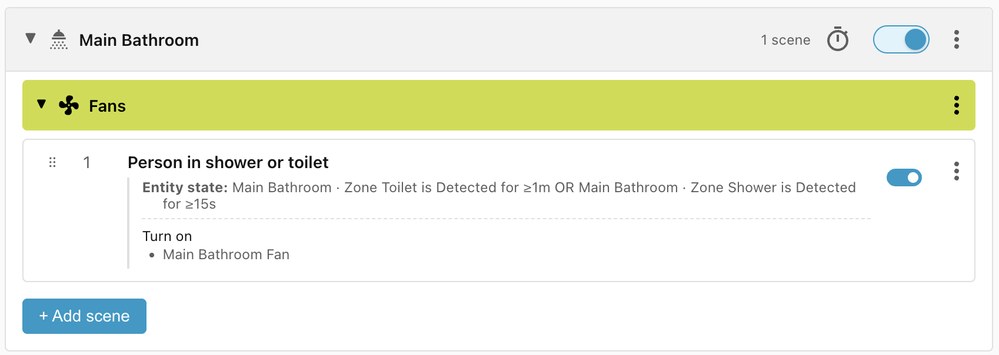
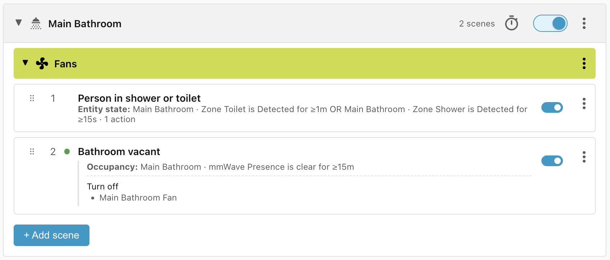

# Bathroom extractor fan

This simple recipe controls the extractor fan in the bathroom. The fan should be
turned on when somebody uses the shower or the toilet.

## Requirements

- **Bathroom mmWave Presence** - Occupancy sensor for the bathroom.
- **Zone Shower** - Occupancy sensor for the shower area.
- **Zone Toilet** - Occupancy sensor for the toilet area.
- **Bathroom Fan** - Extractor fan.

## Scene: Person in shower or toilet

The first scene turns on the extractor fan either when somebody is detected in
the shower area for at least 15 seconds, or in the toilet area for at least 1
minute (shorter visits probably don't need the extractor fan).

## Scene: Bathroom vacant

The second scene turns off the extractor fan after the bathroom has been vacant
for 15 minutes.

## Lifecycle

| Trigger                                 | Matched Scene              | Action                 |
| --------------------------------------- | -------------------------- | ---------------------- |
| Person goes to toilet for 45 seconds    | No match                   | None                   |
| Person goes to toilet for 5 minutes     | Person in shower or toilet | Extractor fan turns on |
| Person showers for 10 minutes           | Person in shower or toilet | None — already applied |
| Person leaves bathroom                  | No match                   | None                   |
| Person enters bathroom 5 minutes later  | No match                   | None                   |
| Person goes to toilet for 5 minutes     | Person in shower or toilet | None — already applied |
| 15 minutes after person leaves bathroom | Bathroom vacant            | Fan turned off         |
