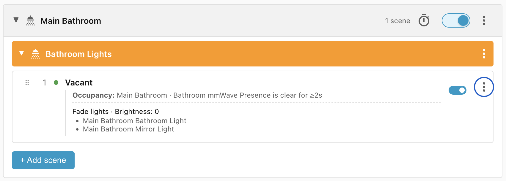
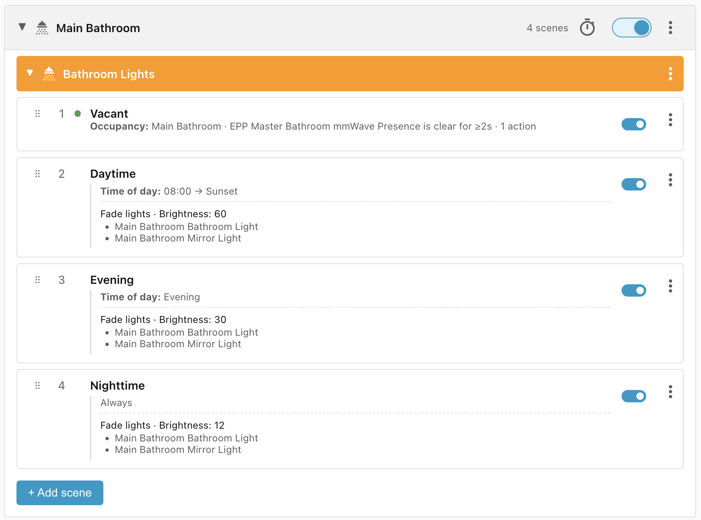
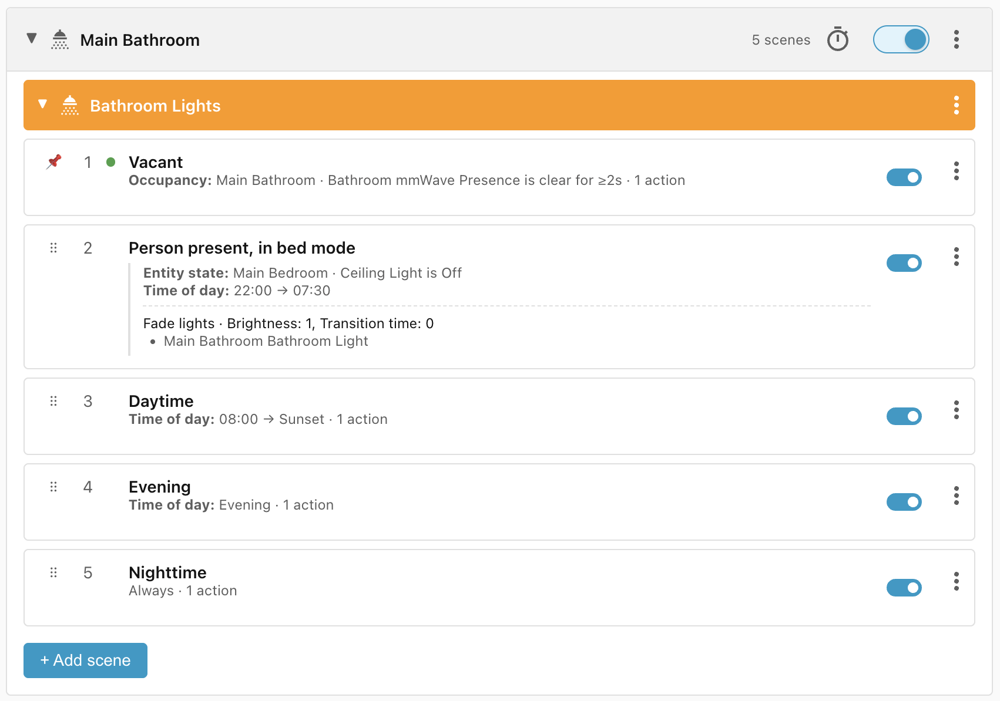

# Bathroom lights

This recipe describes the lifecycle of the main lights in the bathroom. There is
a separate recipe for the [lights in the shower](../shower-lights/), which run
on a different lifecycle.

These lights should be:

- off when the bathroom is empty,
- at 60% when the bathroom is occupied between 8:00 am and sunset,
- at 30% when the bathroom is occupied during the evening (sunset to dusk),
- at 12% when the bathroom is occupied from dusk to 8:00 am,
- at 1% when the bathroom is occupied between 22:00 and 7:00 am, when the
    adjoining bedroom is in "bed mode", to avoid waking up the person in bed (or
    waking yourself up with too bright lights in the middle of the night).

## Requirements

- **Bathroom mmWave Presence** - Occupancy sensor for the bathroom.
- **Bathroom light** - The main light in the bathroom, can fade from 0 - 100%.
- **Mirror light** - The light surrounding the mirror, on/off only.
- **Bedroom ceiling light** - The main light in the bedroom.

## Scene: Vacant

The first scene turns off the lights when the occupancy sensor goes clear for 2
seconds (a small timeout to catch false positives):

## Scenes: Daytime, Evening, Nighttime

The next three scenes cover the daytime, evening, and nighttime light settings.
**Daytime** covers 8:00 am to sunset, the **Evening** time of day covers sunset
to dusk, and the **Nighttime** scene doesn't need to specify a time range
because **Daytime** and **Evening** will match any times that aren't between
dusk and 8:00 am.

There is no need to specify an **Occupancy** condition on these scenes because
they come after the **Vacant** scene. If the **Vacant** scene's **Occupancy is
clear** condition doesn't match, then that means the bathroom is occupied.

## Scene: Person present, in bed mode

The only way to reach the bathroom is via the adjoining bedroom. If somebody
enters the bedroom then the lights turn on. When that person climbs into bed,
they turn the lights off. That means that we can assume that the bedroom is in
"bed mode" if the main bedroom light is off.

In this case, we fade the bathroom light to 1% and leave the mirror light off,
as it would be too bright.

Should the person who has entered the bathroom want to make the bathroom light
brighter, or to turn on the mirror light, they can do so manually. There is no
trigger that will reset the lights until the bathroom becomes vacant again.

**Note**: we've manually moved the **Vacant** scene above the **Person present,
in bed mode** scene because it's **Occupancy** condition gates all of the other
scenes.

## Lifecycle

| Trigger                                                           | Matched Scene               | Action                      |
| ----------------------------------------------------------------- | --------------------------- | --------------------------- |
| Bathroom becomes vacant for 2 seconds                             | Vacant                      | Lights fade off             |
| Person enters bathroom at 9:00 am                                 | Daytime                     | Lights fade to 60%          |
| Person enters bathroom at sunset                                  | Evening                     | Lights fade to 30%          |
| Person enters bathroom at 23:00, bedroom Ceiling light is **on**  | Night                       | Lights fade to 12%          |
| Person enters bathroom at 23:00, bedroom Ceiling light is **off** | Person present, in bed mode | Bathroom lights fades to 1% |
