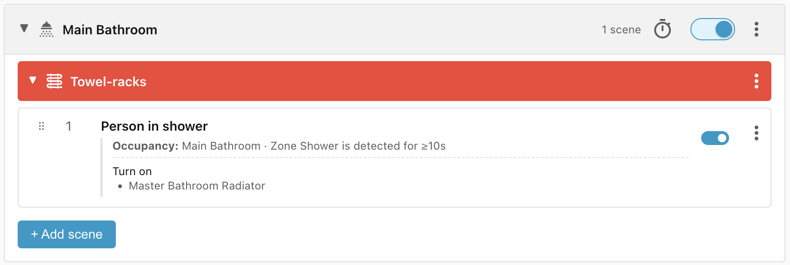
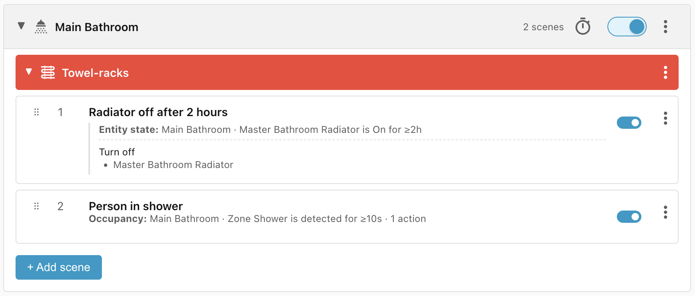
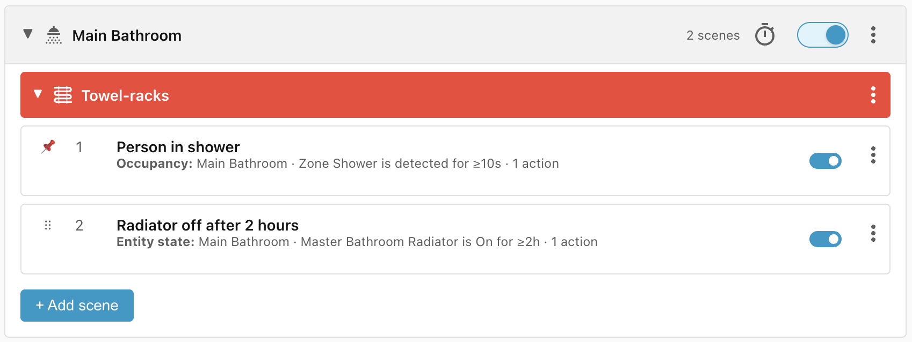
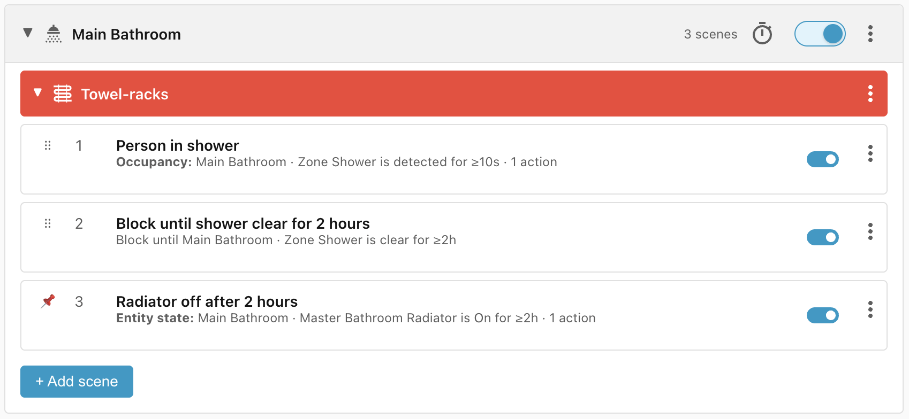

# Bathroom towel rack

This recipe is about how to use the towel rack in the bathroom to dry the towels
after somebody has showered, so that the towels are ready for use for the next
time that somebody showers, whatever time that may be.

In this example we aren't trying to heat up the towels before use, as that would
require us to know at what times people shower.

## Requirements

- **Zone Shower** - an occupancy sensor which tells us when somebody is in the
    shower
- **Radiator** - the towel rack

## Scene: Person in shower

The first scene is intended to turn on the towel-rack (or radiator) once
somebody has been detected in the shower for at least 10 seconds. The 10 seconds
delay is to account for jitter that is often seen with presence sensors.

## Scene: Radiator off after 2 hours

The second scene is intended to turn the radiator off after it has been on for
two hours, which should be enough time to ensure the towels are dry.

An **entity state** condition has a higher priority than an **occupancy**
condition which means that turning the radiator off after 2 hours takes priority
over detecting a person in the shower.

## Problem: Multiple showers

What if somebody has a shower 1h55 minutes after the first person? The radiator
would turn off 5 minutes later and the newly wet towels wouldn't have time to
dry.

We could switch the order of the conditions:

This wouldn't solve the problem because, when the second person enters the
shower, the radiator is already on and so the **last-updated** time wouldn't be
updated.

## Scene: Block until shower clear for 2 hours

Instead, we can add a third scene which will block until the shower has been
clear for at least two hours, and move the radiator-off scene below that:

## Lifecycle

| Trigger                                   | Matched Scene              | Action                     |
| ----------------------------------------- | -------------------------- | -------------------------- |
| Person enters the shower for 5 seconds    | No match                   | None                       |
| Person enters the shower for 10 seconds   | Person in shower           | Radiator turns on          |
| Person leaves the shower after 10 minutes | No match                   | None                       |
| Person enters the shower 1 hour later     | Person in shower           | No action, already applied |
| Person leaves shower                      | Block until shower clear   | None                       |
| Shower clear for 2 hours                  | Radiator off after 2 hours | Radiator turns off         |
