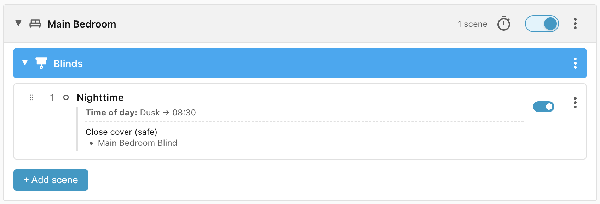
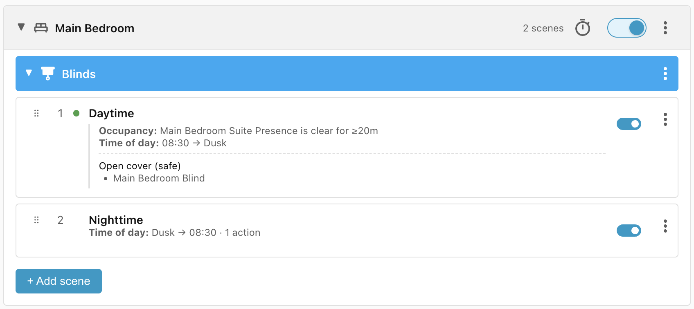

# Bedroom blinds

This simple recipe controls the blinds in the bedroom. They should close at dusk
and remain closed until no earlier than 8:30 am, but they should only open when
the bedroom (and bathroom) are vacant. Given that presence sensors can lose
people asleep in bed for extended periods, we will add a required delay to the
vacancy condition of 20 minutes.

## Requirements

- **Main Bedroom Blind** - a cover entity that responds to `cover.open|close`
    actions.
- **Main Bedroom Suite Presence** - an occupancy sensor that tells us whether
    the main bedroom and bathroom are occupied or vacant.

## Scene: Nighttime

The blind should be closed between dusk and 8:30 am:

## Scene: Daytime

The blind should open at earliest at 8:30 am if the bedroom/bathroom are
unoccupied, or 20 minutes after the bedroom/bathroom become unoccupied:

## Lifecycle

| Trigger                                               | Matched Scene | Action       |
| ----------------------------------------------------- | ------------- | ------------ |
| At dusk                                               | Nighttime     | Blind closes |
| At 8:30, room unoccupied                              | Daytime       | Blind opens  |
| At 8:30, room occupied                                | No match      | None         |
| 20 minutes after room becomes unoccupied, before dusk | Daytime       | Blind opens  |
