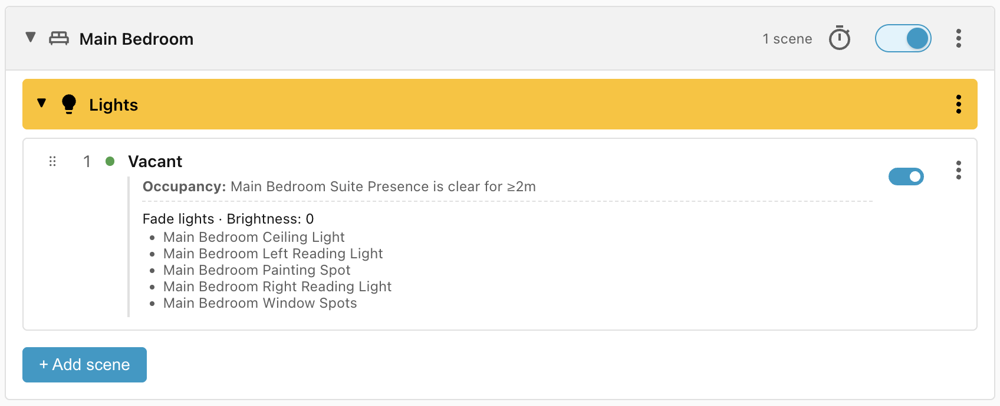
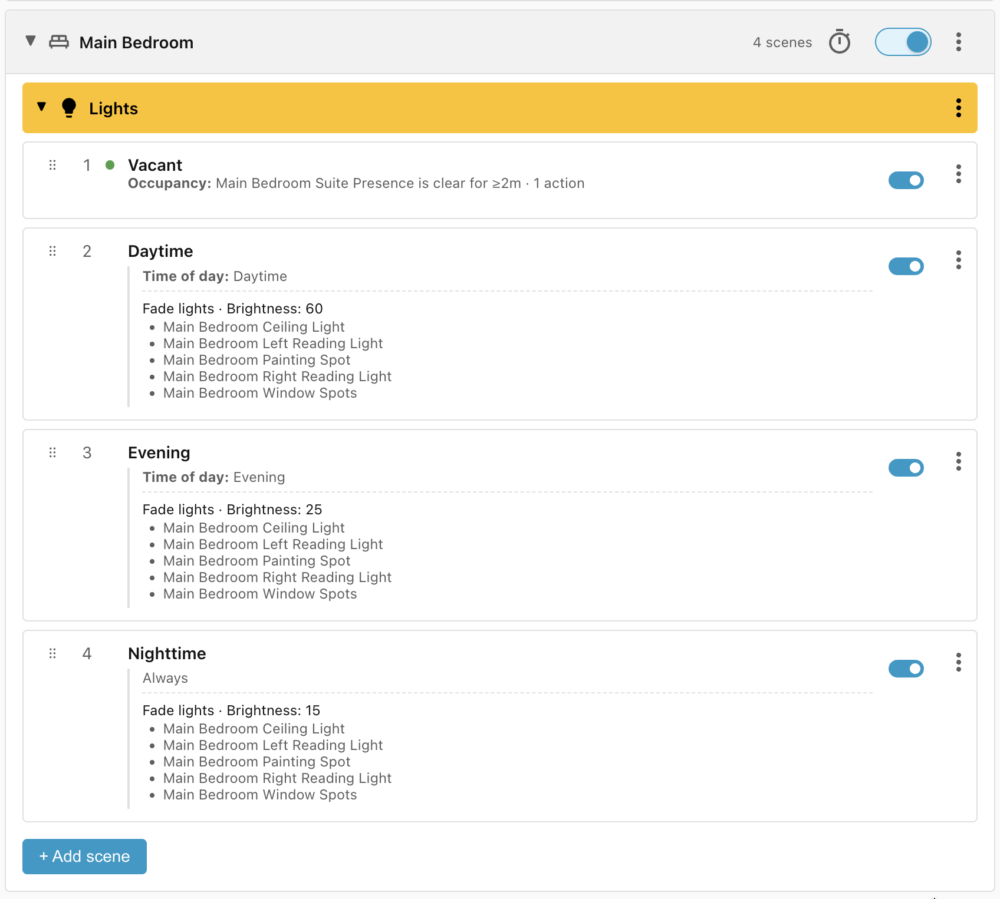
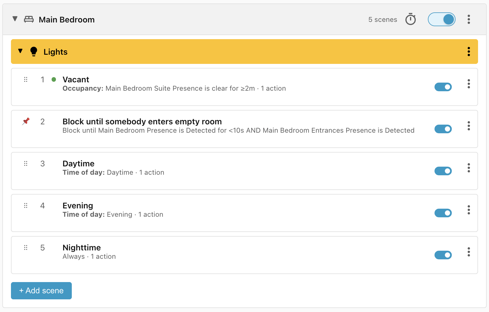
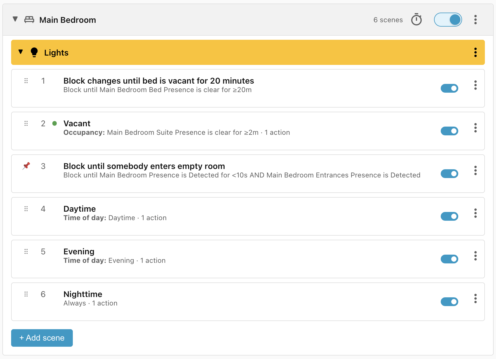
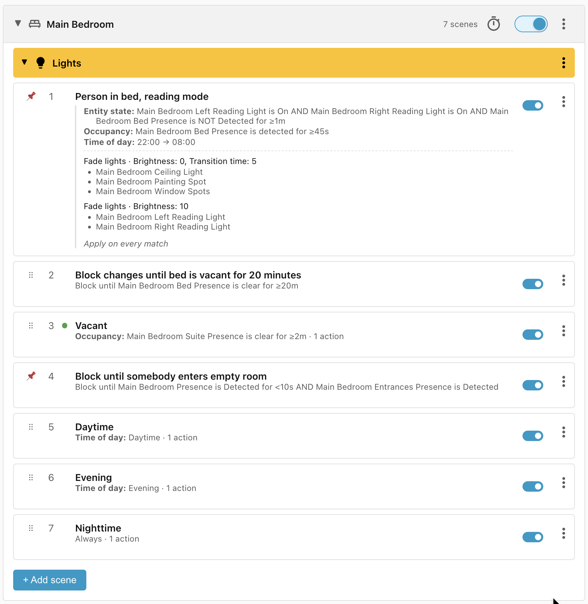

# Bedroom lights

This recipe controls the lighting in the bedroom, where occupancy is determined
by a presence sensor.

!!! note "The disappointment of presence sensors"

    Presence sensors are wonderful but they are notoriously unreliable at detecting
    people who are asleep.

    The Aqara FP2 loses people in bed for 15-20 minutes at a time, and the
    Everything Presence Pro is even worse, losing sleeping people for over an hour
    at a time. (To compensate, the Everything Presence Pro sees far fewer ghosts
    than the Aqara FP2).

    While presence sensors are very useful at detecting when people enter specific
    zones, they can't be relied upon to keep track of them when still.

    I'm waiting for my bed sensors from
    [Elevated Sensors](https://www.elevatedsensors.com/store) to arrive, which will
    hopefully allow me to tighten up my bedroom scene group. But in the meantime,
    I'm using an Aqara FP2 and lots of time buffers to make sure that we don't get
    woken up by the lights coming on in the middle of the night.

When somebody first enters the room, all the lights should turn on at a
brightness that depends on the time of day. But if somebody is already there, we
shouldn't change the lighting, especially if they're asleep in bed.

At night, when the main lights are on and somebody climbs into bed, we enter
*"reading mode"*: turn the main lights off and fade the reading lights to 10%.

When they want to sleep, they turn the lights off manually or by voice, and the
lights stay off until they turn them back on in the morning.

## Requirements

- **Main Bedroom Presence** - an occupancy sensor which covers the main bedroom.
- **Main Bedroom Bed Presence** - an occupancy sensor which covers the bed in
    the main bedroom.
- **Main Bedroom Suite Presence** - an occupancy sensor group which covers the
    main bedroom and the main bathroom.
- **Ceiling Light**, **Painting Spot**, **Window Spots** - main lights in the
    bedroom.
- **Left Reading Light**, **Right Reading Light** - reading lights next to the
    bed.

## Scene: Vacant

When the **Main Bedroom Suite Presence** is clear for 2 minutes, turn all the
lights off. Using the Suite presence means the occupant can use the en-suite
bathroom without the lights resetting.

## Scenes: Daytime, Evening, Nighttime

We add a scene for **Daytime** (which fades the lights to 60%), **Evening**
(25%), and **Nighttime** (15%).

The **Nighttime** condition doesn't need a **Time of day** condition because it
comes after the **Daytime** and **Evening** scenes.

## Scene: Block until somebody enters empty room

It's really important not to turn the lights on when somebody is asleep. The
presence sensor can easily lose a sleeping person, then re-detect them when they
turn over — and try to turn the lights on again.

To reduce the chance of this, we require that a person entered through the
**Main Bedroom Entrances** zone (the bedroom doors) and that **Main Bedroom
Presence** has been occupied for less than 10 seconds.

## Scene: Block changes until bed is vacant for 20 minutes

The **Vacant** scene waits only 2 minutes. We want the lights off soon after
somebody leaves, but the sensor could just as easily lose somebody reading in
bed after 2 minutes and turn the lights off.

To prevent this, we add a blocker that holds off any changes until the bed has
been vacant for at least 20 minutes:

## Scene: Person in bed, reading mode

Finally, when somebody climbs into bed at night, the main lights should fade off
and the reading lights drop to 10%. We can't rely on **Main Bedroom Bed
Presence** alone: it loses sleeping people, then turns the reading lights back
on when it re-detects them.

Instead, we gate on the reading lights: we only enter reading mode if **both**
are still on. If only one is on, a partner may already be asleep, so we leave
things alone.

We also want the occupant to turn the lights back on in the morning without
Ambience resetting reading mode, so we only enter reading mode when the bed has
been occupied for between 45 seconds and one minute:

!!! tip "Apply on every match"

    You may have noticed that the **Person in bed, reading mode** actions are marked
    **Apply on every match**. Because presence sensors aren't very accurate, reading
    mode sometimes triggers when somebody is near the bed rather than in it: they
    turn the lights back on manually and go to the bathroom, and 15 minutes later
    they climb into bed. **Person in bed, reading mode** matches again, but the
    lights aren't dimmed — the scene group blocked on **Block changes until bed is
    vacant for 20 minutes** and thinks reading mode has already been applied.

    By enabling **Apply on every match**, reading mode actions will be applied even
    if they have been applied before.

## Lifecycle

| Trigger                                                 | Matched Scene                                    | Action                                            |
| ------------------------------------------------------- | ------------------------------------------------ | ------------------------------------------------- |
| Person enters empty room                                | Daytime, Evening, or Nighttime                   | Lights turned on to the appropriate brightness    |
| Person leaves room for 2 minutes                        | Vacant                                           | Lights turned off                                 |
| Person climbs into bed for 45 seconds at 11pm           | Person in bed, reading mode                      | Main lights turned off, reading lights set to 10% |
| Person goes to bathroom                                 | Block changes until bed is vacant for 20 minutes | None                                              |
| Person climbs out of bed and leaves room for 2 minutes  | Block changes until bed is vacant for 20 minutes | None                                              |
| Person climbs out of bed and leaves room for 20 minutes | Vacant                                           | Lights turned off                                 |
| Person turns lights back on then returns to bed         | Person in bed, reading mode                      | Main lights turned off, reading lights set to 10% |
| Person in bed, another person enters                    | Block changes until bed is vacant for 20 minutes | None                                              |
| Person wakes up and turns on lights                     | Block changes until bed is vacant for 20 minutes | None                                              |
