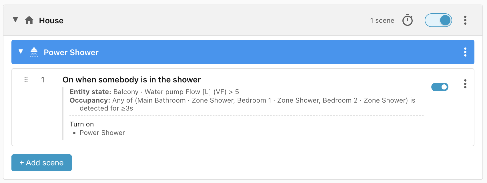
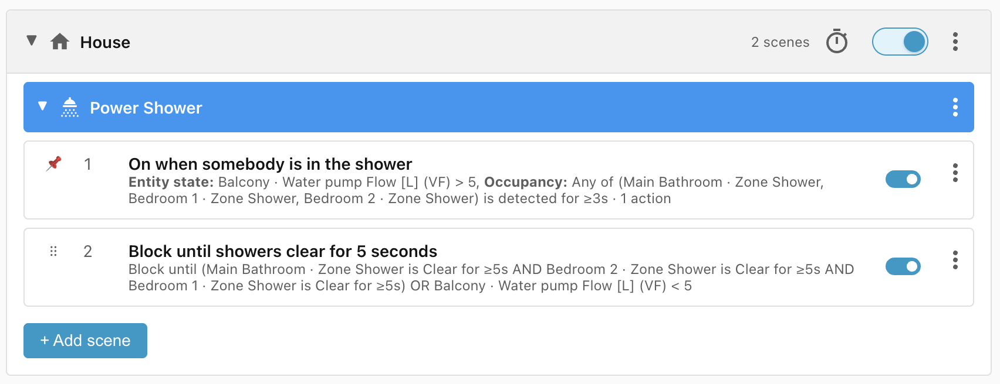
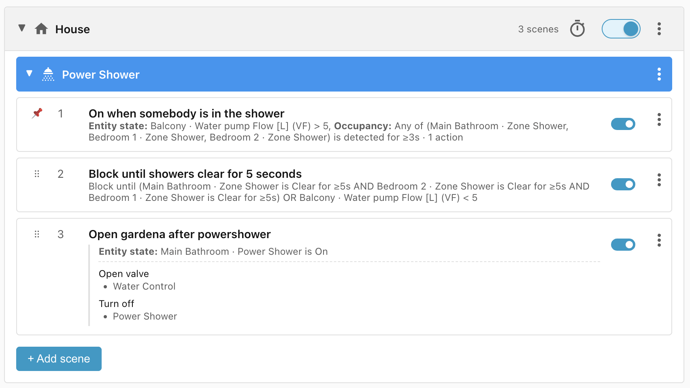
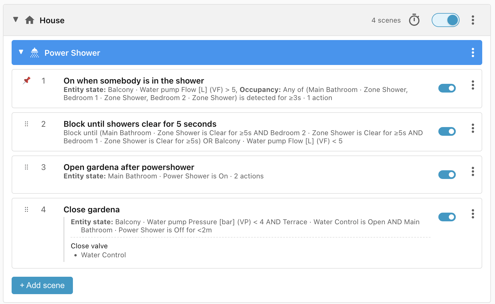
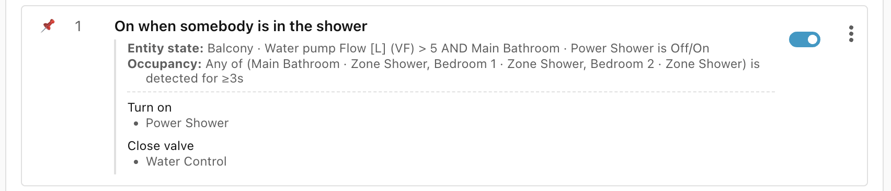

# Power Shower

I have a water pump that boosts the water pressure in the apartment, but the
pipes are old and can't take high pressure for long.

This recipe turns on Power Shower mode when water is running and someone is in
one of the showers. As soon as the water stops or the shower empties, Power
Shower turns off and the Gardena irrigation system runs briefly to bring the
pressure back to normal.

## Power Shower mode in the water pump

There is added complexity to this setup because the water pump has an internal
timer for Power Shower mode, and Home Assistant can't read that mode's current
state from the pump. To work around this, a **Power Shower** `input_boolean`
helper acts as the interface:

- Turning it on triggers an automation that starts Power Shower mode on the pump
    for 5 minutes.
- Turning it off triggers an automation that stops Power Shower mode.
- After it has been on for 5 minutes, an automation turns the boolean back off.

## Requirements

- Power Shower `input_boolean` with automations to control Power Shower mode in
    the water pump (assigned to the Main Bathroom area)
- An occupancy sensor for the shower zone in each bathroom
- Water pump sensors to measure water flow and pressure
- Gardena water control valve to turn on the irrigation system

## Scene: On when somebody is in the shower

When the pump is moving more than 5 litres per minute and someone is in one of
the three showers, turn on the Power Shower `input_boolean`, which starts Power
Shower mode on the pump for 5 minutes:

!!! note "House scope"

    This scene group uses the **House** scope because it acts on devices in
    different areas: the Power Shower `input_boolean` in the Main Bathroom and the
    Gardena water control on the Terrace.

## Scene: Block until showers clear for 5 seconds

We don't want to open the Gardena valve until the person has finished, so we
block until every shower reads clear for at least 5 seconds (to absorb
occupancy-sensor jitter) or the water flow drops below 5 litres per minute:

**Note:** the **On when somebody is in the shower** scene has to be moved to the
top of the list manually to beat the Block scene.

## Scene: Open Gardena after powershower

Once the water stops flowing or every shower is vacant, turn off the Power
Shower and open the Gardena irrigation valve:

## Scene: Close Gardena

Once the water pressure drops below 4 bar and the Gardena valve is open, close
it. We also check that the Power Shower `input_boolean` was turned off less than
two minutes ago, so this scene doesn't interfere with the normal Gardena
irrigation schedule:

## Problem: The 5 minute timer on the Power Shower

Power Shower mode (and its `input_boolean`) turns off automatically after 5
minutes, and nothing in our scene group detects this to turn it back on.

We could add a **Power Shower is off** entity state condition to the **On when
somebody is in the shower** scene, but that creates a loop:

- Someone turns on the water and enters the shower; the **On when somebody is in
    the shower** scene wins and turns on the Power Shower.
- That scene no longer matches (the Power Shower is now on), so **Open Gardena
    after powershower** wins instead, which turns the Power Shower off, so the
    first scene starts matching again.

Instead, we match **Power Shower is (off or on)**. That triggers reevaluation
when the timer turns it off, but keeps matching while it's on.

## Problem: The Power Shower isn't turned on after it goes off

The **On when somebody is in the shower** scene now matches correctly, but it
doesn't turn the Power Shower back on: because it never stops matching, its
actions aren't reapplied.

Turning on the **Apply on every match** toggle at the bottom of the Actions
section fixes this. It won't spam the pump every time it matches, because the
built-in **Turn on** command checks the `input_boolean` and only turns it back
on if it's currently off.

**Note:** we also added an action to **On when somebody is in the shower** to
close the Gardena water control, as we don't want the Power Shower on and the
irrigation system open at the same time.

## Lifecycle

| Trigger                                                                                                                    | Matched Scene                           | Action                                                           |
| -------------------------------------------------------------------------------------------------------------------------- | --------------------------------------- | ---------------------------------------------------------------- |
| Water starts flowing at > 5 litres per minute                                                                              | No match                                | None                                                             |
| Water starts flowing at > 5 litres per minute and somebody enters a shower zone for more than 3 seconds                    | On when somebody is in the shower       | Power Shower mode turns on for 5 minutes, Gardena closed if open |
| Power Shower turns off after 5 minutes, shower still occupied and water flowing                                            | On when somebody is in the shower       | Power Shower mode turns on for 5 minutes                         |
| Power Shower is on but all shower zones are vacated                                                                        | Block until showers clear for 5 seconds | None                                                             |
| Power Shower is on but all shower zones are vacated for 5 seconds                                                          | Open Gardena after powershower          | Gardena water control is opened and Power Shower is turned off   |
| Power Shower is on but water is turned off                                                                                 | Open Gardena after powershower          | Gardena water control is opened                                  |
| Water flow is off or showers are vacated, but water control is open, and Power Shower has been off for less than 2 minutes | Close Gardena                           | Gardena water control is closed                                  |
