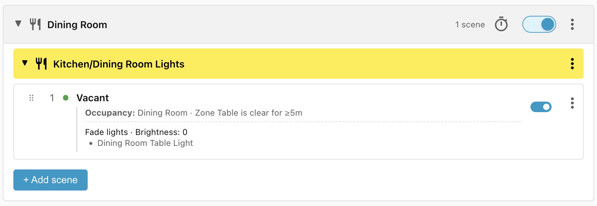
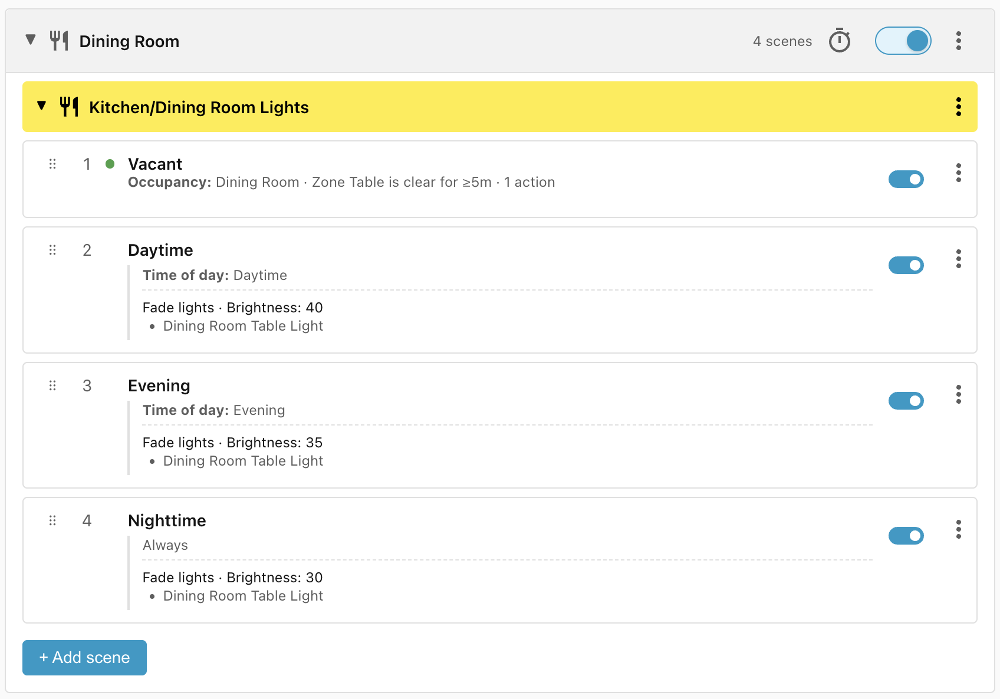
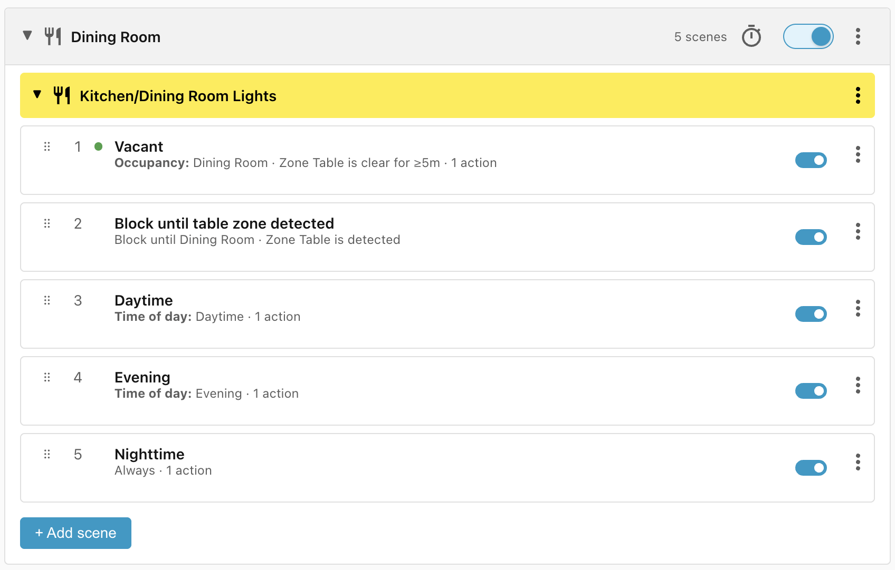
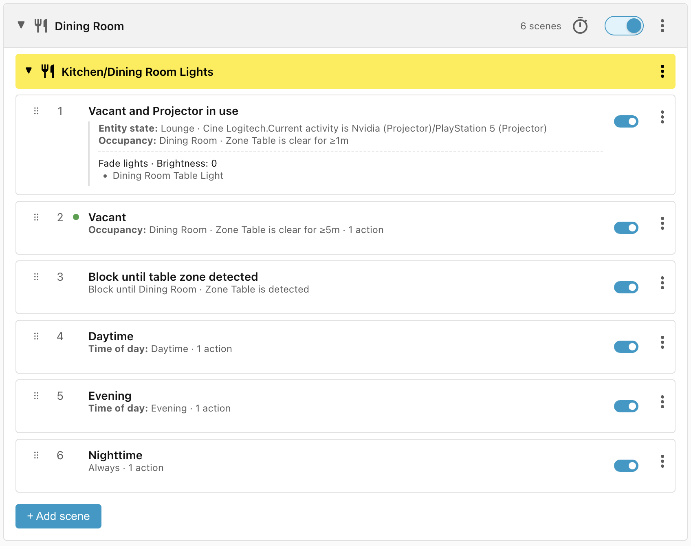

# Dining Room

This recipe controls the **Table Light** above the Dining Room table. It is only
turned on when somebody is seated at the table, and the brightness varies by
time of day. The light is turned off more quickly when the projector in the
adjoining Lounge is in use.

## Requirements

- **Table Light** - the light above the Dining Room table.
- **Zone Table** - occupancy sensor which detects when somebody is seated at the
    table.
- **Cine Logitech** - the remote which tells us when the projector is in use.

## Scene: Vacant

The first scene turns off the Table Light once the **Zone Table** has been
vacant for 5 minutes. We wait 5 minutes so that the light isn't flashing on and
off every time somebody moves in and out of the Zone Table area:

## Scenes: Daytime, Evening, Nighttime

We add a scene for **Daytime** (which fades the Table Light to 40%), **Evening**
(35%), and **Nighttime** (30%).

The **Nighttime** condition doesn't need a **Time of day** condition because it
comes after the **Daytime** and **Evening** scenes.

## Scene: Block until table zone detected

We didn't include an **Occupancy** condition in the **Daytime**, **Evening**,
and **Nighttime** scenes because they come after the **Vacant** scene, so we
know that the table is either occupied or has only been vacant for less than 5
minutes.

However, if we restart Home Assistant it will clear the last detected time on
the presence sensor which would mean that the **Vacant** scene wouldn't match
and the Table Light would turn on for up to 5 minutes.

For completeness we can prevent that occurring by adding a blocking clause:

## Scene: Vacant and Projector in use

Finally, we want the Table Light to turn off more quickly when the projector is
in use, so we add a scene with the highest priority which turns the light off
after 1 minute of vacancy:

## Lifecycle

| Trigger                                                     | Matched Scene               | Action                   |
| ----------------------------------------------------------- | --------------------------- | ------------------------ |
| Person sits at table at 13:00                               | Daytime                     | Table Light fades to 40% |
| Person sits at table just after sunset                      | Evening                     | Table Light fades to 35% |
| Person sits at table after dusk                             | Nighttime                   | Table Light fades to 30% |
| Person leaves table at 13:01 and returns at 13:04           | Daytime                     | None — already applied   |
| Person leaves table for one minute while projector is on    | Vacant and Projector in use | Table Light turns off    |
| Person leaves table for five minutes while projector is off | Vacant                      | Table Light turns off    |
