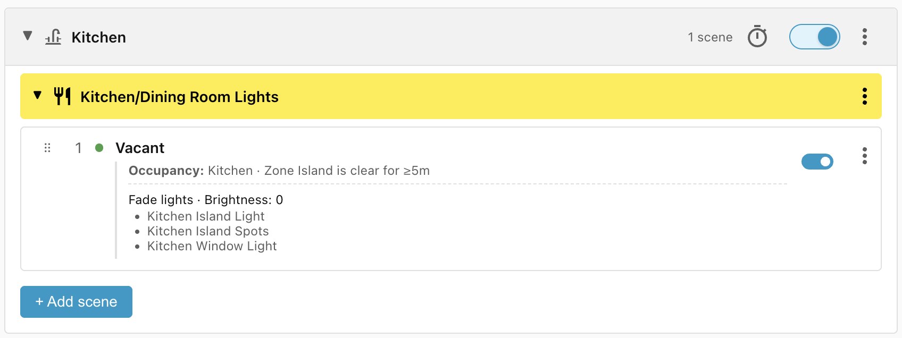
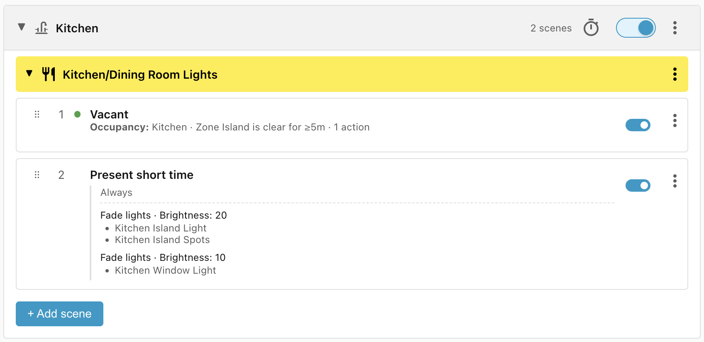
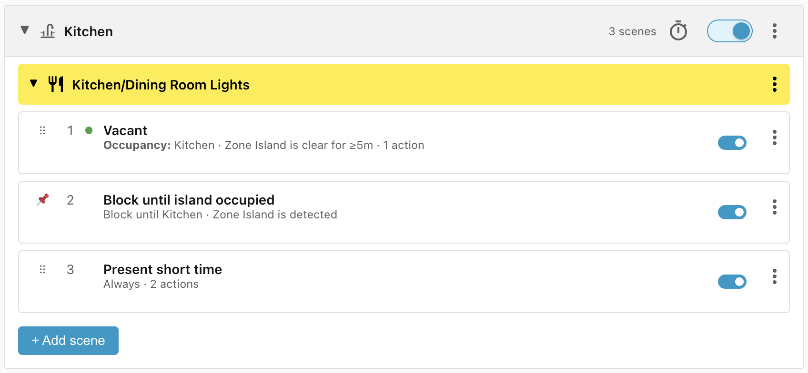
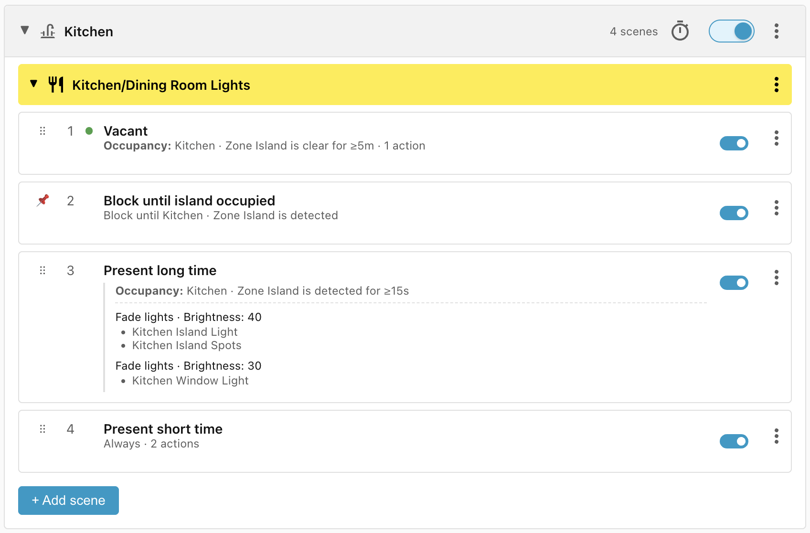
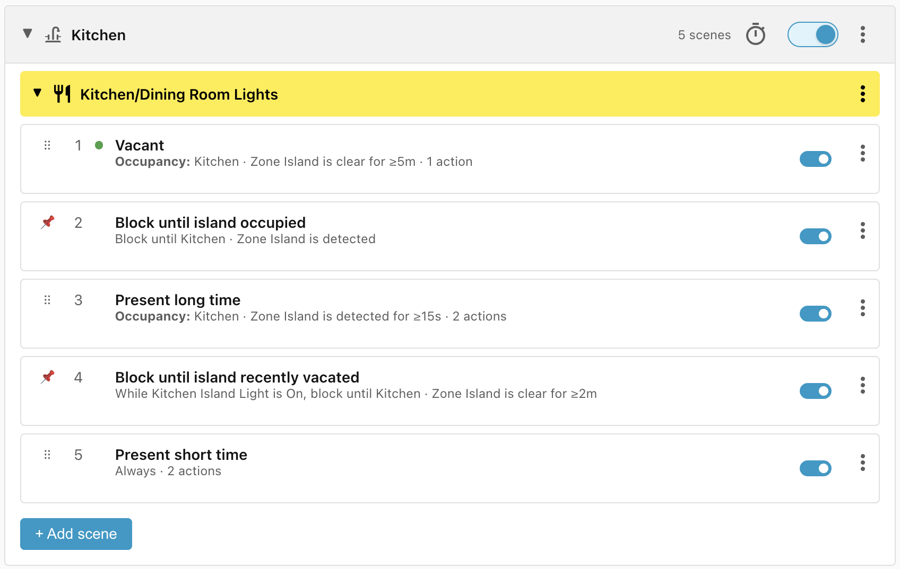
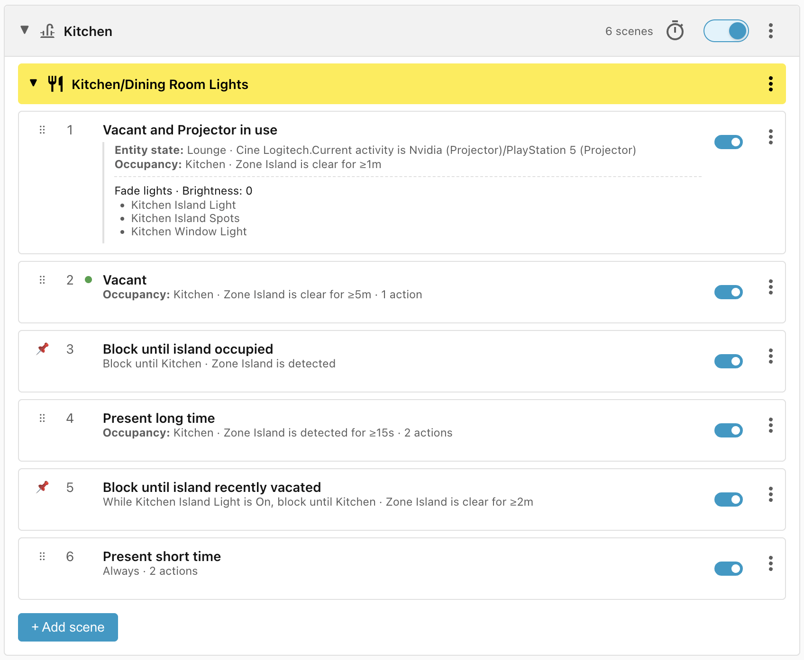

# Kitchen

This recipe controls the lights in the Kitchen, in particular the **Island
Light** and the **Island Spots**.

When somebody approaches the island, they may just want to do something quick
like leaving a cup in the sink. They need light, but not too much to be
distracting to the rest of the room. On the other hand, maybe they want to cook
dinner and so need the island lights to be brighter.

We can distinguish these two situations by how long the person has been at the
island. If they haven't left after 15 seconds, then we can assume that they will
need more light for what they are doing.

Also, the Kitchen/Dining Room adjoins the Lounge where the projector might be in
use. The lights in the kitchen will interfere with the projector viewing so we
turn them off more quickly when the kitchen becomes vacant.

## Requirements

- **Zone Island** - an occupancy sensor which tells us when the island is
    occupied.
- **Island Light**, **Island Spots**, **Window Light** - three lights in the
    kitchen.
- **Cine Logitech** - a remote which tells us when the projector is in use.

## Scene: Vacant

When the **Zone Island** has been vacant for 5 minutes, turn off all the lights
in the kitchen. We use a 5 minutes window to stop the lights turning on and off
frequently as people enter and exit the island area:

## Scene: Present short time

This scene turns on the lights at a low level when somebody first enters the
**Zone Island**. While we don't have an **Occupancy** condition on this scene,
we know that the Zone Island must be occupied (or vacant for less than 5
minutes) because the scene comes after the **Vacant** scene, which does have an
Occupancy condition.

## Scene: Block until island occupied

After a Home Assistant reboot, the **Vacant** scene won't match because the last
updated time gets reset, so the **Present short time** scene will win, turning
on the lights for 5 minutes. For completeness, we can prevent that by adding a
blocking condition:

## Scene: Present long time

Once the person has remained in the **Zone Island** for at least 15 seconds,
this scene increases the brightness of the island lights:

## Scene: Block until island recently vacated

As this stands, there is an issue. Every time the person steps out of the Zone
Island, the **Present long time** scene stops matching and the **Present short
time** scene matches instead, which causes the lights to dim immediately, and
then it takes another 15 seconds after the person returns for the lights to
brighten again.

We can solve this by adding in a buffer to block **Present short time** from
matching for two minutes, as long as the island light is on.

The first time somebody approaches the island, the **Island Light** will be off
and so **Present short time** will match immediately. If the person leaves and
returns within 2 minutes, the **Block** condition will prevent **Present short
time** from matching and will keep the lights on as per the **Present long
time** scene.

## Scene: Vacant and Projector in use

Finally, when the projector is in use, the lights should turn off more quickly
so as to disturb viewing as little as possible. The **Vacant and Projector in
use** scene has the highest priority so it will override the other conditions
when it matches:

## Lifecycle

| Trigger                                                | Matched Scene                       | Action                      |
| ------------------------------------------------------ | ----------------------------------- | --------------------------- |
| Person enters Zone Island                              | Present short time                  | Lights turn on at low level |
| Person remains in Zone Island for 15 seconds           | Present long time                   | Lights brighten             |
| Person exits Zone Island                               | Block until island recently vacated | None                        |
| Person returns to Zone Island within 2 minutes         | Present long time                   | None — already applied      |
| Person exits Zone Island for 2 minutes                 | Present short time                  | Lights dim                  |
| Person exits Zone Island for 5 minutes                 | Vacant                              | Lights turn off             |
| Projector on and person exits Zone Island for 1 minute | Vacant and Projector in use         | Lights turn off             |
