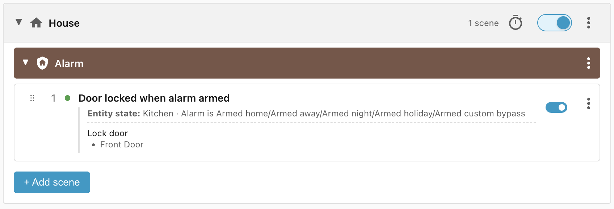
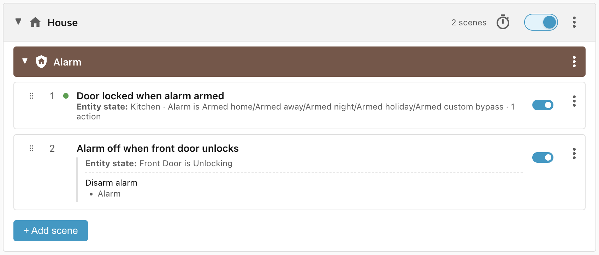
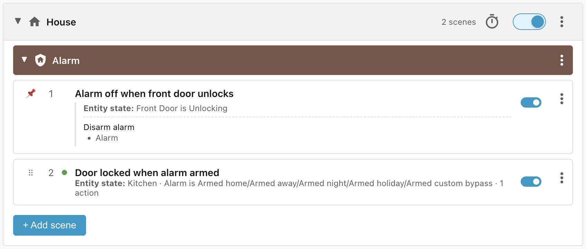

# House alarm

This recipe controls the interaction between the house alarm and the front door
lock:

- When the alarm is turned on, the front door should lock.
- When the lock is unlocked, the alarm should disarm.

## Requirements

- House alarm
- Front door lock

## Scene: Door locked when alarm armed

When the alarm is armed then lock the front door:

**Note:** added custom action `lock.lock`.

## Scene: Alarm off when front door unlocks

When the door starts unlocking then disarm the alarm. This assumes that the
front door lock cannot be opened without a key or code.

**Note:** added custom action `alarm.disarm`.

## Problem: Scene priority

The way it stands at the moment, the door changes to state **Unlocking** and
triggers a reevaluation of the scenes. The **Door locked when alarm armed** wins
the match and makes the door lock itself again.

We can fix this by manually moving the **Alarm off when front door unlocks**
scene to the top of the priority list:

## Lifecycle

| Trigger                          | Matched Scene                     | Action            |
| -------------------------------- | --------------------------------- | ----------------- |
| Alarm is armed, door is unlocked | Door locked when alarm armed      | Door locks        |
| Somebody unlocks door            | Alarm off when front door unlocks | Alarm is disarmed |
