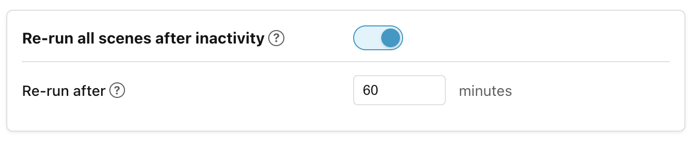

# Apply on every match

When any condition specified in a scene group changes from true to false or vice
versa, it triggers a reassessment of all scenes in the scene group. The winning
scene might be the same scene that won the previous time. In that case, we don't
usually want to reapply its actions as nothing will have changed in the interim.

In fact, often we want to be able to make manual changes and **not** have
Ambience override them every time a trigger fires. For instance, perhaps I want
to close a blind manually, and I don't want Ambience to open it again two
seconds later.

In certain circumstances, however, we **do** want the actions to be reapplied on
every match. For instance, imagine a Power Shower function which we switch on
when somebody is in the shower and the water is flowing. We can create a scene
such as this:

But the Power Shower has an internal timer which switches it off automatically
every 5 minutes. That automatic off-switch is outside our control. To Ambience
it looks like our _"Power Shower on"_ scene is still winning, but in reality the
power shower has been turned off.

We can solve this in two steps:

1. We want to include state of the Power Shower switch as a trigger, so we add
    it as a clause which matches on both **On** and **Off** into the entity
    state condition.
1. Turn the scene's **Apply on every match** toggle to **On**.

This way, the scene will match when somebody is in the shower and the water is
flowing, **and** will turn the Power Shower back on whenever it turns itself
off. The built-in **Turn on** action has a safeguard in place so that it will
not try to turn the Power Shower on if it is already on.

## Re-run all scenes after inactivity

Sometimes devices get out of sync with the currently applied scene, and can
remain so until a new scene wins. Perhaps a turn-off light command was dropped
because of a network outage, or somebody opened a blind manually and forgot to
close it.

The **Re-run all scenes** is a way to periodically trigger the re-evaluation of
all scene groups after a period of inactivity, to get things back into sync.
This feature can be enabled and the timeout configured in the **Settings →
Advanced** tab.

When the feature is enabled and the timeout elapses for a scene group, Ambience
re-evaluates and re-dispatches that group's winning scene (even if the winner
has not changed) to reapply any commands that may have been dropped. The idle
clock resets each time a group's commands are actually dispatched. Disable or
paused scopes are skipped.

______________________________________________________________________

Next: [How actions run](how-actions-run.md).
