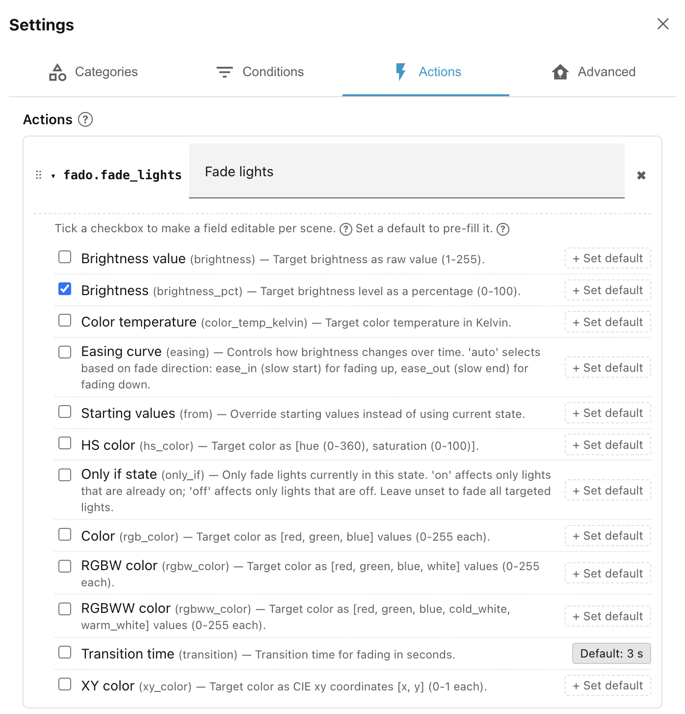

# Exposed actions

Rather than configuring a service from scratch every time you use it in a scene,
Ambience uses a layer of reusable templates called **exposed actions**. You set
these up once, in **Settings → Actions**, and they then appear in the action
picker whenever you edit a scene, and in the order that you choose.

Each exposed action wraps a single Home Assistant service and captures two kinds
of per-field setting:

- **Which fields are visible** in the scene editor — these are the fields you
    expect to vary from scene to scene. When you add the action to a scene, you
    fill these fields in for that scene.
- **Defaults** — values that are always sent to the service, regardless of what
    any scene says. A default can accompany a visible field (pre-filling it with
    a sensible starting value) or it can apply to a hidden field (so the service
    always receives that value but the per-scene editor never shows it).

The combination is flexible. For example, a
[`fado.fade_lights`](https://github.com/clintongormley/ha-fado/#fado-light-fader)
exposed action might:

- show **Brightness** as a visible field, so each scene can set its own levels;
- but set **Transition time** to `3` as a default, so every scene using this
    action gets a three-second fade.

!!! note "Hidden defaults"

    A field doesn't need to be visible to set a default. You can set a default but
    leave the field unchecked. The default parameter will always be passed, but you
    won't be able to override it in the scene's action list.

See
[Step 3 of Getting started](../../getting-started/step-3-exposing-actions.md)
for a worked example.

______________________________________________________________________

Next: [Built-in actions](built-in-actions.md).
