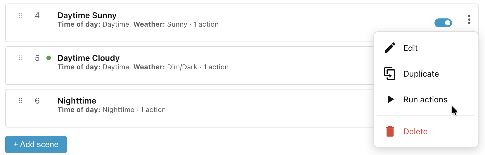

# How actions run

Ambience re-evaluates your scenes continuously. Whenever the winning scene
changes — because a condition changes state, the time crosses a boundary, or
something else shifts — it applies the new winner's actions immediately.

If you want to test a scene's actions without waiting for its conditions to
match, use the **Run actions** option in the scene's action menu. This runs that
scene's actions once, independently of the normal evaluation cycle. If the
engine is applying the same scope and category at that moment, the manual run
waits for it to finish rather than interleaving with it.

## Action execution model

The actions of the winning scene are applied as follows:

- **In parallel**, not sequentially — every action is turned into a coroutine
    and they're all launched together via `asyncio.gather`. Because they run
    concurrently, completion order is nondeterministic. If the same entity
    exists in two actions, whichever arrives last wins.
- **Not fire-and-forget** — each call is `blocking=True`, and the whole batch is
    `await`ed. Ambience waits for all the service calls to finish before the
    apply completes (it then records last-applied, traces, etc.). It does not
    just dispatch and move on.
- **Fault-isolated** — `return_exceptions=True` means one action raising an
    exception is logged (`"ambience: action raised: …"`) but doesn't abort the
    others. Malformed and unexposed actions are skipped with a warning before
    the gather (so they never become coros).

______________________________________________________________________

Next: [Settings reference](../settings-reference.md).
