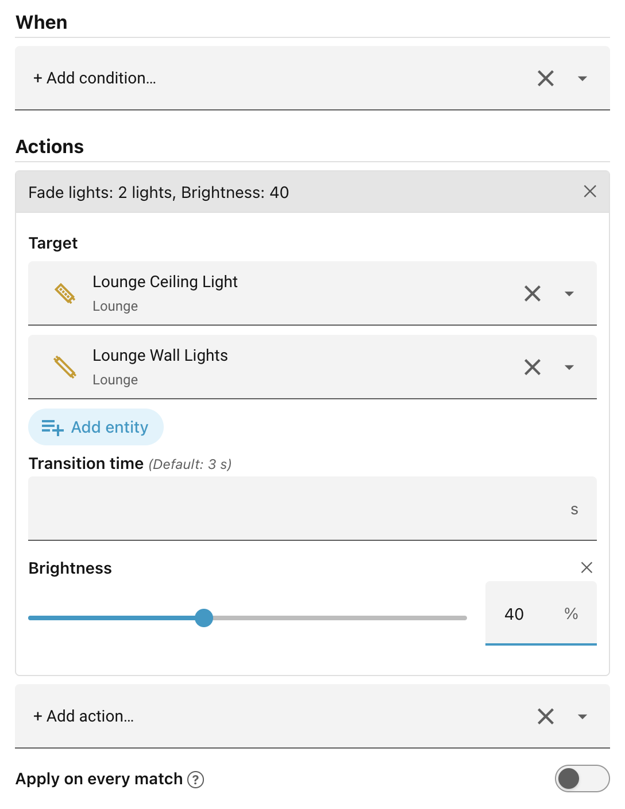

# Using an action in a scene

In a scene's **Actions** section, click **+ Add action…** and pick one of your
exposed actions. Fill in its **visible fields** and choose a **target** — the
entities to act on, if the service requires one. The target picker lists only
entities relevant to the scene's scope (House, Floor, or Area) and to the
action's domain. (e.g. `Fado.fade_lights` will only list lights.)

______________________________________________________________________

Next: [Apply on every match](apply-on-every-match.md).
