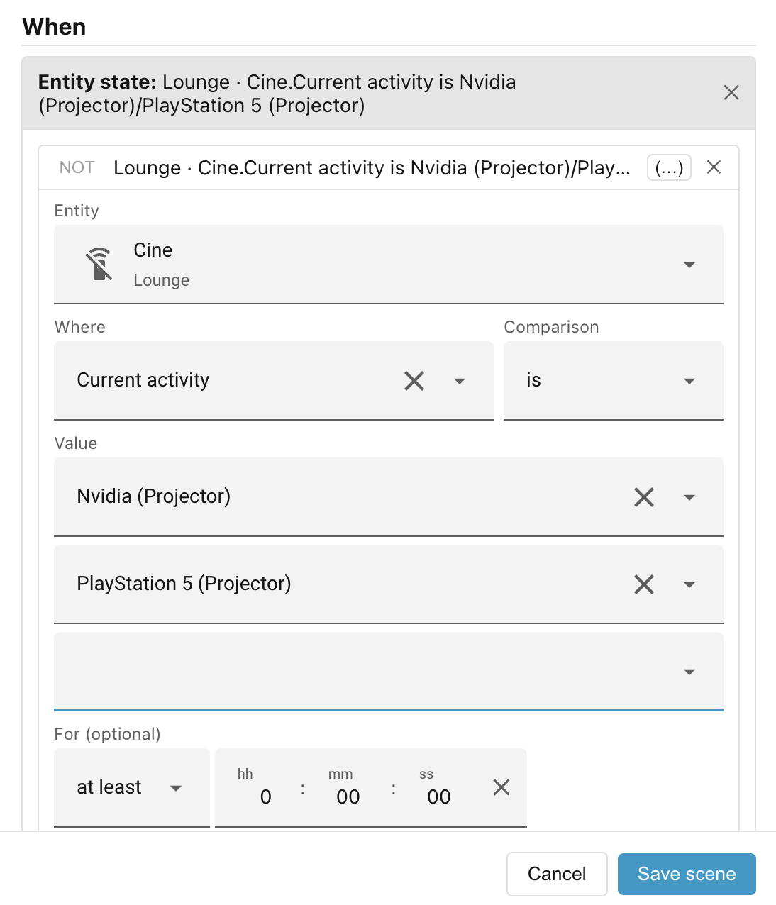
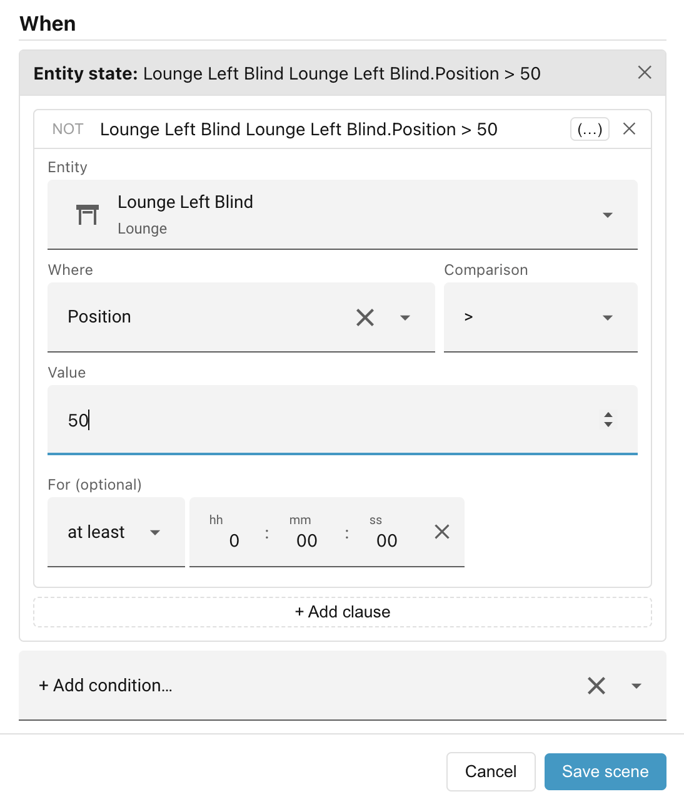
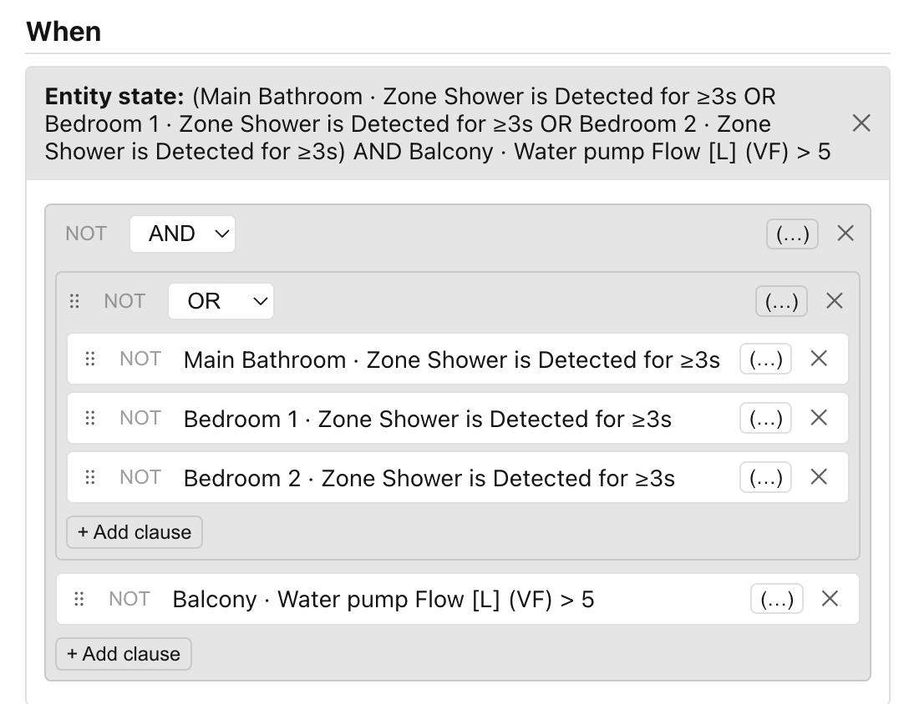
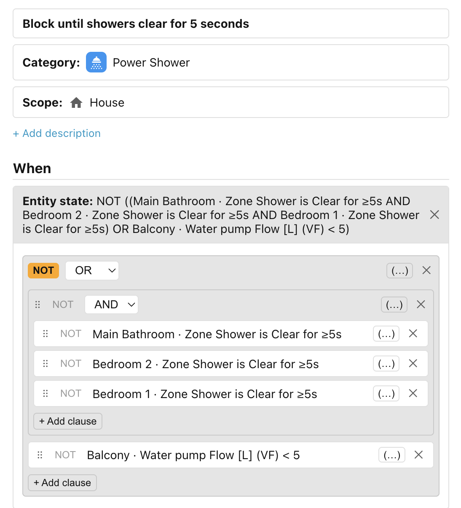

# Entity state

!!! tip "Worked example"

    For a worked example of the Entity-state condition, see
    [Step 5 of Getting started](../../getting-started/step-5-entity-state-conditions.md).

Checks the state (or an attribute) of an entity, compares it to a value that you
specify, and returns `true` or `false`. Multiple **clauses** can be combined
with **AND**, **OR**, and **NOT** operators, and can be grouped using
parentheses.

Each clause picks an entity, then chooses **where to look** — either the
entity's own state (the default) or one of its attributes — and then sets a
**comparison** and a **value**.

## Text comparisons

For text comparisons, you can list multiple values:

| Operator | Meaning                                                        |
| -------- | -------------------------------------------------------------- |
| `is`     | the state or attribute matches **any** of the values you list  |
| `is not` | the state or attribute matches **none** of the values you list |

## Numeric comparisons

For numeric states and numeric attributes, the UI switches automatically to
numeric operators:

| Operator | Meaning                          |
| -------- | -------------------------------- |
| `>`      | greater than                     |
| `≥`      | at least (greater than or equal) |
| `<`      | less than                        |
| `≤`      | at most (less than or equal)     |

## Boolean operators

When a scene needs more than one clause, you combine them using **AND** and
**OR** groups. Use the **"(…)"** (wrap-in-group) button on any clause to place
it inside a new group, then add sibling clauses to the same group. You can nest
groups to arbitrary depth. Each clause and each group can also be negated with
the **NOT** toggle on its header — turning it on inverts the result of that
clause or group.

In the following example, we want to turn on the Power Shower when the water
flow is over 5L/min and somebody has been present in at least one of the showers
for at least 3 seconds.

!!! tip "Drag handles"

    The **⠿** drag handles can be used to drag clauses from one group to another.

## Simplified descriptions

As you build the expression, Ambience shows it back as a plain-language summary
that tidies the logic to read naturally rather than mirroring the raw tree. A
**NOT** on a simple `is` clause is folded inline — *"Lamp is on"* under a NOT
becomes *"Lamp is NOT on"*, instead of *"NOT Lamp is on"*.

The following is a complicated example where we want a **blocking scene** to
prevent us turning off the power shower until either the water flow is under
5L/min or all of the showers have been vacant for at least 5 seconds.

The "raw" description of the condition reads as follows:

_NOT ((Main Bathroom · Zone Shower is Clear for ≥5s AND Bedroom 2 · Zone Shower
is Clear for ≥5s AND Bedroom 1 · Zone Shower is Clear for ≥5s) OR Balcony ·
Water pump Flow [L] (VF) < 5)._

The simplified version is easier to read and understand:

_Block until (Main Bathroom · Zone Shower is Clear for ≥5s AND Bedroom 2 · Zone
Shower is Clear for ≥5s AND Bedroom 1 · Zone Shower is Clear for ≥5s) OR Balcony
· Water pump Flow [L] (VF) < 5_.

## For duration

You can also set a **For** duration on the condition, so it only passes once its
test has stayed continuously true for more than or less than the specified
duration. See [The "for" duration](index.md#the-for-duration) for the details,
including how the clock behaves when a clause lists several states.

______________________________________________________________________

Next: [Lux](lux.md).
