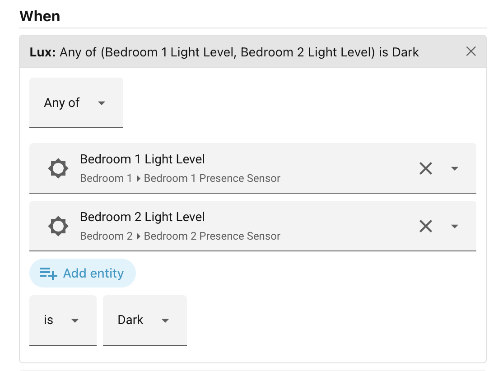
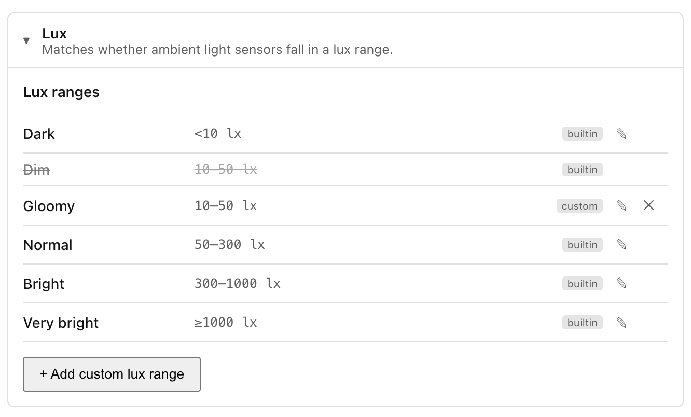

# Lux

Checks whether ambient-light (illuminance) sensors fall inside a lux range, such
as: _"the lounge is dark"_, or _"the office is brighter than 300 lx"_.

This is the natural condition for daylight-aware lighting: instead of guessing
from the time of day or the weather, it reads what your light sensors actually
measure. It is used with `sensor` entities whose device class is `illuminance`.

When you add a Lux condition to a scene, the editor shows (top to bottom):

- **Any of** or **All of** — shown above the sensors once you pick more than
    one. "Any of" passes when at least one sensor reads inside the range; "All
    of" requires every sensor to match.
- **Entity** — a picker listing your illuminance sensors. Pick one or more.
    Leaving it empty makes the condition match anything (no constraint).
- **is** / **is not** — whether each reading must fall **inside** the chosen
    range (*is*) or **outside** it (*is not*). "is not" inverts the whole test —
    the band *and* the Any-of/All-of quantifier — so *Any of (hall, landing) is
    not Dark* matches when neither sensor reads below 10 lx.
- **Range** — either a **named lux range** (see below) or a custom inline band
    with a **Min** and/or **Max** in lux. A band is half-open: it matches when
    `min ≤ reading < max`. Either bound may be left empty for an open-ended
    range.

A sensor reporting `unavailable`, `unknown`, or a non-numeric value never counts
as inside *or* outside a range — it is treated as unobservable, so neither
**is** nor **is not** passes on it. An *"is not bright"* test will not fire just
because a sensor dropped offline.

### Examples

| Setup                               | Meaning                                        |
| ----------------------------------- | ---------------------------------------------- |
| Lounge sensor, range *Dark*         | The lounge reads below 10 lx.                  |
| Office sensor, min 300              | The office is at 300 lx or brighter.           |
| Office sensor, is not, range *Dark* | The office is reading, and not dark (≥ 10 lx). |
| Hall + landing, Any of, range *Dim* | At least one of the two reads 10–50 lx.        |

## Named lux ranges

Ambience ships five built-in ranges:

| Range       | Band              |
| ----------- | ----------------- |
| Dark        | below 10 lx       |
| Dim         | 10 – 50 lx        |
| Normal      | 50 – 300 lx       |
| Bright      | 300 – 1000 lx     |
| Very bright | 1000 lx and above |

You can change these, hide them, or add your own in the panel's **Settings** →
**Conditions** tab → **Lux ranges**. Scenes that reference a named range pick up
any later edits to it automatically.

Next: [Occupancy](occupancy.md).
