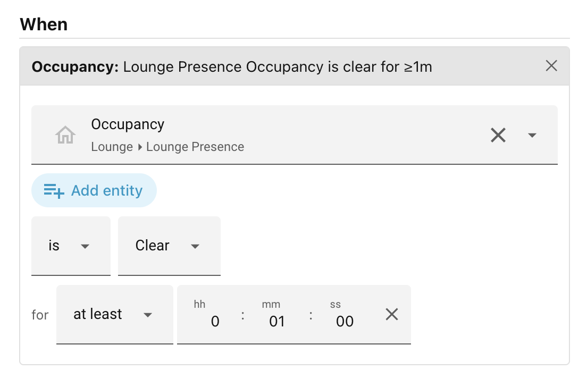

# Occupancy

Checks whether one or more presence sensors report a room as occupied
(**Detected**) or vacant (**Clear**).

This is the purpose-built way to drive presence-based lighting. Under the hood a
presence sensor is just a `binary_sensor`, so you *could* express the same test
with an [Entity state](entity-state.md) condition — but the Occupancy condition
gives you a sensor picker that only lists presence-type sensors, a
Detected/Clear toggle, and (importantly) the right **precedence** relative to
your other rules.

When you add an Occupancy condition to a scene, the editor shows:

- **Any of / All of** — shown above the sensors only when you pick more than
    one. "Any of" passes when at least one sensor is in the chosen state; "All
    of" requires every sensor to be.
- **Sensors** — a picker listing your `binary_sensor` entities whose device
    class is `occupancy`, `presence`, or `motion`. Pick one or more.
- **is** / **is not** and **Detected / Clear** — the state to test and whether
    to invert it: _"is not clear for 2 minutes"_ is not the same as _"is
    detected for 2 minutes"_
- **for** — an optional duration (see
    [the *for* duration](index.md#the-for-duration)). With "Any of", the clock
    tracks the combined test, so it keeps running through a handover from one
    sensor to another as long as *some* chosen sensor stays in the wanted state.

### Examples

| Setup                           | Meaning                                              |
| ------------------------------- | ---------------------------------------------------- |
| Lounge sensor, Detected         | The lounge is occupied right now.                    |
| Lounge sensor, Clear, for 15m   | The lounge has been empty for 15 continuous minutes. |
| Any of, Hall + Stairs, Detected | Someone is in the hall or on the stairs.             |
| All of, Hall + Stairs, Clear    | Both the hall and the stairs are empty.              |

A sensor reporting `unavailable` or `unknown` never counts as occupied or vacant
— it is treated as unobservable, so the condition does not pass on it, and *is
not* never inverts an unobservable sensor into a match.

______________________________________________________________________

Next: [People](people.md).
