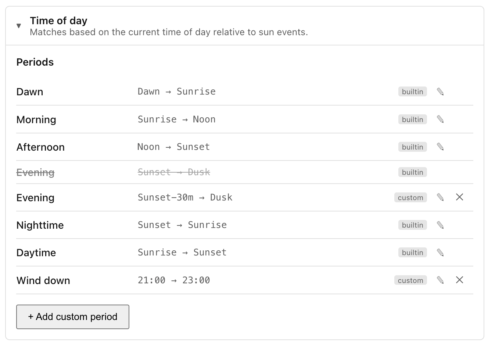
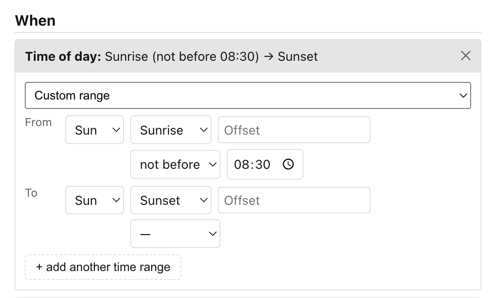

# Time of day

Checks whether the current time falls within a specified window, expressed as a
named period, a clock range, or a range anchored to sun events such as sunrise
or dusk.

When you add a Time of day condition to a scene, you see a dropdown with three
kinds of entry:

- **Any time** — the condition always matches (equivalent to having no condition
    at all; useful as a placeholder while you build a scene).
- **A named period** — one of the built-in periods or any custom period you have
    defined in Settings.
- **Custom range** — you define the start and end yourself.

## Using a named period

Ambience ships six built-in periods that track the sun automatically, so they
adjust throughout the year without any configuration:

| Period    | From    | To      |
| --------- | ------- | ------- |
| Dawn      | Dawn    | Sunrise |
| Morning   | Sunrise | Noon    |
| Afternoon | Noon    | Sunset  |
| Evening   | Sunset  | Dusk    |
| Nighttime | Sunset  | Sunrise |
| Daytime   | Sunrise | Sunset  |

All six are sun-relative, so "Morning" in summer starts earlier than it does in
winter, and everything shifts with your latitude automatically. "Nighttime"
spans the whole night (sunset to sunrise) and so overlaps the narrower "Evening"
and "Dawn" windows; where periods overlap, a scene's summary names the most
specific one.

You can also define your own periods — for example a "Wind down" period from
21:00 to 23:00 — via **Settings → Conditions**. Once saved, custom periods
appear in the same dropdown alongside the built-ins.

## Using a custom range

Select **Custom range** from the dropdown and the editor expands to show a
**From** row and a **To** row. Each end of the range has two controls:

1. A **kind** dropdown — choose **Time** for a fixed clock time, or **Sun** for
    a sun-relative anchor.
1. The value itself:
    - **Time**: a standard time-of-day picker (hh:mm in your local timezone,
        DST-aware).
    - **Sun**: an anchor dropdown (Dawn, Sunrise, Noon, Sunset, Dusk, or
        Midnight) plus an offset field. Enter a positive number to push the
        boundary later (e.g. `30` = 30 minutes after the anchor) or a negative
        number to push it earlier (e.g. `-30` = 30 minutes before). Leave the
        offset at `0` for exactly at the anchor. The hint next to the field shows
        the offset in plain English, such as `+30 min` or `−1 hour`. A second row
        lets you optionally **clamp** the result to a clock floor or ceiling —
        see
        [Pinning a sun anchor to a clock time](#pinning-a-sun-anchor-to-a-clock-time)
        below.

Ranges can wrap midnight. If your "From" time is later in the day than your "To"
time (for example, 22:00 to 06:00), the condition matches from 22:00 through to
06:00 the following morning.

### Pinning a sun anchor to a clock time

A sun anchor drifts across the year — sunset can be around 16:30 in midwinter
and 21:30 at midsummer. The **clamp** row beneath a **Sun** endpoint bounds that
drift to a fixed clock time. Pick a direction and a time (leave the direction on
**—** for no clamp, the default):

- **not before HH:MM** — a *floor*: if the anchor lands earlier than this time,
    use this time instead. *Sunset, not before 18:00* stops an evening scene
    from starting before 18:00 on short winter days, while still following a
    later summer sunset.
- **not after HH:MM** — a *ceiling*: if the anchor lands later than this time,
    use this time instead. *Sunrise, not after 07:00* makes a morning scene
    start by 07:00 on dark winter mornings, while still following an earlier
    summer sunrise.

The clamp time is read in your local timezone and is applied **after** the
offset, so it bounds the already-offset anchor.

## Adding multiple time windows

Once a custom range is set, an **+ add another time range** button appears below
it. Clicking it adds a second entry to the condition. The condition then matches
if the current time falls within *any* of the listed windows, which lets you
express things like "between 07:00–09:00 or 17:00–19:00" in a single condition.
Each added entry collapses to a summary chip when you move to another; click a
chip to expand and edit it.

______________________________________________________________________

Next: [Unavailable](unavailable.md).
