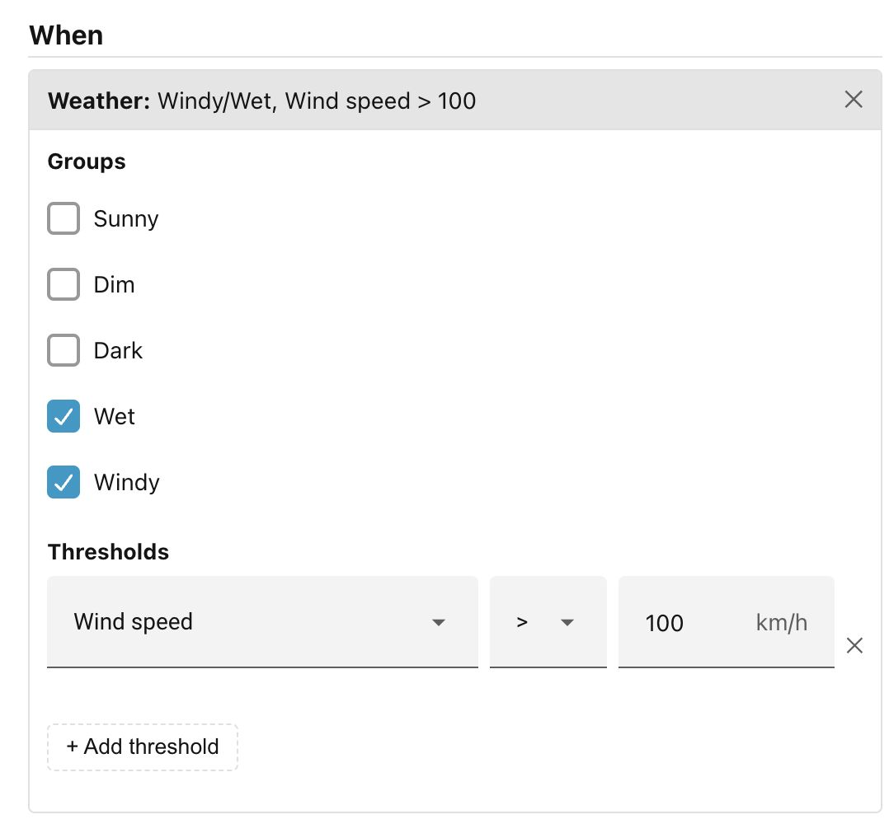
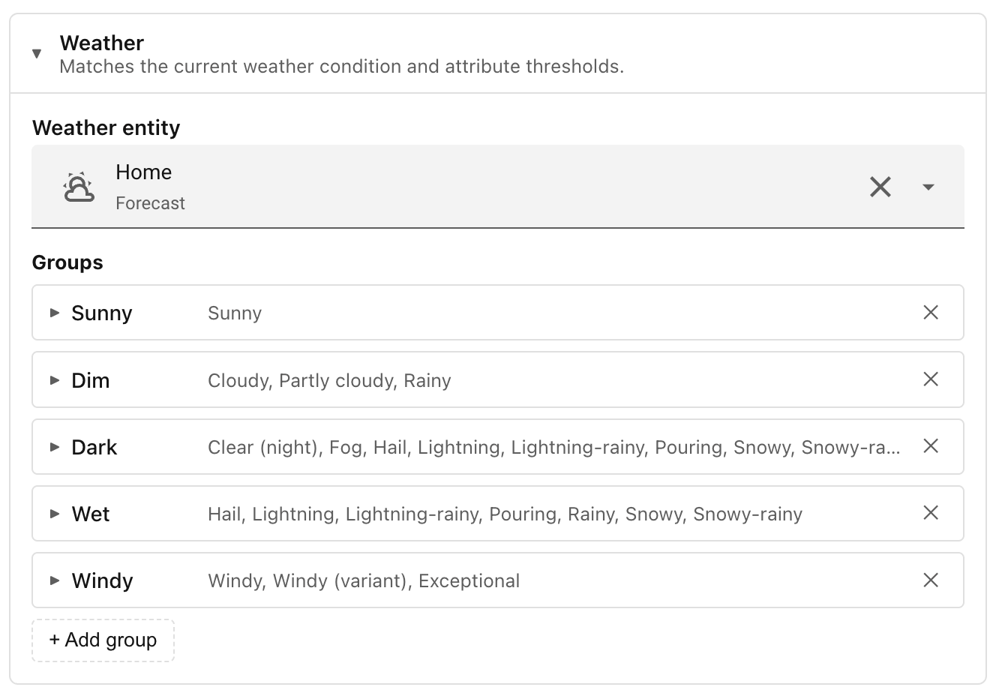

# Weather

The weather condition checks the current state reported by a Home Assistant
weather entity — both the named condition (sunny, cloudy, rainy, and so on) and
numeric attributes such as temperature, humidity, and wind speed.

!!! note "Configure a weather entity"

    Before the weather condition can do anything, you need to tell Ambience which
    weather entity to reference, as explained in
    [Add a Weather integration](../../getting-started/step-4-weather-conditions.md#add-a-weather-integration).

In the scene editor, click **+ Add condition…** and choose **Weather**. The
condition panel has two independent sections — **Groups** and **Thresholds** —
and you can use either, both, or neither.

## Groups

A group is a named collection of weather states. When you tick one or more
groups, the condition passes only if the current weather state belongs to at
least one of them.

Ambience comes with five built-in groups:

| Group     | Weather states it covers                                                                       |
| --------- | ---------------------------------------------------------------------------------------------- |
| **Sunny** | Sunny                                                                                          |
| **Dim**   | Cloudy, Partly cloudy, Rainy                                                                   |
| **Dark**  | Clear (night), Fog, Hail, Lightning, Lightning-rainy, Pouring, Snowy, Snowy-rainy, Exceptional |
| **Wet**   | Hail, Lightning, Lightning-rainy, Pouring, Rainy, Snowy, Snowy-rainy                           |
| **Windy** | Windy, Windy (variant), Exceptional                                                            |

You can add your own groups in the panel's settings under the **Conditions**
tab. Each custom group has a label and a list of individual weather states drawn
from the full set that Home Assistant defines. Once saved, your custom groups
appear alongside the built-ins in every scene's weather condition picker.

## Thresholds

A threshold tests a numeric attribute of the weather entity against a value you
supply. Click **+ Add threshold** and choose:

- **Attribute** — one of: Temperature, Apparent temperature, Humidity, Wind
    speed, Pressure.
- **Comparator** — less than (`<`), at most (`≤`), greater than (`>`), at least
    (`≥`).
- **Value** — the number to compare against. The unit shown matches what your
    weather entity reports (for example `°C` or `hPa`).

You can add as many thresholds as you like. All of them must hold for the
condition to pass.

### Combining groups and thresholds

Groups and thresholds work together. If you select the **Wet** group and add a
threshold of "Temperature ≥ 5", the condition passes only when the weather is
wet *and* the temperature is at least 5 degrees. Neither check alone is
sufficient.

For a worked example that builds a weather-based scene, see
[Step 4 of Getting started](../../getting-started/step-4-weather-conditions.md).

______________________________________________________________________

## Notes

- If the configured weather entity is unavailable or not yet loaded, the
    condition does not match. Scenes that depend on the weather condition are
    therefore skipped until the entity reports a valid state.
- If you rename or delete a custom group that is already referenced by a scene,
    Ambience will warn you via a banner in Settings listing the affected scenes.

______________________________________________________________________

Next: [Actions](../actions/index.md).
